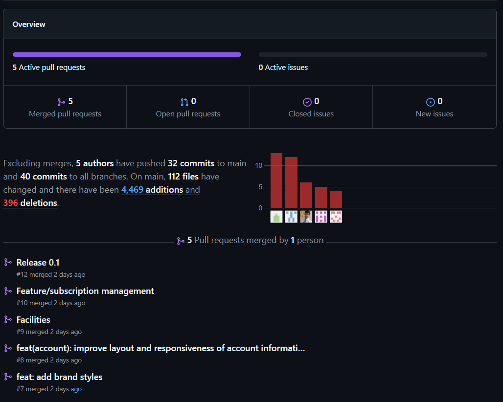
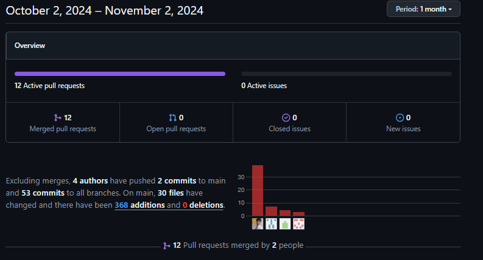
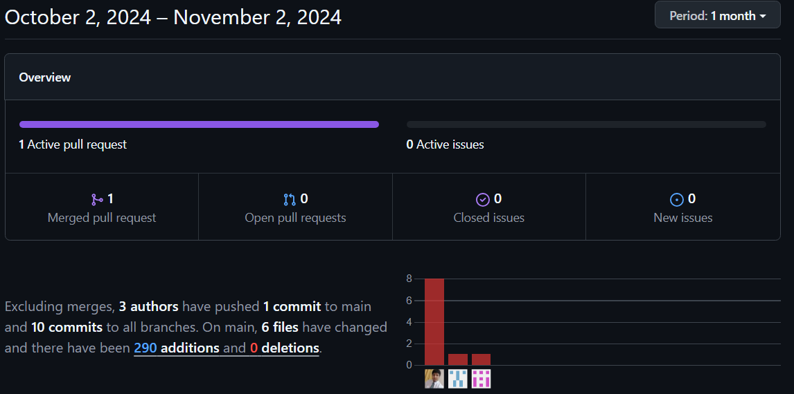
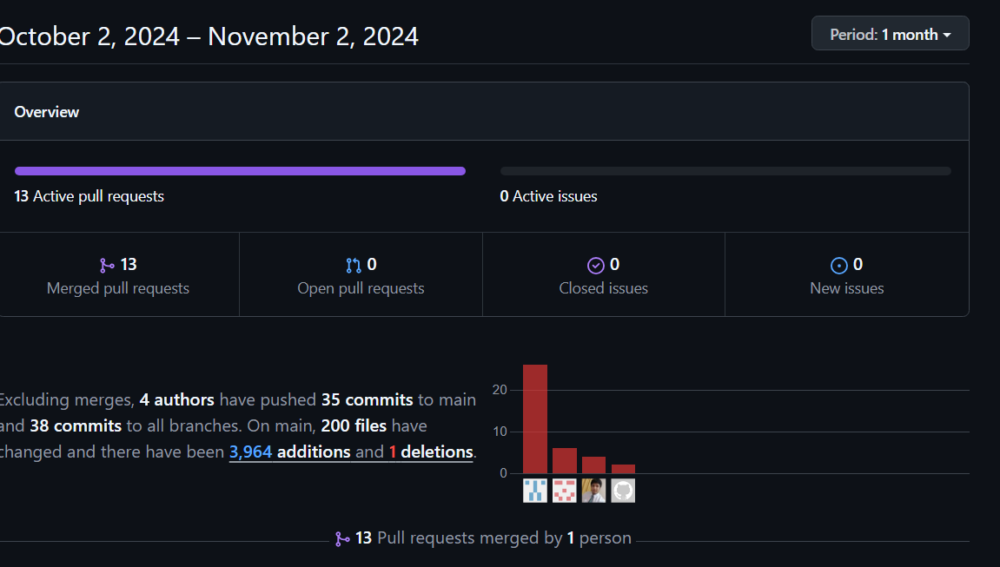

# Universidad Peruana De Ciencas Aplicadas
## Desarrollo de Soluciones IOT

 </img> 

# **Informe TB2**
## **Ditto - Dittobox**
## **Sección: WV71**  
## Profesor: Angel Augusto Velasquez Nuñez

## **Integrantes:**

*  **Diego Fabian Cancho Coila**
*  **José Anthony Arenas Conde**
*  **Samuel Rolando Chamorro Torres**
*  **Luis Eduardo Lagos Aguilar**
*  **Anthony Jeandet Guerrero Castillo**
-----

**Agosto 2024**

---

## Registro de Versiones Del Informe

| **Version** | **Fecha** | **Autor**                                                                               | **Descripcion de modificacion**                                                                 |
|-------------|-----------|-----------------------------------------------------------------------------------------|-------------------------------------------------------------------------------------------------|
| 0.1         | 22/08/24  | Cancho Coila Diego        | Descripcion Profile Start Up             |
| 0.2         | 07/09/24  | Arenas Conde José Anthony | Lean UX Process, EventStorming, Entrevista, Bounded Contexts          |
| 0.3         | 07/09/24  | Lagos Aguilar, Luis Eduardo        | C4 Model, Entrevista    |
| 0.4         | 07/09/24  | Guerrero Castillo, Anthony Jeandet       | Startup Profile, Solution Profile, entrevista, Impact Mapping, Context Mapping           |

## Project Report Collaboration Insights

**Link del repositorio-Informe:** [https://github.com/DittoBox/FinalProjectReport](https://github.com/DittoBox/FinalProjectReport)

**Link de los repositorios de la oraganización:** [https://github.com/orgs/DittoBox/repositories](https://github.com/orgs/DittoBox/repositories)

### **Reporte de colaboración de la entrega del TB1:**

En esta entrega, nuestra meta principal fue la creación de nuestro start-up. Para llevar a cabo este objetivo, hicimos uso de diversas herramientas como GitHub, Mural, Jira, UXPressia y Miro. A continuación, vamos a presentar los diagramas de flujo que representan los commits realizados por cada miembro del equipo Ditto:

En la imagen se evidencia el gráfico de distribución  de la cantidad de commits realizadas por cada uno de los integrantes del equipo en para realizar el TB1.

Estos gráficos ofrecen una representación visual de las clonaciones registradas en nuestro repositorio, junto con la fecha en que cada una de estas acciones se llevó a cabo. Además, se presenta información sobre la cantidad de visitantes que ha tenido el repositorio de nuestro equipo a lo largo del tiempo.

------

### **Reporte de colaboración de la entrega del TP1:**

En esta entrega, nuestra meta principal fue la creación de nuestros bounded context. Para llevar a cabo este objetivo, hicimos uso de diversas herramientas como GitHub, Mural, Jira, UXPressia y Miro. A continuación, vamos a presentar los diagramas de flujo que representan los commits realizados por cada miembro del equipo Ditto:

En la imagen se evidencia el gráfico de barras de la cantidad de commits realizadas por cada uno de los integrantes del equipo en para realizar el TP1 en el caso del avanze del Web Application de DittoBox

------

### **Reporte de colaboración de la entrega del TB2:**

En esta entrega, nuestra meta principal fue la creación de nuestros productos, tales como el Web App, Mobile App y el Embedded Aplication. Para llevar a cabo este objetivo, hicimos uso de diversas herramientas como GitHub, Jira, Visual Studio Code, Firebase, Azure y Visual Studio Studio Comunity. A continuación, vamos a presentar los diagramas de flujo que representan los commits realizados por cada miembro del equipo Ditto en los respectivos repositorios de productos

**Web app**

**Mobile app**

**Embedded app**

**Web Services API**

# Contenido

## Capítulo I: Introducción  
- [1.1. Startup Profile](/docs/chapter-I.md/#11-startup-profile)  
  - [1.1.1. Descripción de la Startup](/docs/chapter-I.md/#111-descripción-de-la-startup)  
  - [1.1.2. Perfiles de Integrantes del equipo](/docs/chapter-I.md/#112-perfiles-de-integrantes-del-equipo)  
- [1.2. Solution Profile](/docs/chapter-I.md/#12-solution-profile)  
  - [1.2.1. Antecedentes y problemática](/docs/chapter-I.md/#121-antecedentes-y-problemática)  
  - [1.2.2. Lean UX Process](/docs/chapter-I.md/#122-lean-ux-process)  
    - [1.2.2.1. Lean UX Problem Statements](/docs/chapter-I.md/#1221-lean-ux-problem-statements)  
    - [1.2.2.2. Lean UX Assumptions](/docs/chapter-I.md/#1222-lean-ux-assumptions)  
    - [1.2.2.3. Lean UX Hypothesis Statements](/docs/chapter-I.md/#1223-lean-ux-hypothesis-statements)  
    - [1.2.2.4. Lean UX Canvas](/docs/chapter-I.md/#1224-lean-ux-canvas)  
- [1.3. Segmentos Objetivos](/docs/chapter-I.md/#13-segmentos-objetivos)  

## Capítulo II: Requirements Elicitation & Analysis  
- [2.1. Competidores](/docs/chapter-IV.md/#21-competidores)  
  - [2.1.1. Análisis Competitivo](/docs/chapter-IV.md/#211-análisis-competitivo)  
  - [2.1.2. Estrategias y tácticas frente a competidores](/docs/chapter-IV.md/#212-estrategias-y-tácticas-frente-a-competidores)  
- [2.2. Entrevistas](/docs/chapter-IV.md/#22-entrevistas)  
  - [2.2.1. Diseño de entrevistas](/docs/chapter-IV.md/#221-diseño-de-entrevistas)  
  - [2.2.2. Registro de entrevistas](/docs/chapter-IV.md/#222-registro-de-entrevistas)  
  - [2.2.3. Análisis de entrevistas](/docs/chapter-IV.md/#223-análisis-de-entrevistas)  
- [2.3. Needfinding](/docs/chapter-IV.md/#23-needfinding)  
  - [2.3.1. User Personas](/docs/chapter-IV.md/#231-user-persona)  
  - [2.3.2. User Task Matrix](/docs/chapter-IV.md/#232-user-task-matrix)  
  - [2.3.3. User Journey Mapping](/docs/chapter-IV.md/#233-user-journey-mapping)  
  - [2.3.4. Empathy Mapping](/docs/chapter-IV.md/#234-empathy-mapping)  
  - [2.3.5. As-is Scenario Mapping](/docs/chapter-IV.md/#235-as-is-scenario-mapping)  
- [2.4. Ubiquitous Language](/docs/chapter-IV.md/#24-ubiquitous-language)  

## Capítulo III: Requirements Specification  
- [3.1. To-Be Scenario Mapping](/docs/chapter-IV.md/#31-to-be-scenario-mapping)  
- [3.2. User Stories](/docs/chapter-IV.md/#32-user-stories)  
- [3.3. Impact Mapping](/docs/chapter-IV.md/#33-impact-mapping)  
- [3.4. Product Backlog](/docs/chapter-IV.md/#34-product-backlog)  

## Capítulo IV: Solution Software Design  
- [4.1. Strategic-Level Domain-Driven Design](/docs/chapter-IV.md/#41-strategic-level-domain-driven-design)  
  - [4.1.1. EventStorming](/docs/chapter-IV.md/#411-eventstorming)  
    - [4.1.1.1. Candidate Context Discovery](/docs/chapter-IV.md/#4111-candidate-context-discovery)  
    - [4.1.1.2. Domain Message Flows Modeling](/docs/chapter-IV.md/#4112-domain-message-flows-modeling)  
    - [4.1.1.3. Bounded Context Canvases](/docs/chapter-IV.md/#4113-bounded-context-canvases)  
  - [4.1.2. Context Mapping](/docs/chapter-IV.md/#412-context-mapping)  
  - [4.1.3. Software Architecture](/docs/chapter-IV.md/#413-software-architecture)  
    - [4.1.3.1. Software Architecture System Landscape Diagram](/docs/chapter-IV.md/#4131-software-architecture-system-landscape-diagram)  
    - [4.1.3.2. Software Architecture Context Level Diagrams](/docs/chapter-IV.md/#4132-software-architecture-context-level-diagrams)  
    - [4.1.3.3. Software Architecture Container Level Diagrams](/docs/chapter-IV.md/#4133-software-architecture-container-level-diagrams)  
    - [4.1.3.4. Software Architecture Deployment Diagrams](/docs/chapter-IV.md/#4134-software-architecture-deployment-diagrams)  
- [4.2. Tactical-Level Domain-Driven Design](/docs/chapter-IV.md/#42-tactical-level-domain-driven-design)  
  - [4.2.1. Bounded Account & Subscription Management Context](/docs/chapter-IV.md/#421-bounded-account-subscription-management-context)  
    - [4.2.1.1. Domain Layer](/docs/chapter-IV.md/#4211-domain-layer)  
    - [4.2.1.2. Interface Layer](/docs/chapter-IV.md/#4212-interface-layer)  
    - [4.2.1.3. Application Layer](/docs/chapter-IV.md/#4213-application-layer)  
    - [4.2.1.4. Infrastructure Layer](/docs/chapter-IV.md/#4214-infrastructure-layer)  
    - [4.2.1.5. Bounded Context Software Architecture Component Level Diagrams](/docs/chapter-IV.md/#4215-bounded-context-software-architecture-component-level-diagrams)  
    - [4.2.1.6. Bounded Context Software Architecture Code Level Diagrams](/docs/chapter-IV.md/#4216-bounded-context-software-architecture-code-level-diagrams)  
      - [4.2.1.6.1. Bounded Context Domain Layer Class Diagrams](/docs/chapter-IV.md/#42161-bounded-context-domain-layer-class-diagrams)  
      - [4.2.1.6.2. Bounded Context Database Design Diagram](/docs/chapter-IV.md/#42162-bounded-context-database-design-diagram)  
  - [4.2.2. Bounded User & Profile Management Context](/docs/chapter-IV.md/#422-bounded-user-profile-management-context)  
    - [4.2.2.1. Domain Layer](/docs/chapter-IV.md/#4221-domain-layer)  
    - [4.2.2.2. Interface Layer](/docs/chapter-IV.md/#4222-interface-layer)  
    - [4.2.2.3. Application Layer](/docs/chapter-IV.md/#4223-application-layer)  
    - [4.2.2.4. Infrastructure Layer](/docs/chapter-IV.md/#4224-infrastructure-layer)  
    - [4.2.2.5. Bounded Context Software Architecture Component Level Diagrams](/docs/chapter-IV.md/#4225-bounded-context-software-architecture-component-level-diagrams)  
    - [4.2.2.6. Bounded Context Software Architecture Code Level Diagrams](/docs/chapter-IV.md/#4226-bounded-context-software-architecture-code-level-diagrams)  
      - [4.2.2.6.1. Bounded Context Domain Layer Class Diagrams](/docs/chapter-IV.md/#42261-bounded-context-domain-layer-class-diagrams)  
      - [4.2.2.6.2. Bounded Context Database Design Diagram](/docs/chapter-IV.md/#42262-bounded-context-database-design-diagram)  
  - [4.2.3. Bounded Container Management Context](/docs/chapter-IV.md/#423-bounded-container-management-context)  
    - [4.2.3.1. Domain Layer](/docs/chapter-IV.md/#4231-domain-layer)  
    - [4.2.3.2. Interface Layer](/docs/chapter-IV.md/#4232-interface-layer)  
    - [4.2.3.3. Application Layer](/docs/chapter-IV.md/#4233-application-layer)  
    - [4.2.3.4. Infrastructure Layer](/docs/chapter-IV.md/#4234-infrastructure-layer)  
    - [4.2.3.5. Bounded Context Software Architecture Component Level Diagrams](/docs/chapter-IV.md/#4235-bounded-context-software-architecture-component-level-diagrams)  
    - [4.2.3.6. Bounded Context Software Architecture Code Level Diagrams](/docs/chapter-IV.md/#4236-bounded-context-software-architecture-code-level-diagrams)  
      - [4.2.3.6.1. Bounded Context Domain Layer Class Diagrams](/docs/chapter-IV.md/#42361-bounded-context-domain-layer-class-diagrams)  
      - [4.2.3.6.2. Bounded Context Database Design Diagram](/docs/chapter-IV.md/#42362-bounded-context-database-design-diagram)  
  - [4.2.4. Bounded Groups Management Context](/docs/chapter-IV.md/#424-bounded-groups-management-context)  
    - [4.2.4.1. Domain Layer](/docs/chapter-IV.md/#4241-domain-layer)  
    - [4.2.4.2. Interface Layer](/docs/chapter-IV.md/#4242-interface-layer)  
    - [4.2.4.3. Application Layer](/docs/chapter-IV.md/#4243-application-layer)  
    - [4.2.4.4. Infrastructure Layer](/docs/chapter-IV.md/#4244-infrastructure-layer)  
    - [4.2.4.5. Bounded Context Software Architecture Component Level Diagrams](/docs/chapter-IV.md/#4245-bounded-context-software-architecture-component-level-diagrams)  
    - [4.2.4.6. Bounded Context Software Architecture Code Level Diagrams](/docs/chapter-IV.md/#4246-bounded-context-software-architecture-code-level-diagrams)  
      - [4.2.4.6.1. Bounded Context Domain Layer Class Diagrams](/docs/chapter-IV.md/#42461-bounded-context-domain-layer-class-diagrams)  
      - [4.2.4.6.2. Bounded Context Database Design Diagram](/docs/chapter-IV.md/#42462-bounded-context-database-design-diagram)  

## Capítulo V: Solution UI/UX Design  
- [5.1. Style Guidelines](/docs/chapter-V.md/#51-style-guidelines)  
  - [5.1.1. General Style Guidelines](/docs/chapter-V.md/#511-general-style-guidelines)  
  - [5.1.2. Web, Mobile and IoT Style Guidelines](/docs/chapter-V.md/#512-web-mobile-and-iot-style-guidelines)  
- [5.2. Information Architecture](/docs/chapter-V.md/#52-information-architecture)  
  - [5.2.1. Organization Systems](/docs/chapter-V.md/#521-organization-systems)  
  - [5.2.2. Labeling Systems](/docs/chapter-V.md/#522-labeling-systems)  
  - [5.2.3. SEO Tags and Meta Tags](/docs/chapter-V.md/#523-seo-tags-and-meta-tags)  
  - [5.2.4. Searching Systems](/docs/chapter-V.md/#524-searching-systems)  
  - [5.2.5. Navigation Systems](/docs/chapter-V.md/#525-navigation-systems)  
- [5.3. Landing Page UI Design](/docs/chapter-V.md/#53-landing-page-ui-design)  
  - [5.3.1. Landing Page Wireframe](/docs/chapter-V.md/#531-landing-page-wireframe)  
  - [5.3.2. Landing Page Mock-up](/docs/chapter-V.md/#532-landing-page-mock-up)  
- [5.4. Applications UX/UI Design](/docs/chapter-V.md/#54-applications-uxui-design)  
  - [5.4.1. Applications Wireframes](/docs/chapter-V.md/#541-applications-wireframes)  
  - [5.4.2. Applications Wireflow Diagrams](/docs/chapter-V.md/#542-applications-wireflow-diagrams)  
  - [5.4.3. Applications Mock-ups](/docs/chapter-V.md/#543-applications-mock-ups)  
  - [5.4.4. Applications User Flow Diagrams](/docs/chapter-V.md/#544-applications-user-flow-diagrams)  
- [5.5. Applications Prototyping](/docs/chapter-V.md/#55-applications-prototyping)  

## Capítulo VI: Product Implementation, Validation & Deployment  
- [6.1. Software Configuration Management](/docs/chapter-VI.md/#61-software-configuration-management)  
  - [6.1.1. Software Development Environment Configuration](/docs/chapter-VI.md/#611-software-development-environment-configuration)  
  - [6.1.2. Source Code Management](/docs/chapter-VI.md/#612-source-code-management)  
  - [6.1.3. Source Code Style Guide & Conventions](/docs/chapter-VI.md/#613-source-code-style-guide--conventions)  
  - [6.1.4. Software Deployment Configuration](/docs/chapter-VI.md/#614-software-deployment-configuration)  
- [6.2. Landing Page, Services & Applications Implementation](/docs/chapter-VI.md/#62-landing-page-services--applications-implementation)  
  - [6.2.1. Sprint 1](/docs/chapter-VI.md/#621-sprint-1)  
    - [6.2.1.1. Sprint Planning 1](/docs/chapter-VI.md/#6211-sprint-planning-1)  
    - [6.2.1.2. Sprint Backlog 1](/docs/chapter-VI.md/#6212-sprint-backlog-1)  
    - [6.2.1.3. Development Evidence for Sprint Review](/docs/chapter-VI.md/#6213-development-evidence-for-sprint-review)  
    - [6.2.1.4. Testing Suite Evidence for Sprint Review](/docs/chapter-VI.md/#6214-testing-suite-evidence-for-sprint-review)  
    - [6.2.1.5. Execution Evidence for Sprint Review](/docs/chapter-VI.md/#6215-execution-evidence-for-sprint-review)  
    - [6.2.1.6. Services Documentation Evidence for Sprint Review](/docs/chapter-VI.md/#6216-services-documentation-evidence-for-sprint-review)  
    - [6.2.1.7. Software Deployment Evidence for Sprint Review](/docs/chapter-VI.md/#6217-software-deployment-evidence-for-sprint-review)  
    - [6.2.1.8. Team Collaboration Insights during Sprint](/docs/chapter-VI.md/#6218-team-collaboration-insights-during-sprint)  
  - [6.2.2. Sprint 2](/docs/chapter-VI.md/#622-sprint-2)  
    - [6.2.2.1. Sprint Planning 2](/docs/chapter-VI.md/#6221-sprint-planning-2)  
    - [6.2.2.2. Sprint Backlog 2](/docs/chapter-VI.md/#6222-sprint-backlog-2)  
    - [6.2.2.3. Development Evidence for Sprint Review](/docs/chapter-VI.md/#6223-development-evidence-for-sprint-review)  
    - [6.2.2.4. Testing Suite Evidence for Sprint Review](/docs/chapter-VI.md/#6224-testing-suite-evidence-for-sprint-review)  
    - [6.2.2.5. Execution Evidence for Sprint Review](/docs/chapter-VI.md/#6225-execution-evidence-for-sprint-review)  
    - [6.2.2.6. Services Documentation Evidence for Sprint Review](/docs/chapter-VI.md/#6226-services-documentation-evidence-for-sprint-review)  
    - [6.2.2.7. Software Deployment Evidence for Sprint Review](/docs/chapter-VI.md/#6227-software-deployment-evidence-for-sprint-review)  
    - [6.2.2.8. Team Collaboration Insights during Sprint](/docs/chapter-VI.md/#6228-team-collaboration-insights-during-sprint)  
- [6.3. Validation Interviews](/docs/chapter-VI.md/#63-validation-interviews)  
  - [6.3.1. Diseño de Entrevistas](/docs/chapter-VI.md/#631-diseño-de-entrevistas)  
  - [6.3.2. Registro de Entrevistas](/docs/chapter-VI.md/#632-registro-de-entrevistas)  
  - [6.3.3. Evaluaciones según Heurísticas](/docs/chapter-VI.md/#633-evaluaciones-según-heurísticas)  
- [6.4. Video About-The-Product](/docs/chapter-VI.md/#64-video-about-the-product)  

## Anexos y Bibliografía  
- [Anexos](/docs/appendices&bibliography.md/#71-anexos)  
- [Bibliografía](/docs/appendices&bibliography.md/#72-bibliografía)  

## Student Outcome

| **Criterio Específico** | **Acciones Realizadas** | **Conclusiones**                                                                               |
|-------------------------|--------------------------|-----------------------------------------------------------------------------------------------|
| Trabaja en equipo para proporcionar liderazgo en forma conjunta | Chamorro Torres Samuel Rolando  TB1 Se desarrolló el Needfinding para identificar necesidades y optimizar la experiencia del usuario. También se crearon los Bounded Context Canvases para definir y contextualizar los aspectos críticos del sistema en el monitoreo. TP Se configuró el entorno de desarrollo y la gestión del código fuente, además de implementar la landing page y los servicios. Se completaron el Sprint 1, evidencias de pruebas y despliegue, y se documentaron las colaboraciones del equipo durante el sprint. TB2 Se completó el Sprint 2, incluyendo planificación, backlog, desarrollo, pruebas, documentación de servicios y despliegue del software. También se realizaron entrevistas de validación y un video explicativo del producto, fortaleciendo la colaboración del equipo.  Anthony Guerrero Castillo TB1 Se elbaró la descripción de la startup, información y análisis de los competidores, parte del Requirement Elicitation, entrevistas y partes del Solution Software Design  TB2 Siguiendo la herramienta Jira, se elaboró las Tasks para cada historia de usuario. Cumplí con mis tareas asignadas para los productos Web Application, API, Mobile Application y Embedded Application   Arenas Conde, José Anthony   TB1     Se desarrollaron diversos puntos de manera conjunta, identificando diversos aspectos de la propuesta de software a través de reuniones presenciales que fue la principal actividad que contribuyó al desarrollo del proyecto.    Cancho Coila, Diego Fabian TB1 Se realizó la definición de requirements, user stories y product backlog, tomando en cuenta las necesidades de los usuarios y las funcionalidades esperadas del sistema por parte de los mismos.|TB1     Para esta entrega el concluye que se realizaron diferentes actividades donde el liderazgo de cada integrante, dependiendo de sus puntos fuertes, fue esencial para el buen desarrollo del proyecto, como las actividades precensiales, por ejemplo el EventStorming y reuniones semanales
| Crea un entorno colaborativo e inclusivo, establece metas, planifica tareas y cumple objetivos. | Chamorro Torres Samuel Rolando  TB1 Se fomentó un entorno colaborativo estableciendo metas claras y planificando tareas con el equipo para asegurar un desarrollo eficaz del sistema TP Se configuraron el entorno de desarrollo y la gestión del código, estableciendo guías de estilo. Se planificaron metas y tareas para el Sprint 1, y se documentaron las colaboraciones del equipo en el desarrollo y pruebas del producto. TB2 Promovió un entorno colaborativo e inclusivo mediante la planificación de metas y tareas en el Sprint 2, logrando una ejecución coordinada y el cumplimiento de objetivos para el sistema.   Anthony Guerrero Castillo TB1 Se realizaron reuniones para crear una misma idea entre todos los participantes, y de esta forma avanzar más rápido y seguro  TB2  Pudimos realizar las reuniones acordadas para monitorear el avance del proyecto. Todos participamos activamente.    Arenas Conde, José Anthony   TB1     Se usaron herramientas que facilitaron un entorno colaborativo y comunicación constante entre los miembros del equipo, para realizar una buena solución de software  Cancho Coila, Diego Fabian  TB1 Como grupo, se procuró incentivar la participación y oportunidad de comunicar, proponer y defender ideas propias, buscando tanto un consenso en los objetivos planteados como en el desarrollo de cada uno de los integrantes como líderes capaces.   | TB1     La planificación de metas y objetivos para el desarrollo de distintas actividades del trabajo fue esencial para poder terminar satisfactoriamente los puntos clave de este proyecto. Por ello, se planearon con anticipación dias de reuniones precensiales semanales, comunicación activa y reuniones virtuales. |

