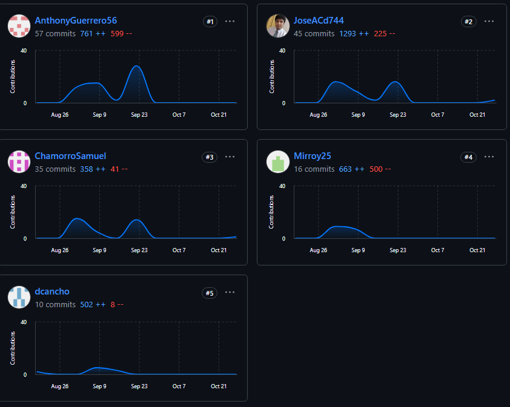

# Universidad Peruana De Ciencas Aplicadas
## Desarrollo de Soluciones IOT

 </img> 

# **Informe TB2**
## **Ditto - Dittobox**
## **Sección: WV71**  
## Profesor: Angel Augusto Velasquez Nuñez

## **Integrantes:**

*  **Diego Fabian Cancho Coila**
*  **José Anthony Arenas Conde**
*  **Samuel Rolando Chamorro Torres**
*  **Luis Eduardo Lagos Aguilar**
*  **Anthony Jeandet Guerrero Castillo**
-----

**Agosto 2024**

---

## Registro de Versiones Del Informe

| **Version** | **Fecha** | **Autor**                                                                               | **Descripcion de modificacion**                                                                 |
|-------------|-----------|-----------------------------------------------------------------------------------------|-------------------------------------------------------------------------------------------------|
| 0.1         | 22/08/24  | Cancho Coila Diego        | Descripcion Profile Start Up             |
| 0.2         | 07/09/24  | Arenas Conde José Anthony | Lean UX Process, EventStorming, Entrevista, Bounded Contexts          |
| 0.3         | 07/09/24  | Lagos Aguilar, Luis Eduardo        | C4 Model, Entrevista    |
| 0.4         | 07/09/24  | Guerrero Castillo, Anthony Jeandet       | Startup Profile, Solution Profile, entrevista, Impact Mapping, Context Mapping           |

## Project Report Collaboration Insights

**Link del repositorio-Informe:** [https://github.com/DittoBox/FinalProjectReport](https://github.com/DittoBox/FinalProjectReport)

**Link de los repositorios de la oraganización:** [https://github.com/orgs/DittoBox/repositories](https://github.com/orgs/DittoBox/repositories)

### **Reporte de colaboración de la entrega del TB1:**

En esta primera entrega (TB1), nuestro objetivo principal fue la creación de nuestra startup. Todos los miembros del equipo DittoBox participaron activamente en la elaboración del informe, utilizando herramientas colaborativas como GitHub, Mural, Jira, UXPressia y Miro.. A continuación, vamos a presentar los diagramas de flujo que representan los commits realizados por cada miembro del equipo Ditto:

Este gráfico muestra la cantidad de commits realizados por cada integrante durante la elaboración del TB1.

Este gráfico ofrece una representación visual de las clonaciones registradas en nuestro repositorio y la cantidad de visitantes a lo largo del tiempo.

Estas evidencias demuestran una colaboración equilibrada y efectiva, con cada miembro aportando significativamente al desarrollo del informe.

------

### **Reporte de colaboración de la entrega del TP1:**

En esta entrega (TP1), nuestro objetivo principal fue la creación de nuestros Bounded Contexts para el proyecto DittoBox. El equipo trabajó de manera colaborativa utilizando herramientas como GitHub, Mural, Jira, UXPressia y Miro para coordinar las actividades y desarrollar el informe correspondiente. A continuación, vamos a presentar los diagramas de flujo que representan los commits realizados por cada miembro del equipo Ditto:

Este gráfico de barras muestra la cantidad de commits realizados por cada integrante durante la elaboración del TP1.

------

### **Reporte de colaboración de la entrega del TB2:**

En esta entrega (TB2), nuestro objetivo principal fue la creación de nuestros productos: la Web App, la Aplicación Móvil y la Aplicación Embebida. El equipo Ditto trabajó de manera colaborativa utilizando herramientas como GitHub, Jira, Visual Studio Code, Firebase, Azure y Visual Studio Community para desarrollar estos productos y elaborar el informe correspondiente.
A continuación, vamos a presentar los diagramas de flujo que representan los commits realizados por cada miembro del equipo Ditto:

Este gráfico muestra la cantidad de commits realizados por cada integrante en el repositorio del informe durante la elaboración del TB2.

------

### **Reporte de colaboración de la entrega del TF1:**

En esta entrega final (TF1), nuestro objetivo principal fue concluir el ciclo de vida del proyecto DittoBox, integrando todos los componentes desarrollados y asegurando una documentación completa y coherente. El equipo trabajó de manera colaborativa para mejorar y corregir los artefactos previamente presentados, así como para elaborar las secciones finales del informe, incluyendo el Registro de Versiones del Informe, Project Report Collaboration Insights, Sección Student Outcome, Conclusiones, Bibliografía y Anexos.
A continuación, presentamos las capturas de los analíticos de colaboración y commits en GitHub que demuestran la participación activa de todos los miembros en el repositorio del informe para la entrega TF1:

Este gráfico muestra la cantidad de commits realizados por cada integrante en el repositorio del informe durante la elaboración de la entrega TF1. Se evidencia una participación equilibrada entre los miembros del equipo.

------

# Contenido

## Capítulo I: Introducción  
- [1.1. Startup Profile](/docs/chapter-I.md/#11-startup-profile)  
  - [1.1.1. Descripción de la Startup](/docs/chapter-I.md/#111-descripción-de-la-startup)  
  - [1.1.2. Perfiles de Integrantes del equipo](/docs/chapter-I.md/#112-perfiles-de-integrantes-del-equipo)  
- [1.2. Solution Profile](/docs/chapter-I.md/#12-solution-profile)  
  - [1.2.1. Antecedentes y problemática](/docs/chapter-I.md/#121-antecedentes-y-problemática)  
  - [1.2.2. Lean UX Process](/docs/chapter-I.md/#122-lean-ux-process)  
    - [1.2.2.1. Lean UX Problem Statements](/docs/chapter-I.md/#1221-lean-ux-problem-statements)  
    - [1.2.2.2. Lean UX Assumptions](/docs/chapter-I.md/#1222-lean-ux-assumptions)  
    - [1.2.2.3. Lean UX Hypothesis Statements](/docs/chapter-I.md/#1223-lean-ux-hypothesis-statements)  
    - [1.2.2.4. Lean UX Canvas](/docs/chapter-I.md/#1224-lean-ux-canvas)  
- [1.3. Segmentos Objetivos](/docs/chapter-I.md/#13-segmentos-objetivos)  

## Capítulo II: Requirements Elicitation & Analysis  
- [2.1. Competidores](/docs/chapter-IV.md/#21-competidores)  
  - [2.1.1. Análisis Competitivo](/docs/chapter-IV.md/#211-análisis-competitivo)  
  - [2.1.2. Estrategias y tácticas frente a competidores](/docs/chapter-IV.md/#212-estrategias-y-tácticas-frente-a-competidores)  
- [2.2. Entrevistas](/docs/chapter-IV.md/#22-entrevistas)  
  - [2.2.1. Diseño de entrevistas](/docs/chapter-IV.md/#221-diseño-de-entrevistas)  
  - [2.2.2. Registro de entrevistas](/docs/chapter-IV.md/#222-registro-de-entrevistas)  
  - [2.2.3. Análisis de entrevistas](/docs/chapter-IV.md/#223-análisis-de-entrevistas)  
- [2.3. Needfinding](/docs/chapter-IV.md/#23-needfinding)  
  - [2.3.1. User Personas](/docs/chapter-IV.md/#231-user-persona)  
  - [2.3.2. User Task Matrix](/docs/chapter-IV.md/#232-user-task-matrix)  
  - [2.3.3. User Journey Mapping](/docs/chapter-IV.md/#233-user-journey-mapping)  
  - [2.3.4. Empathy Mapping](/docs/chapter-IV.md/#234-empathy-mapping)  
  - [2.3.5. As-is Scenario Mapping](/docs/chapter-IV.md/#235-as-is-scenario-mapping)  
- [2.4. Ubiquitous Language](/docs/chapter-IV.md/#24-ubiquitous-language)  

## Capítulo III: Requirements Specification  
- [3.1. To-Be Scenario Mapping](/docs/chapter-IV.md/#31-to-be-scenario-mapping)  
- [3.2. User Stories](/docs/chapter-IV.md/#32-user-stories)  
- [3.3. Impact Mapping](/docs/chapter-IV.md/#33-impact-mapping)  
- [3.4. Product Backlog](/docs/chapter-IV.md/#34-product-backlog)  

## Capítulo IV: Solution Software Design  
- [4.1. Strategic-Level Domain-Driven Design](/docs/chapter-IV.md/#41-strategic-level-domain-driven-design)  
  - [4.1.1. EventStorming](/docs/chapter-IV.md/#411-eventstorming)  
    - [4.1.1.1. Candidate Context Discovery](/docs/chapter-IV.md/#4111-candidate-context-discovery)  
    - [4.1.1.2. Domain Message Flows Modeling](/docs/chapter-IV.md/#4112-domain-message-flows-modeling)  
    - [4.1.1.3. Bounded Context Canvases](/docs/chapter-IV.md/#4113-bounded-context-canvases)  
  - [4.1.2. Context Mapping](/docs/chapter-IV.md/#412-context-mapping)  
  - [4.1.3. Software Architecture](/docs/chapter-IV.md/#413-software-architecture)  
    - [4.1.3.1. Software Architecture System Landscape Diagram](/docs/chapter-IV.md/#4131-software-architecture-system-landscape-diagram)  
    - [4.1.3.2. Software Architecture Context Level Diagrams](/docs/chapter-IV.md/#4132-software-architecture-context-level-diagrams)  
    - [4.1.3.3. Software Architecture Container Level Diagrams](/docs/chapter-IV.md/#4133-software-architecture-container-level-diagrams)  
    - [4.1.3.4. Software Architecture Deployment Diagrams](/docs/chapter-IV.md/#4134-software-architecture-deployment-diagrams)  
- [4.2. Tactical-Level Domain-Driven Design](/docs/chapter-IV.md/#42-tactical-level-domain-driven-design)  
  - [4.2.1. Bounded Account & Subscription Management Context](/docs/chapter-IV.md/#421-bounded-account-subscription-management-context)  
    - [4.2.1.1. Domain Layer](/docs/chapter-IV.md/#4211-domain-layer)  
    - [4.2.1.2. Interface Layer](/docs/chapter-IV.md/#4212-interface-layer)  
    - [4.2.1.3. Application Layer](/docs/chapter-IV.md/#4213-application-layer)  
    - [4.2.1.4. Infrastructure Layer](/docs/chapter-IV.md/#4214-infrastructure-layer)  
    - [4.2.1.5. Bounded Context Software Architecture Component Level Diagrams](/docs/chapter-IV.md/#4215-bounded-context-software-architecture-component-level-diagrams)  
    - [4.2.1.6. Bounded Context Software Architecture Code Level Diagrams](/docs/chapter-IV.md/#4216-bounded-context-software-architecture-code-level-diagrams)  
      - [4.2.1.6.1. Bounded Context Domain Layer Class Diagrams](/docs/chapter-IV.md/#42161-bounded-context-domain-layer-class-diagrams)  
      - [4.2.1.6.2. Bounded Context Database Design Diagram](/docs/chapter-IV.md/#42162-bounded-context-database-design-diagram)  
  - [4.2.2. Bounded User & Profile Management Context](/docs/chapter-IV.md/#422-bounded-user-profile-management-context)  
    - [4.2.2.1. Domain Layer](/docs/chapter-IV.md/#4221-domain-layer)  
    - [4.2.2.2. Interface Layer](/docs/chapter-IV.md/#4222-interface-layer)  
    - [4.2.2.3. Application Layer](/docs/chapter-IV.md/#4223-application-layer)  
    - [4.2.2.4. Infrastructure Layer](/docs/chapter-IV.md/#4224-infrastructure-layer)  
    - [4.2.2.5. Bounded Context Software Architecture Component Level Diagrams](/docs/chapter-IV.md/#4225-bounded-context-software-architecture-component-level-diagrams)  
    - [4.2.2.6. Bounded Context Software Architecture Code Level Diagrams](/docs/chapter-IV.md/#4226-bounded-context-software-architecture-code-level-diagrams)  
      - [4.2.2.6.1. Bounded Context Domain Layer Class Diagrams](/docs/chapter-IV.md/#42261-bounded-context-domain-layer-class-diagrams)  
      - [4.2.2.6.2. Bounded Context Database Design Diagram](/docs/chapter-IV.md/#42262-bounded-context-database-design-diagram)  
  - [4.2.3. Bounded Container Management Context](/docs/chapter-IV.md/#423-bounded-container-management-context)  
    - [4.2.3.1. Domain Layer](/docs/chapter-IV.md/#4231-domain-layer)  
    - [4.2.3.2. Interface Layer](/docs/chapter-IV.md/#4232-interface-layer)  
    - [4.2.3.3. Application Layer](/docs/chapter-IV.md/#4233-application-layer)  
    - [4.2.3.4. Infrastructure Layer](/docs/chapter-IV.md/#4234-infrastructure-layer)  
    - [4.2.3.5. Bounded Context Software Architecture Component Level Diagrams](/docs/chapter-IV.md/#4235-bounded-context-software-architecture-component-level-diagrams)  
    - [4.2.3.6. Bounded Context Software Architecture Code Level Diagrams](/docs/chapter-IV.md/#4236-bounded-context-software-architecture-code-level-diagrams)  
      - [4.2.3.6.1. Bounded Context Domain Layer Class Diagrams](/docs/chapter-IV.md/#42361-bounded-context-domain-layer-class-diagrams)  
      - [4.2.3.6.2. Bounded Context Database Design Diagram](/docs/chapter-IV.md/#42362-bounded-context-database-design-diagram)  
  - [4.2.4. Bounded Groups Management Context](/docs/chapter-IV.md/#424-bounded-groups-management-context)  
    - [4.2.4.1. Domain Layer](/docs/chapter-IV.md/#4241-domain-layer)  
    - [4.2.4.2. Interface Layer](/docs/chapter-IV.md/#4242-interface-layer)  
    - [4.2.4.3. Application Layer](/docs/chapter-IV.md/#4243-application-layer)  
    - [4.2.4.4. Infrastructure Layer](/docs/chapter-IV.md/#4244-infrastructure-layer)  
    - [4.2.4.5. Bounded Context Software Architecture Component Level Diagrams](/docs/chapter-IV.md/#4245-bounded-context-software-architecture-component-level-diagrams)  
    - [4.2.4.6. Bounded Context Software Architecture Code Level Diagrams](/docs/chapter-IV.md/#4246-bounded-context-software-architecture-code-level-diagrams)  
      - [4.2.4.6.1. Bounded Context Domain Layer Class Diagrams](/docs/chapter-IV.md/#42461-bounded-context-domain-layer-class-diagrams)  
      - [4.2.4.6.2. Bounded Context Database Design Diagram](/docs/chapter-IV.md/#42462-bounded-context-database-design-diagram)  

## Capítulo V: Solution UI/UX Design  
- [5.1. Style Guidelines](/docs/chapter-V.md/#51-style-guidelines)  
  - [5.1.1. General Style Guidelines](/docs/chapter-V.md/#511-general-style-guidelines)  
  - [5.1.2. Web, Mobile and IoT Style Guidelines](/docs/chapter-V.md/#512-web-mobile-and-iot-style-guidelines)  
- [5.2. Information Architecture](/docs/chapter-V.md/#52-information-architecture)  
  - [5.2.1. Organization Systems](/docs/chapter-V.md/#521-organization-systems)  
  - [5.2.2. Labeling Systems](/docs/chapter-V.md/#522-labeling-systems)  
  - [5.2.3. SEO Tags and Meta Tags](/docs/chapter-V.md/#523-seo-tags-and-meta-tags)  
  - [5.2.4. Searching Systems](/docs/chapter-V.md/#524-searching-systems)  
  - [5.2.5. Navigation Systems](/docs/chapter-V.md/#525-navigation-systems)  
- [5.3. Landing Page UI Design](/docs/chapter-V.md/#53-landing-page-ui-design)  
  - [5.3.1. Landing Page Wireframe](/docs/chapter-V.md/#531-landing-page-wireframe)  
  - [5.3.2. Landing Page Mock-up](/docs/chapter-V.md/#532-landing-page-mock-up)  
- [5.4. Applications UX/UI Design](/docs/chapter-V.md/#54-applications-uxui-design)  
  - [5.4.1. Applications Wireframes](/docs/chapter-V.md/#541-applications-wireframes)  
  - [5.4.2. Applications Wireflow Diagrams](/docs/chapter-V.md/#542-applications-wireflow-diagrams)  
  - [5.4.3. Applications Mock-ups](/docs/chapter-V.md/#543-applications-mock-ups)  
  - [5.4.4. Applications User Flow Diagrams](/docs/chapter-V.md/#544-applications-user-flow-diagrams)  
- [5.5. Applications Prototyping](/docs/chapter-V.md/#55-applications-prototyping)  

## Capítulo VI: Product Implementation, Validation & Deployment  
- [6.1. Software Configuration Management](/docs/chapter-VI.md/#61-software-configuration-management)  
  - [6.1.1. Software Development Environment Configuration](/docs/chapter-VI.md/#611-software-development-environment-configuration)  
  - [6.1.2. Source Code Management](/docs/chapter-VI.md/#612-source-code-management)  
  - [6.1.3. Source Code Style Guide & Conventions](/docs/chapter-VI.md/#613-source-code-style-guide--conventions)  
  - [6.1.4. Software Deployment Configuration](/docs/chapter-VI.md/#614-software-deployment-configuration)  
- [6.2. Landing Page, Services & Applications Implementation](/docs/chapter-VI.md/#62-landing-page-services--applications-implementation)  
  - [6.2.1. Sprint 1](/docs/chapter-VI.md/#621-sprint-1)  
    - [6.2.1.1. Sprint Planning 1](/docs/chapter-VI.md/#6211-sprint-planning-1)  
    - [6.2.1.2. Sprint Backlog 1](/docs/chapter-VI.md/#6212-sprint-backlog-1)  
    - [6.2.1.3. Development Evidence for Sprint Review](/docs/chapter-VI.md/#6213-development-evidence-for-sprint-review)  
    - [6.2.1.4. Testing Suite Evidence for Sprint Review](/docs/chapter-VI.md/#6214-testing-suite-evidence-for-sprint-review)  
    - [6.2.1.5. Execution Evidence for Sprint Review](/docs/chapter-VI.md/#6215-execution-evidence-for-sprint-review)  
    - [6.2.1.6. Services Documentation Evidence for Sprint Review](/docs/chapter-VI.md/#6216-services-documentation-evidence-for-sprint-review)  
    - [6.2.1.7. Software Deployment Evidence for Sprint Review](/docs/chapter-VI.md/#6217-software-deployment-evidence-for-sprint-review)  
    - [6.2.1.8. Team Collaboration Insights during Sprint](/docs/chapter-VI.md/#6218-team-collaboration-insights-during-sprint)  
  - [6.2.2. Sprint 2](/docs/chapter-VI.md/#622-sprint-2)  
    - [6.2.2.1. Sprint Planning 2](/docs/chapter-VI.md/#6221-sprint-planning-2)  
    - [6.2.2.2. Sprint Backlog 2](/docs/chapter-VI.md/#6222-sprint-backlog-2)  
    - [6.2.2.3. Development Evidence for Sprint Review](/docs/chapter-VI.md/#6223-development-evidence-for-sprint-review)  
    - [6.2.2.4. Testing Suite Evidence for Sprint Review](/docs/chapter-VI.md/#6224-testing-suite-evidence-for-sprint-review)  
    - [6.2.2.5. Execution Evidence for Sprint Review](/docs/chapter-VI.md/#6225-execution-evidence-for-sprint-review)  
    - [6.2.2.6. Services Documentation Evidence for Sprint Review](/docs/chapter-VI.md/#6226-services-documentation-evidence-for-sprint-review)  
    - [6.2.2.7. Software Deployment Evidence for Sprint Review](/docs/chapter-VI.md/#6227-software-deployment-evidence-for-sprint-review)  
    - [6.2.2.8. Team Collaboration Insights during Sprint](/docs/chapter-VI.md/#6228-team-collaboration-insights-during-sprint)  
- [6.3. Validation Interviews](/docs/chapter-VI.md/#63-validation-interviews)  
  - [6.3.1. Diseño de Entrevistas](/docs/chapter-VI.md/#631-diseño-de-entrevistas)  
  - [6.3.2. Registro de Entrevistas](/docs/chapter-VI.md/#632-registro-de-entrevistas)  
  - [6.3.3. Evaluaciones según Heurísticas](/docs/chapter-VI.md/#633-evaluaciones-según-heurísticas)  
- [6.4. Video About-The-Product](/docs/chapter-VI.md/#64-video-about-the-product)  

## Anexos y Bibliografía  
- [Anexos](/docs/appendices&bibliography.md/#71-anexos)  
- [Bibliografía](/docs/appendices&bibliography.md/#72-bibliografía)  

## Student Outcome

| **Criterio Específico** | **Acciones Realizadas**                                                                                                                                                                                                                                                                                                                                                                                                                                                                                                                                                                                                                                                                                                                                                                                                                                                                                                                                                                                                                                                                                                                                                                                                                                                                                                                                                                                                                                                                                                                                                                                                                                                                                                                                                                                                                                                                                                                                                                                                                                                                                                                                                                                                                                                                                                                                                                                                                                                                                                                                                                                                                                                                                                                                                                                                                                                                                                                                                                                                                                                                                                                                                                                                                                                                                                                                                                                                                                                                                                                                                                                                                                                                                                                                                                                                                                                                                                                                                                                                        | **Conclusiones**                                                                               |
|-------------------------|--------------------------------------------------------------------------------------------------------------------------------------------------------------------------------------------------------------------------------------------------------------------------------------------------------------------------------------------------------------------------------------------------------------------------------------------------------------------------------------------------------------------------------------------------------------------------------------------------------------------------------------------------------------------------------------------------------------------------------------------------------------------------------------------------------------------------------------------------------------------------------------------------------------------------------------------------------------------------------------------------------------------------------------------------------------------------------------------------------------------------------------------------------------------------------------------------------------------------------------------------------------------------------------------------------------------------------------------------------------------------------------------------------------------------------------------------------------------------------------------------------------------------------------------------------------------------------------------------------------------------------------------------------------------------------------------------------------------------------------------------------------------------------------------------------------------------------------------------------------------------------------------------------------------------------------------------------------------------------------------------------------------------------------------------------------------------------------------------------------------------------------------------------------------------------------------------------------------------------------------------------------------------------------------------------------------------------------------------------------------------------------------------------------------------------------------------------------------------------------------------------------------------------------------------------------------------------------------------------------------------------------------------------------------------------------------------------------------------------------------------------------------------------------------------------------------------------------------------------------------------------------------------------------------------------------------------------------------------------------------------------------------------------------------------------------------------------------------------------------------------------------------------------------------------------------------------------------------------------------------------------------------------------------------------------------------------------------------------------------------------------------------------------------------------------------------------------------------------------------------------------------------------------------------------------------------------------------------------------------------------------------------------------------------------------------------------------------------------------------------------------------------------------------------------------------------------------------------------------------------------------------------------------------------------------------------------------------------------------------------------------------------------------|-----------------------------------------------------------------------------------------------|
| Trabaja en equipo para proporcionar liderazgo en forma conjunta | Lagos Aguilar, Luis Eduardo TB1 Lideré la documentación del proyecto, coordinando al equipo en la elaboración de entrevistas para la recolección de requisitos. Fomenté la participación activa de todos para asegurar una comprensión compartida de los objetivos del proyecto.  TP1 Guié al equipo en la creación del diagrama C4 para la arquitectura del sistema, facilitando discusiones y decisiones conjuntas sobre los componentes y su interacción. Promoví el trabajo colaborativo en la corrección de errores identificados, fortaleciendo el liderazgo conjunto. TB2 Colaboré estrechamente con mis compañeros en la integración de artefactos como el backend, la aplicación web, móvil y embebida, asegurando una cohesión en el equipo y una integración fluida entre todos los componentes.   Chamorro Torres Samuel Rolando  TB1 Lideré el proceso de Needfinding, coordinando al equipo en la identificación de necesidades y oportunidades. Guié la creación de los Bounded Context Canvases, promoviendo la participación y el liderazgo compartido en la definición de aspectos críticos del sistema. TP Asumí un rol de liderazgo en la configuración del entorno de desarrollo y gestión del código fuente, facilitando la colaboración técnica del equipo. Coordiné la implementación de la landing page y servicios, asegurando que todos contribuyeran de manera efectiva durante el Sprint 1. TB2 Dirigí la planificación y ejecución del Sprint 2, estableciendo metas claras y asignando tareas en conjunto con el equipo. Lideré las entrevistas de validación y la creación del video explicativo del producto, fortaleciendo el liderazgo conjunto y la cohesión del equipo.  Anthony Guerrero Castillo TB1 Coordiné la elaboración de la descripción de la startup y el análisis de competidores, involucrando al equipo en la recopilación y análisis de información. Fomenté un liderazgo compartido al facilitar la toma de decisiones conjunta.  TP Lideré la implementación de las validaciones para mostrar los contenedores en la Web Application, colaborando con el equipo para integrar funcionalidades clave y resolver desafíos técnicos juntos. TB2 Utilicé Jira para elaborar y asignar tareas para cada historia de usuario, asegurando que todos los miembros comprendieran sus responsabilidades y promoviendo el liderazgo compartido en el desarrollo de los productos.   Arenas Conde, José Anthony     TB1     Coordiné reuniones presenciales para identificar aspectos clave de la propuesta de software, promoviendo la colaboración y el liderazgo conjunto en la toma de decisiones. Facilité un ambiente donde todos pudieran aportar ideas.   TP1     Lideré actividades grupales como el EventStorming, guiando al equipo en la visualización y diseño de procesos. Promoví el liderazgo compartido al asegurar que cada miembro pudiera contribuir significativamente.    TB2     Asumí el rol de líder en la definición de roles y responsabilidades por producto, facilitando la organización y promoviendo el liderazgo conjunto en la ejecución de las tareas asignadas.    Cancho Coila, Diego Fabian TB1 Lideré la definición de requisitos, historias de usuario y el product backlog, coordinando al equipo para reflejar adecuadamente las necesidades de los usuarios. Fomenté la participación activa y el liderazgo compartido en la planificación del proyecto.   TP Guié al equipo en el diseño de las interfaces y la estructura de los productos, promoviendo discusiones colaborativas y tomando decisiones conjuntas sobre servicios web, servidor local y aplicación embebida.   TB2 Coordiné la integración con servicios externos y administrados, liderando al equipo en la adopción de soluciones tecnológicas y asegurando que todos estuvieran alineados en los objetivos técnicos. |TB1     Concluimos que el liderazgo conjunto fue esencial para el desarrollo exitoso del proyecto. Cada miembro asumió roles de liderazgo en áreas específicas, aprovechando sus fortalezas individuales y fomentando la colaboración y cohesión del equipo. Esto permitió una toma de decisiones más efectiva y un progreso más fluido.     TP1     La colaboración y el liderazgo compartido continuaron siendo fundamentales. Al distribuir responsabilidades y liderar diferentes aspectos del proyecto, avanzamos eficientemente y mejoramos la calidad de nuestro trabajo. La participación activa de todos fortaleció el equipo y facilitó la consecución de los objetivos planteados.     TB2     El liderazgo en equipo nos permitió una mejor organización y ejecución de las tareas. La definición de líderes para cada producto promovió el empoderamiento de los miembros y aseguró una integración fluida entre los diferentes componentes del sistema. Esto consolidó el liderazgo conjunto y la efectividad del equipo en la recta final del proyecto.  
| Crea un entorno colaborativo e inclusivo, establece metas, planifica tareas y cumple objetivos. | Lagos Aguilar, Luis Eduardo TB1 Organicé reuniones donde todos los miembros del equipo pudieron compartir ideas y opiniones, fomentando un entorno inclusivo. Establecimos metas claras para la recolección de requisitos y planificamos las tareas necesarias para cumplir los objetivos del proyecto. TP1 Coordiné la planificación del Sprint, asignando tareas según las fortalezas de cada miembro. Facilitamos un espacio colaborativo que permitió finalizar la primera versión de la aplicación web de manera exitosa. TB2 Utilicé Jira para monitorear el avance del proyecto y asegurar la alineación con las metas establecidas. Promoví reuniones de seguimiento, manteniendo un entorno colaborativo y garantizando el cumplimiento de los objetivos.  Chamorro Torres Samuel Rolando  TB1 Fomenté un entorno colaborativo estableciendo metas claras y planificando tareas con el equipo para asegurar un desarrollo eficaz del sistema. Aseguré que cada miembro entendiera su rol y aportara al objetivo común. TP Planifiqué metas y tareas para el Sprint 1, promoviendo la colaboración y asignando tareas equitativamente. Documenté las colaboraciones del equipo, reforzando la importancia de trabajar juntos. TB2 Promoví un entorno colaborativo e inclusivo mediante la planificación de metas y tareas en el Sprint 2. Coordiné la ejecución de las actividades, logrando una ejecución coordinada y el cumplimiento de los objetivos establecidos.   Anthony Guerrero Castillo TB1 Organicé reuniones para alinear las ideas del equipo y definir la visión del proyecto, creando un entorno donde todos pudieran contribuir. Establecimos metas y planificamos tareas para avanzar de manera efectiva.  TP Participé activamente en la organización y distribución de tareas, lo que nos permitió lograr nuestra primera versión de la Web Application con una colaboración fluida.  TB2  Utilicé Jira para elaborar las tareas correspondientes a cada historia de usuario, asignando responsabilidades y facilitando la participación activa de todos los integrantes en el cumplimiento de los objetivos.    Arenas Conde, José Anthony   TB1     Implementé herramientas que facilitaron un entorno colaborativo y una comunicación constante entre los miembros del equipo, lo que fue crucial para desarrollar una solución de software efectiva. Establecimos metas y planificamos tareas en conjunto.     TP1     Coordiné actividades grupales y utilicé herramientas de organización como Jira para planificar tareas y establecer objetivos claros, asegurando la participación de todos en el proceso.     TB2     Ayudé en la definición de colaboradores y líderes por grupo, lo que, junto con el uso de Jira, mantuvo una buena organización para las tareas realizadas en el Sprint 2 y promovió un entorno inclusivo.     Cancho Coila, Diego Fabian  TB1 Promoví la participación de todos los miembros en la definición de requisitos y user stories, buscando un consenso en los objetivos planteados y planificando las tareas necesarias para alcanzarlos.   TP Continué incentivando la participación activa en la toma de decisiones, asegurando que durante las reuniones todos tuvieran tiempo para presentar ideas y planificar las tareas del desarrollo.  TB2 Coordiné la planificación de la implementación de los productos, asignando tareas y estableciendo metas claras. La designación de líderes por producto ayudó a empoderar a cada integrante y a mantener un entorno colaborativo.                                                                                                                                                                                                                                                                                                                                                                                                                                                                                                                                                                                                                                                                                                                                                                                                                                                  | TB1     La planificación de metas y objetivos para el desarrollo de las actividades fue esencial para terminar satisfactoriamente los puntos clave del proyecto. Las reuniones presenciales semanales, la comunicación activa y las reuniones virtuales facilitaron un entorno inclusivo y colaborativo.     TP1     Como grupo, concluimos que la planificación anticipada de metas y la organización de tareas en equipo nos permitieron alcanzar los objetivos de esta entrega parcial. Las reuniones colaborativas y el uso de herramientas de gestión como Jira aseguraron que todos participaran activamente, promoviendo un entorno de constante comunicación y colaboración.     TB2     Concluimos que la planificación de metas y objetivos fue esencial para cumplir satisfactoriamente con los puntos clave del proyecto. El uso de herramientas colaborativas como Jira y las reuniones semanales, tanto presenciales como virtuales, facilitaron un entorno inclusivo donde se promovió la participación de todos en la toma de decisiones y en el cumplimiento de los objetivos establecidos.    |

