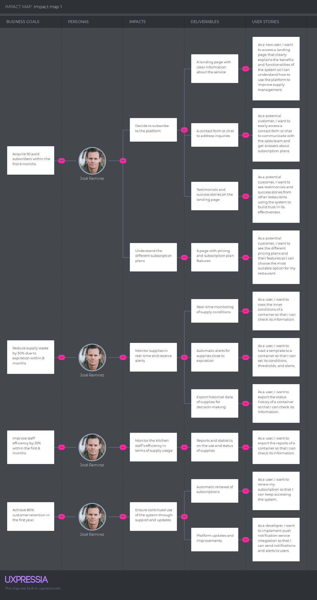
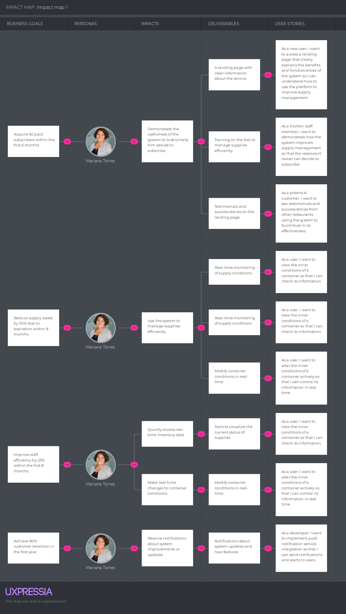

# Capítulo III: Requierements Specification

## 3.1. To-Be Scenario Mapping.

El To-Be Scenario Mapping esboza el futuro idealizado de la experiencia del usuario con el producto "DittoBox". Este mapa detalla cómo se anticipa que los usuarios interactúen con la aplicación una vez implementadas las mejoras y optimizaciones basadas en los hallazgos del análisis As-is. A continuación, se describe cómo esta visión futura mejora la interacción actual y facilita una experiencia más enriquecedora y efectiva para el usuario.

-**Segmento Objetivo:** Dueños del restaurante.

En este proceso para dueños de restaurantes, destacamos cómo pueden adquirir y gestionar eficientemente sus almacenamientos "Dittobox" a través de nuestra plataforma web y móvil, asegurando un control preciso sobre la frescura y calidad de los insumos con ayuda de nuestra aplicación. Este enfoque no solo mejora la eficiencia operativa, sino que también garantiza el cumplimiento de estándares de calidad y seguridad alimentaria.

-**Segmento Objetivo:** Personal de cocina.

El proceso "To-be" para el personal de cocina resalta la facilidad y la funcionalidad de nuestra solución para manejar las condiciones de almacenamiento directamente en la cocina. Esto permite a los chefs y personal de cocina un manejo más intuitivo y directo de los insumos, mejorando la preparación de alimentos y asegurando la utilización óptima de cada producto almacenado en "Dittobox"

## 3.2. User Stories.

| Epic/Story Id | Título | Descripción | Relacionado con |
|---------------|--------|-------------|-----------------|
| DIT-1 | Account authentication | As a Developer, I want to add user registration backend through API so that users can create, authenticate, and manage their accounts securely |  |
| DIT-2 | Account Authorization | As a Developer, I want to add a role-based access control system through API so that I can define roles and permissions, allowing users to have different access levels within the system |  |
| DIT-3 | Account Management | As a Developer, I want to add account management methods through API so that users can view, update, and manage their personal account information effectively|  |
| DIT-4 | Subscription Management | As a Developer, I want to add subscription management methods through API so that users can upgrade, downgrade, renew, or cancel their subscriptions |  |
| DIT-5 | Group Management | As a Developer, I want to add a group management system through API so that users can create, edit, view, and delete groups to manage resources inside them. |  |
| DIT-6 | Worker Management | As a Developer, I want to add worker registration and removal functionality through API so that users can assign and revoke access to workers within groups to manage shared resources |  |
| DIT-7 | Container Management | As a Developer, I want to add container management functionality through API so that users can register, link, unlink, and manage containers and their conditions within groups. |  |
| DIT-8 | Template Management | As a Developer, I want to add template management features through API so that users can create, configure, delete, and load templates into containers to manage conditions and alerts. |  |
| DIT-9 | Security and compliance | As a Developer, I want to add security measures such as encryption, data protection, and compliance with regulations (e.g., GDPR) through API so that user data is secure and the system complies with legal requirements. |  |
| DIT-10 | DevOps & CI/CD | As a Developer, I want to add continuous integration and continuous deployment (CI/CD) pipelines through API so that the application can be built, tested, and deployed automatically and efficiently. |  |
| DIT-11 | External Services Integration | As a Developer, I want to add external services (e.g., payment gateways, messaging services, or third-party APIs) through API so that users can access additional features or make transactions seamlessly.  Scenario: Integrate payment gateway Given The Endpoint "/api/v1/integrations/payment" is available When A Post Request is sent with values for serviceId and configuration Then A Response is received with Status 201 And A Payment Gateway Integration Resource is included in Response Body, with a new Id and registered values for serviceId and configuration.  Scenario: Integrate messaging service Given The Endpoint "/api/v1/integrations/messaging" is available When A Post Request is sent with values for serviceId and configuration Then A Response is received with Status 201 And A Messaging Service Integration Resource is included in Response Body, with a new Id and registered values for serviceId and configuration. |  |
| DIT-12 | Create REST endpoint for user management | As a Developer, I want to add a REST endpoint for user account management through API so that users can register and manage their accounts.  Scenario: Create a new user account Given The Endpoint "/api/v1/accounts" is available When A Post Request is sent with values for username, password, and email Then A Response is received with Status 201 And A User Account Resource is included in Response Body, with a new Id and registered values for username, password, and email.  Scenario: Update user account information Given The Endpoint "/api/v1/accounts" is available When A Put Request is sent with updated values for username, email, and password Then A Response is received with Status 200 And The User Account Resource is updated with the new values. | DIT-1 |
| DIT-13 | Create REST endpoint for account management | As a Developer, I want to add a REST endpoint for subscription account management through API so that users can register and manage their subscription accounts.  Scenario: Create a new subscription account Given The Endpoint "/api/v1/subscriptions" is available When A Post Request is sent with values for userId and subscriptionTier Then A Response is received with Status 201 And A Subscription Account Resource is included in Response Body, with a new Id and registered values for userId and subscriptionTier.  Scenario: Update subscription account information Given The Endpoint "/api/v1/subscriptions" is available When A Put Request is sent with updated values for subscriptionTier Then A Response is received with Status 200 And The Subscription Account Resource is updated with the new values. | DIT-1 |
| DIT-14 | Implement JWT-based authentication | As a Developer, I want to add JWT-based authentication through API so that users can securely log in to the system.  Scenario: Authenticate user with JWT Given The Endpoint "/api/v1/authenticate" is available When A Post Request is sent with values for username and password Then A Response is received with Status 200 And A JWT Token is included in Response Body, with the userId and expiration time.  Scenario: Authenticate user with invalid credentials Given The Endpoint "/api/v1/authenticate" is available When A Post Request is sent with invalid values for username and password Then A Response is received with Status 401 And A Message is included in Response Body, with value "Invalid credentials." | DIT-1 |
| DIT-15 | Secure login requests with encryption | As a Developer, I want to add secure login requests with encryption through API so that user credentials are protected.  Scenario: Encrypt login request Given The Endpoint "/api/v1/security/encrypt" is available When A Post Request is sent with values for username and password Then A Response is received with Status 200 And The Login Request is encrypted and sent securely.  Scenario: Decrypt login request Given The Endpoint "/api/v1/security/decrypt" is available When A Post Request is sent with encrypted values for username and password Then A Response is received with Status 200 And The Login Request is decrypted and processed. | DIT-1 |
| DIT-16 | Implement session handling and token expiration policies | As a Developer, I want to add session handling and token expiration policies through API so that user sessions are managed securely.  Scenario: Handle user session Given The Endpoint "/api/v1/sessions" is available When A Post Request is sent with values for userId and sessionToken Then A Response is received with Status 200 And The User Session is created and managed securely.  Scenario: Expire user session Given The Endpoint "/api/v1/sessions/expire" is available When A Post Request is sent with the sessionToken Then A Response is received with Status 200 And The User Session is expired and invalidated. | DIT-1 |
| DIT-17 | Implement email-based password recovery | As a Developer, I want to add email-based password recovery through API so that users can reset their passwords.  Scenario: Send password recovery email Given The Endpoint "/api/v1/password/recover" is available When A Post Request is sent with the user's email Then A Response is received with Status 200 And A Password Recovery Email is sent to the user's email address.  Scenario: Reset password with recovery token Given The Endpoint "/api/v1/password/reset" is available When A Post Request is sent with the recovery token and new password Then A Response is received with Status 200 And The User's Password is reset successfully. | DIT-1 |
| DIT-18 | Implement logic for deleting accounts | As a Developer, I want to add logic for deleting accounts through API so that users can remove their data from the system.  Scenario: Delete user account Given The Endpoint "/api/v1/accounts/delete" is available When A Delete Request is sent with the userId Then A Response is received with Status 200 And The User Account is deleted from the system.  Scenario: Attempt to delete non-existent account Given The Endpoint "/api/v1/accounts/delete" is available When A Delete Request is sent with a non-existent userId Then A Response is received with Status 404 And A Message is included in Response Body, with value "User account not found." | DIT-1 |
| DIT-19 | Create a new user in the web app | As an user, I want to create a new account so that I can access the system.  Scenario 1: Create Account via Web App Given a user fills out the registration form with valid details, When the form is submitted, Then a new user account should be created, and the user should receive a confirmation message.  | DIT-1 |
| DIT-20 | Create a new user for another user in the web app | As an user, I want to create a new account for another user so that they can access the system.  Scenario 1: Admin Creates User Account Given an admin enters details to create a new user account, When the request is processed, Then a new user account should be created, and the user should be notified.  | DIT-1 |
| DIT-21 | Link an user to a account in the web app | As an user, I want to link my account to a subscription account so that I can access the system within the terms of the subscription signed.  Scenario 1: Link User to Subscription Given a user and subscription account exist, When the link request is processed, Then the user should be linked to the subscription account.  | DIT-1 |
| DIT-22 | Log in to an existing account in the web app | As an user, I want to log in to an existing account so that I can access the system.  Scenario 1: User Login Given a user provides valid credentials, When the login request is processed, Then the user should be authenticated, and a session or token should be created.  | DIT-1 |
| DIT-23 | Log out of an account in the web app | As an user, I want to log out of an account so that I can leave the system.  Scenario 1: User Logout Given a user is logged in, When the logout request is processed, Then the user should be logged out, and the session or token should be invalidated.  | DIT-1 |
| DIT-24 | Recover a password in the web app | As an user, I want to recover a password so that I can access my account.  Scenario 1: Password Recovery Request Given a user requests password recovery, When the request is processed, Then a password reset email should be sent.  | DIT-1 |
| DIT-25 | Change a password in the web app | As an user, I want to change a password after starting the recovery process so that I can access my account.  Scenario 1: Change Password Given a user submits a new password, When the change request is processed, Then the password should be updated, and a confirmation response should be returned.  | DIT-1 |
| DIT-26 | Delete an account in the web app | As an user, I want to delete an account so that I can leave the system.  Scenario 1: Delete User Account Given a user requests account deletion, When the request is processed, Then the user account should be removed from the system.  | DIT-1 |
| DIT-27 | Delete an user in the web app | As an user, I want to delete another user account so that they can  Scenario 1: Admin Deletes User Account Given an admin requests to delete a user account, When the request is processed, Then the user account should be deleted, and all associated data should be removed.  | DIT-1 |
| DIT-28 | Unlink an user from a account in the web app | As an user, I want to unlink my account from a subscription account so that I can terminate the subscription.  Scenario 1: Unlink User from Subscription Given a user is linked to a subscription account, When the unlink request is processed, Then the user should be removed from the subscription account.  | DIT-1 |

| DIT-29 | Define roles and permissions in the system | As a Developer, I want to add roles and permissions in the system through API so that I can implement role-based access control.  Scenario: Define a new role Given The Endpoint "/api/v1/roles" is available When A Post Request is sent with values for roleName and permissions Then A Response is received with Status 201 And A Role Resource is included in Response Body, with a new Id and registered values for roleName and permissions.  Scenario: Update existing role permissions Given The Endpoint "/api/v1/roles" is available When A Put Request is sent with updated values for roleName and permissions Then A Response is received with Status 200 And The Role Resource is updated with the new permissions. | DIT-2 |
| DIT-30 | Implement middleware for role-based access control | As a Developer, I want to add middleware for role-based access control through API so that I can restrict access to resources based on user roles.  Scenario: Implement middleware for role-based access Given The Endpoint "/api/v1/middleware/role" is available When A Post Request is sent with values for roleId and resource Then A Response is received with Status 201 And A Middleware Resource is included in Response Body, with a new Id and registered values for roleId and resource.  Scenario: Restrict access to resource based on role Given The Endpoint "/api/v1/middleware/role" is available When A Get Request is sent with the roleId Then A Response is received with Status 200 And The Access to the resource is restricted based on the role. | DIT-2 |
| DIT-31 | Implement REST endpoints for granting and revoking privileges | As a Developer, I want to add REST endpoints for granting and revoking privileges through API so that users can manage their permissions.  Scenario: Grant privilege to a user Given The Endpoint "/api/v1/privileges/grant" is available When A Post Request is sent with values for userId and privilege Then A Response is received with Status 201 And A Privilege Resource is included in Response Body, with the userId and granted privilege.  Scenario: Revoke privilege from a user Given The Endpoint "/api/v1/privileges/revoke" is available When A Post Request is sent with values for userId and privilege Then A Response is received with Status 200 And The Privilege Resource is marked as revoked. | DIT-2 |
| DIT-32 | Implement inter-group privileges | As a Developer, I want to add inter-group privileges through API so that users can access resources across different groups.  Scenario: Assign inter-group privilege Given The Endpoint "/api/v1/privileges/inter-group" is available When A Post Request is sent with values for userId, groupId, and privilege Then A Response is received with Status 201 And An Inter-Group Privilege Resource is included in Response Body, with the userId, groupId, and assigned privilege.  Scenario: Revoke inter-group privilege Given The Endpoint "/api/v1/privileges/inter-group" is available When A Delete Request is sent with values for userId and group| DIT-2|
| DIT-33 | Grant privileges to an user in the web app | As an user, I want to grant privileges to another user so that they can execute specific actions within the subscription account.  Scenario 1: User with admin role grants privileges to another user Given a user with admin role When the user selects another user in the web app And chooses specific privileges to grant Then the selected user should have the updated privileges in the system Scenario 2: Insufficient permissions to grant privileges Given a user without admin role When the user attempts to grant privileges to another user Then the system should deny the action and display an error message  | DIT-2 |
| DIT-34 | Revoke privileges from an user in the web app | As an user, I want to revoke privileges from another user so that they can execute specific actions within the subscription account.  Scenario 1: Admin user revokes privileges from another user Given a user with admin role When the user selects another user in the web app And chooses specific privileges to revoke Then the selected user should no longer have the revoked privileges in the system Scenario 2: Revoke last privilege Given a user with admin role When the user revokes the last privilege of another user Then the system should notify the admin that the user will lose all access rights  | DIT-2 |
| DIT-35 | Grant intergroup privileges in the web app | As an user, I want to grant privileges to another user to execute actions within all the groups in the subscription account so that they can execute specific actions within the subscription account.  Scenario 1: Admin grants intergroup privileges to a user Given a user with admin role When the user selects a specific group and another user And grants intergroup privileges Then the selected user should have intergroup access as defined Scenario 2: Conflict with existing privileges Given a user with existing group privileges When the admin attempts to grant conflicting intergroup privileges Then the system should warn of potential conflicts and allow the admin to proceed or cancel  | DIT-2 |
| DIT-36 | Revoke intergroup privileges in the web app | As an user, I want to revoke privileges from another user to execute actions within all the groups in the subscription account so that they can  Scenario 1: Admin revokes intergroup privileges from a user Given a user with intergroup privileges When the admin revokes these privileges in the web app Then the user should lose access to intergroup functionalities Scenario 2: Dependent privileges Given a user with intergroup and other dependent privileges When the admin revokes the intergroup privileges Then the system should alert the admin about the dependent privileges that might be affected  | DIT-2 |
| DIT-37 | Grant subscription privileges in the web app | As an user, I want to grant privileges to another user to execute actions in the subscription configuration so that they can execute specific actions within the subscription account.  Scenario 1: Admin grants subscription privileges to a user Given a user with admin role When the user selects a subscription and assigns privileges to another user Then the user should have access to subscription-related functionalities Scenario 2: Subscription privileges conflict Given an active subscription with specific restrictions When the admin grants conflicting subscription privileges Then the system should notify the admin about the conflict and suggest solutions  | DIT-2 |
| DIT-38 | Revoke subscription privileges in the web app | As an user, I want to revoke privileges from another user to execute actions in the subscription configuration so that they can  Scenario 1: Admin revokes subscription privileges Given a user with subscription privileges When the admin revokes these privileges in the web app Then the user should lose access to subscription-related functionalities Scenario 2: Revoke without affecting access Given a user with multiple subscription-related privileges When the admin revokes only specific privileges Then the user should retain access to other functionalities not related to the revoked privileges  | DIT-2 |
| DIT-39 | Implement REST endpoints for account information management | As a Developer, I want to add REST endpoints for account information management through API so that users can view and update their account details.  Scenario: Get user account information Given The Endpoint "/api/v1/accounts" is available When A Get Request is sent with the userId Then A Response is received with Status 200 And The User Account Information is included in Response Body.  Scenario: Update user account information Given The Endpoint "/api/v1/accounts" is available When A Put Request is sent with updated values for username, email, and password Then A Response is received with Status 200 And The User Account Information is updated with the new values. | DIT-3 |
| DIT-40 | Implement account information validation | As a Developer, I want to add account information validation through API so that user data is verified and stored securely.  Scenario: Validate user account information Given The Endpoint "/api/v1/validation" is available When A Post Request is sent with values for username, email, and password Then A Response is received with Status 200 And The User Account Information is validated and stored securely.  Scenario: Validate user account with invalid email Given The Endpoint "/api/v1/validation" is available When A Post Request is sent with an invalid email format Then A Response is received with Status 400 And A Message is included in Response Body, with value "Invalid email format." | DIT-3 |
| DIT-41 | View account information in the web app | As an user, I want to view my account information so that I can check the accuracy of my information.  Scenario 1: View account information as an authenticated user with appropriate permissions Given that I am an authenticated user with permissions to view account information, When I navigate to the account management page in the web application, Then I should see all information associated with my account, including name, email, assigned roles, and other relevant details. Scenario 2: Attempt to view account information without appropriate permissions Given that I am an authenticated user but do not have permissions to view account information, When I try to access the account management page in the web application, Then I should receive an error message indicating that I do not have permission to view this information.  | DIT-3 |
| DIT-42 | Update account information in the web app | As an user, I want to update my account information so that I can keep my information up to date.  Scenario 1: Successfully update account information Given that I am an authenticated user with permissions to update account information, When I navigate to the account management page in the web application, And I update the account name and associated email, Then I should see a success message confirming that the account information has been updated correctly. Scenario 2: Validation failure when attempting to update account information Given that I am an authenticated user with permissions to update account information, When I try to update the account with an email in an invalid format, Then I should receive an error message indicating that the email format is incorrect and that the update has failed. Scenario 3: Attempt to update account information without appropriate permissions Given that I am an authenticated user but do not have permissions to update account information, When I try to change the account name in the web application, Then I should receive an error message indicating that I do not have permission to perform this action.  | DIT-3 |
| DIT-43 | Define database schema for subscription tiers | As a Developer, I want to define a database schema for subscription tiers through API so that users can select and manage their subscription plans effectively.  Scenario: Define subscription tiers Given The Endpoint "/api/v1/schema" is available When A Post Request is sent with values for subscriptionTier and features Then A Response is received with Status 201 And The Subscription Tier Schema is created with the specified features.  Scenario: Update subscription tier schema Given The Endpoint "/api/v1/schema" is available When A Put Request is sent with updated values for subscriptionTier and features Then A Response is received with Status 200 And The Subscription Tier Schema is updated with the new features. | DIT-4 |
| DIT-44 | Automate subscription lifecycle management | As a Developer, I want to automate subscription lifecycle management through API so that users can manage their subscriptions seamlessly.  Scenario: Automate subscription renewal Given The Endpoint "/api/v1/automation/renewal" is available When A Post Request is sent with the userId and subscriptionTier Then A Response is received with Status 200 And The Subscription is renewed automatically.  Scenario: Automate subscription cancellation Given The Endpoint "/api/v1/automation/cancel" is available When A Post Request is sent with the userId Then A Response is received with Status 200 And The Subscription is canceled automatically. | DIT-4 |
| DIT-45 | Upgrade a subscription in the web app | As an user, I want to upgrade my subscription so that I can access more features.  Scenario 1: Successful Upgrade Given that a user with an active subscription wants to upgrade, When the user selects a higher subscription tier on the web app and confirms the upgrade, Then the system should process the payment, apply the new tier immediately, and notify the user of the successful upgrade. Scenario 2: Failed Payment during Upgrade Given that a user attempts to upgrade their subscription, When the payment fails due to insufficient funds or a declined card, Then the system should revert to the current subscription, notify the user of the failure, and suggest updating payment details.  | DIT-4 |
| DIT-46 | Downgrade a subscription in the web app | As an user, I want to downgrade my subscription so that I can access fewer features.  Scenario 1: Successful Downgrade Given that a user wants to downgrade their subscription, When the user selects a lower subscription tier on the web app and confirms the downgrade, Then the system should schedule the downgrade for the next billing cycle, apply the changes, and notify the user of the downgrade. Scenario 2: Immediate Downgrade Option Given that a user wants to immediately downgrade their subscription, When the user selects this option, Then the system should immediately apply the downgrade, refund the difference (if applicable), and adjust features and access accordingly.  | DIT-4 |
| DIT-47 | Renew a subscription in the web app | As an user, I want to renew my subscription so that I can keep accessing the system.  Scenario 1: Manual Renewal Given that a user's subscription is about to expire, When the user manually initiates a renewal in the web app, Then the system should process the renewal payment and extend the subscription for the selected period. Scenario 2: Auto-Renewal Option Given that a user's subscription is set to auto-renew, When the renewal date arrives, Then the system should automatically renew the subscription, charge the stored payment method, and notify the user of the successful renewal.  | DIT-4 |
| DIT-48 | Cancel a subscription in the web app | As an user, I want to cancel my subscription so that I can leave the system.  Scenario 1: Immediate Cancellation Given that a user wants to cancel their subscription, When the user confirms cancellation on the web app, Then the system should immediately cancel the subscription, revoke access to premium features, and set the subscription status to Inactive. Scenario 2: End-of-Term Cancellation Given that a user wants to cancel their subscription at the end of the current term, When the user selects this option, Then the system should schedule the cancellation for the end of the term, maintain the current features until then, and notify the user of the scheduled cancellation.  | DIT-4 |
| DIT-49 | Implement REST endpoints for group management | As a Developer, I want to add REST endpoints for group management through API so that users can create, edit, and delete groups effectively.  Scenario: Create a new group Given The Endpoint "/api/v1/groups" is available When A Post Request is sent with values for groupName and description Then A Response is received with Status 201 And A Group Resource is included in Response Body, with a new Id and registered values for groupName and description.  Scenario: Update group information Given The Endpoint "/api/v1/groups" is available When A Put Request is sent with updated values for groupName and description Then A Response is received with Status 200 And The Group Resource is updated with the new values. | DIT-5 |
| DIT-50 | Implement group ownership and user association logic | As a Developer, I want to add group ownership and user association logic through API so that users can manage groups effectively.  Scenario: Assign group ownership Given The Endpoint "/api/v1/groups/ownership" is available When A Post Request is sent with values for groupId and userId Then A Response is received with Status 201 And The Group Ownership is assigned to the user.  Scenario: Remove group ownership Given The Endpoint "/api/v1/groups/ownership" is available When A Delete Request is sent with the groupId and userId Then A Response is received with Status 200 And The Group Ownership is removed from the user. | DIT-5 |
| DIT-51 | Create a group in the web app | As an user, I want to create a group so that I can organize my resources.  Scenario 1: Creating a Group with Valid Data Given the user has logged into the web app and has appropriate permissions When the user navigates to the "Create Group" form and submits valid data (e.g., group name, description) Then the group should be successfully created and appear in the list of groups associated with the account. Scenario 2: Attempting to Create a Group with Invalid Data Given the user is attempting to create a group in the web app When the user submits the form with invalid or incomplete data (e.g., missing group name) Then the system should display validation errors and prevent the group from being created.  | DIT-5 |
| DIT-52 | Delete a group in the web app | As an user, I want to delete a group so that I can remove it from the system.  Scenario 1: Deleting a Group with Confirmation Given the user has appropriate permissions and has selected a group to delete When the user confirms the deletion action in the web app Then the group should be permanently deleted, and any associated users should be notified. Scenario 2: Canceling Group Deletion Given the user is in the process of deleting a group When the user cancels the deletion action before confirming Then the group should remain intact, and no changes should occur.  | DIT-5 |
| DIT-53 | Edit a group in the web app | As an user, I want to edit a group so that I can update its information.  Scenario 1: Editing Group Details Successfully Given the user has permissions to manage a group When the user navigates to the group edit page in the web app and makes changes to the group details Then the changes should be saved, and the updated details should be reflected in the group information. Scenario 2: Editing Group with Invalid Data Given the user is editing a group in the web app When the user submits invalid data (e.g., blank group name) Then the system should display an error message and not save the changes.  | DIT-5 |
| DIT-54 | View a group in the web app | As an user, I want to view a group so that I can check its information.  Scenario 1: Viewing Group Details Given the user has appropriate permissions When the user selects a group from the list of groups in the web app Then the group details should be displayed, including group name, description, members, and associated privileges. Scenario 2: Insufficient Permissions to View Group Given the user is trying to view a group in the web app When the user does not have the necessary permissions Then the system should display an error or redirect the user to an appropriate page.  | DIT-5 |
| DIT-55 | Register a worker to a group in the web app | As an user, I want to register another user as a worker in a group so that they can access the resources.  Scenario 1: Successful Registration of a Worker to a Group Given the user is logged into the web app and has permissions to manage workers When the user navigates to the "Group Management" section and selects the option to add a worker to a group And the user enters valid worker details and selects the appropriate group Then the worker should be successfully registered to the group, and the group's member list should be updated to include the new worker. Scenario 2: Attempt to Register a Worker with Invalid Details Given the user is logged into the web app and has permissions to manage workers When the user tries to add a worker with incomplete or invalid information (e.g., missing worker ID or name) Then the system should display an error message indicating that the registration failed due to invalid details.  | DIT-6 |
| DIT-56 | Remove a worker from a group in the web app | As an user, I want to remove another user from a group so that they can  Scenario 1: Successfully Removing a Worker from a Group Given the user is logged into the web app and has permissions to manage workers When the user navigates to the "Group Management" section and selects the option to remove a worker from a group And the user selects the worker and confirms the removal Then the worker should be successfully removed from the group, and the group's member list should be updated accordingly. Scenario 2: Attempt to Remove a Worker Who is Not in the Group Given the user is logged into the web app and has permissions to manage workers When the user attempts to remove a worker who is not currently in the group Then the system should display an error message indicating that the worker is not part of the group.  | DIT-6 |
| DIT-57 | Implement container linkage logic | As a Developer, I want to add container linkage logic through API so that users can link and unlink containers effectively.  Scenario: Link container to group Given The Endpoint "/api/v1/containers/link" is available When A Post Request is sent with values for containerId and groupId Then A Response is received with Status 201 And The Container is linked to the group.  Scenario: Unlink container from group Given The Endpoint "/api/v1/containers/unlink" is available When A Delete Request is sent with the containerId and groupId Then A Response is received with Status 200 And The Container is unlinked from the group. | DIT-7 |
| DIT-58 | Implement time-series database | As a Developer, I want to add a time-series database through API so that users can store and retrieve time-series data efficiently.  Scenario: Store time-series data Given The Endpoint "/api/v1/timeseries/store" is available When A Post Request is sent with values for data and timestamp Then A Response is received with Status 201 And The Time-Series Data is stored in the database.  Scenario: Retrieve time-series data Given The Endpoint "/api/v1/timeseries/retrieve" is available When A Get Request is sent with the timestamp range Then A Response is received with Status 200 And The Time-Series Data is retrieved from the database. | DIT-7 |
| DIT-59 | Implement real-time data retrieval | As a Developer, I want to add real-time data retrieval through API so that users can access real-time data streams efficiently.  Scenario: Retrieve real-time data Given The Endpoint "/api/v1/realtime/retrieve" is available When A Get Request is sent with the data source Then A Response is received with Status 200 And The Real-Time Data Stream is retrieved from the source.  Scenario: Stream real-time data Given The Endpoint "/api/v1/realtime/stream" is available When A Post Request is sent with the data source and destination Then A Response is received with Status 200 And The Real-Time Data Stream is streamed to the destination. | DIT-7|
| DIT-60 | Implement data export and formatting logic | As a Developer, I want to add data export and formatting logic through API so that users can export and format data efficiently.  Scenario: Export data to CSV Given The Endpoint "/api/v1/export/csv" is available When A Post Request is sent with values for data and format Then A Response is received with Status 200 And The Data is exported to a CSV file.  Scenario: Format data as JSON Given The Endpoint "/api/v1/format/json" is available When A Post Request is sent with values for data and format Then A Response is received with Status 200 And The Data is formatted as JSON. | DIT-7 |
| DIT-61 | Implement threshold-based alerting logic | As a Developer, I want to add threshold-based alerting logic through API so that users can set alerts based on predefined thresholds.  Scenario: Set threshold alert Given The Endpoint "/api/v1/alerts/threshold" is available When A Post Request is sent with values for data, threshold, and alert message Then A Response is received with Status 201 And The Threshold Alert is set for the data with the specified threshold and message.  Scenario: Receive threshold alert Given The Endpoint "/api/v1/alerts/threshold" is available When A Get Request is sent with the data and threshold range Then A Response is received with Status 200 And The Threshold Alert is triggered for the data within the threshold range. | DIT-7 |
| DIT-62 | Implement anomaly detection logic | As a Developer, I want to add anomaly detection logic through API so that users can detect anomalies in their data efficiently.  Scenario: Detect anomalies in data Given The Endpoint "/api/v1/anomaly/detect" is available When A Post Request is sent with values for data and anomaly threshold Then A Response is received with Status 200 And The Anomalies in the Data are detected based on the threshold.  Scenario: Receive anomaly alert Given The Endpoint "/api/v1/anomaly/alert" is available When A Get Request is sent with the anomaly data Then A Response is received with Status 200 And The Anomaly Alert is triggered for the data. | DIT-7|
| DIT-63 | Implement data Implement data receiving logic | As a Developer, I want to add data receiving logic through API so that users can send data to the system efficiently.  Scenario: Receive data from external source Given The Endpoint "/api/v1/data/receive" is available When A Post Request is sent with values for data and source Then A Response is received with Status 201 And The Data is received from the external source and stored in the system.  Scenario: Process received data Given The Endpoint "/api/v1/data/process" is available When A Get Request is sent with the data source Then A Response is received with Status 200 And The Data is processed and stored in the system. | DIT-7 |
| DIT-64 | Implement data processing logic | As a Developer, I want to add data processing logic through API so that users can process data efficiently.  Scenario: Process data for analysis Given The Endpoint "/api/v1/data/process" is available When A Post Request is sent with values for data and analysis type Then A Response is received with Status 200 And The Data is processed for the specified analysis type.  Scenario: Analyze processed data Given The Endpoint "/api/v1/data/analyze" is available When A Get Request is sent with the processed data Then A Response is received with Status 200 And The Analysis Results are returned for the processed data. | DIT-7 |
| DIT-65 | Implement data storage logic | As a Developer, I want to add data storage logic through API so that users can store and retrieve data efficiently.  Scenario: Store data in database Given The Endpoint "/api/v1/data/store" is available When A Post Request is sent with values for data and database Then A Response is received with Status 201 And The Data is stored in the specified database.  Scenario: Retrieve data from database Given The Endpoint "/api/v1/data/retrieve" is available When A Get Request is sent with the data source Then A Response is received with Status 200 And The Data is retrieved from the database. | DIT-7 |
| DIT-66 | Implement container actions logic | As a Developer, I want to add container actions logic through API so that users can perform actions on containers efficiently.  Scenario: Start container Given The Endpoint "/api/v1/containers/start" is available When A Post Request is sent with the containerId Then A Response is received with Status 200 And The Container is started successfully.  Scenario: Stop container Given The Endpoint "/api/v1/containers/stop" is available When A Post Request is sent with the containerId Then A Response is received with Status 200 And The Container is stopped successfully. | DIT-7 || DIT-57 | Implement container linkage logic | As a Developer, I want to add container linkage logic through API so that users can link and unlink containers effectively.  Scenario: Link container to group Given The Endpoint "/api/v1/containers/link" is available When A Post Request is sent with values for containerId and groupId Then A Response is received with Status 201 And The Container is linked to the group.  Scenario: Unlink container from group Given The Endpoint "/api/v1/containers/unlink" is available When A Delete Request is sent with the containerId and groupId Then A Response is received with Status 200 And The Container is unlinked from the group. | DIT-7 |
| DIT-58 | Implement time-series database | As a Developer, I want to add a time-series database through API so that users can store and retrieve time-series data efficiently.  Scenario: Store time-series data Given The Endpoint "/api/v1/timeseries/store" is available When A Post Request is sent with values for data and timestamp Then A Response is received with Status 201 And The Time-Series Data is stored in the database.  Scenario: Retrieve time-series data Given The Endpoint "/api/v1/timeseries/retrieve" is available When A Get Request is sent with the timestamp range Then A Response is received with Status 200 And The Time-Series Data is retrieved from the database. | DIT-7 |
| DIT-59 | Implement real-time data retrieval | As a Developer, I want to add real-time data retrieval through API so that users can access real-time data streams efficiently.  Scenario: Retrieve real-time data Given The Endpoint "/api/v1/realtime/retrieve" is available When A Get Request is sent with the data source Then A Response is received with Status 200 And The Real-Time Data Stream is retrieved from the source.  Scenario: Stream real-time data Given The Endpoint "/api/v1/realtime/stream" is available When A Post Request is sent with the data source and destination Then A Response is received with Status 200 And The Real-Time Data Stream is streamed to the destination. | DIT-7|
| DIT-60 | Implement data export and formatting logic | As a Developer, I want to add data export and formatting logic through API so that users can export and format data efficiently.  Scenario: Export data to CSV Given The Endpoint "/api/v1/export/csv" is available When A Post Request is sent with values for data and format Then A Response is received with Status 200 And The Data is exported to a CSV file.  Scenario: Format data as JSON Given The Endpoint "/api/v1/format/json" is available When A Post Request is sent with values for data and format Then A Response is received with Status 200 And The Data is formatted as JSON. | DIT-7 |
| DIT-61 | Implement threshold-based alerting logic | As a Developer, I want to add threshold-based alerting logic through API so that users can set alerts based on predefined thresholds.  Scenario: Set threshold alert Given The Endpoint "/api/v1/alerts/threshold" is available When A Post Request is sent with values for data, threshold, and alert message Then A Response is received with Status 201 And The Threshold Alert is set for the data with the specified threshold and message.  Scenario: Receive threshold alert Given The Endpoint "/api/v1/alerts/threshold" is available When A Get Request is sent with the data and threshold range Then A Response is received with Status 200 And The Threshold Alert is triggered for the data within the threshold range. | DIT-7 |
| DIT-62 | Implement anomaly detection logic | As a Developer, I want to add anomaly detection logic through API so that users can detect anomalies in their data efficiently.  Scenario: Detect anomalies in data Given The Endpoint "/api/v1/anomaly/detect" is available When A Post Request is sent with values for data and anomaly threshold Then A Response is received with Status 200 And The Anomalies in the Data are detected based on the threshold.  Scenario: Receive anomaly alert Given The Endpoint "/api/v1/anomaly/alert" is available When A Get Request is sent with the anomaly data Then A Response is received with Status 200 And The Anomaly Alert is triggered for the data. | DIT-7|
| DIT-63 | Implement data Implement data receiving logic | As a Developer, I want to add data receiving logic through API so that users can send data to the system efficiently.  Scenario: Receive data from external source Given The Endpoint "/api/v1/data/receive" is available When A Post Request is sent with values for data and source Then A Response is received with Status 201 And The Data is received from the external source and stored in the system.  Scenario: Process received data Given The Endpoint "/api/v1/data/process" is available When A Get Request is sent with the data source Then A Response is received with Status 200 And The Data is processed and stored in the system. | DIT-7 |
| DIT-64 | Implement data processing logic | As a Developer, I want to add data processing logic through API so that users can process data efficiently.  Scenario: Process data for analysis Given The Endpoint "/api/v1/data/process" is available When A Post Request is sent with values for data and analysis type Then A Response is received with Status 200 And The Data is processed for the specified analysis type.  Scenario: Analyze processed data Given The Endpoint "/api/v1/data/analyze" is available When A Get Request is sent with the processed data Then A Response is received with Status 200 And The Analysis Results are returned for the processed data. | DIT-7 |
| DIT-65 | Implement data storage logic | As a Developer, I want to add data storage logic through API so that users can store and retrieve data efficiently.  Scenario: Store data in database Given The Endpoint "/api/v1/data/store" is available When A Post Request is sent with values for data and database Then A Response is received with Status 201 And The Data is stored in the specified database.  Scenario: Retrieve data from database Given The Endpoint "/api/v1/data/retrieve" is available When A Get Request is sent with the data source Then A Response is received with Status 200 And The Data is retrieved from the database. | DIT-7 |
| DIT-66 | Implement container actions logic | As a Developer, I want to add container actions logic through API so that users can perform actions on containers efficiently.  Scenario: Start container Given The Endpoint "/api/v1/containers/start" is available When A Post Request is sent with the containerId Then A Response is received with Status 200 And The Container is started successfully.  Scenario: Stop container Given The Endpoint "/api/v1/containers/stop" is available When A Post Request is sent with the containerId Then A Response is received with Status 200 And The Container is stopped successfully. | DIT-7 |
| DIT-67 | Unlink a container from an account in the web app | As an user, I want to unlink a container from my account so that I can  Scenario 1: Successfully Unlinking a Container from an Account Given the user is logged into the web app and has permissions to manage containers When the user navigates to the "Container Management" section and selects the option to unlink a container from an account And the user selects the container and confirms the unlinking Then the container should be successfully unlinked from the account, and the account's list of containers should be updated accordingly. Scenario 2: Attempt to Unlink a Nonexistent Container Given the user is logged into the web app and has permissions to manage containers When the user tries to unlink a container that does not exist or is already unlinked Then the system should display an error message indicating that the container cannot be found or is already unlinked.  | DIT-7 |
| DIT-68 | Register a container to a group in the web app | As an user, I want to register a container to a group so that I can access its information.  Scenario 1: Successfully Registering a Container to a Group Given the user is logged into the web app and has permissions to manage containers When the user navigates to the "Group Management" section and selects the option to register a container to a group And the user selects the container and the group to which it should be registered Then the container should be successfully registered to the group, and the group's container list should be updated to include the new container. Scenario 2: Attempt to Register a Container to a Nonexistent Group Given the user is logged into the web app and has permissions to manage containers When the user tries to register a container to a group that does not exist Then the system should display an error message indicating that the group does not exist.  | DIT-7 |
| DIT-69 | Remove a container from a group in the web app | As an user, I want to remove a container from a group so that I can  Scenario 1: Successfully Removing a Container from a Group Given the user is logged into the web app and has permissions to manage containers When the user navigates to the "Group Management" section and selects the option to remove a container from a group And the user selects the container and confirms the removal Then the container should be successfully removed from the group, and the group's container list should be updated accordingly. Scenario 2: Attempt to Remove a Container Not in the Group Given the user is logged into the web app and has permissions to manage containers When the user tries to remove a container that is not currently in the group Then the system should display an error message indicating that the container is not part of the group.  | DIT-7 |
| DIT-70 | View container status in the web app | As an user, I want to view the status of a container so that I can check its information.  Scenario 1: Successfully Viewing Container Status Given the user is logged into the web app and has permissions to view container statuses When the user navigates to the "Container Management" section and selects a container to view its status Then the current status of the container should be displayed, including details such as temperature, humidity, and other relevant metrics. Scenario 2: Attempt to View Status of a Nonexistent Container Given the user is logged into the web app and has permissions to view container statuses When the user tries to view the status of a container that does not exist Then the system should display an error message indicating that the container cannot be found.  | DIT-7 |
| DIT-71 | View container inner conditions in the web app | As an user, I want to view the inner conditions of a container so that I can check its information.  Scenario 1: Successfully Viewing Container Inner Conditions Given the user is logged into the web app and has permissions to view container inner conditions When the user navigates to the "Container Management" section and selects a container to view its inner conditions Then the current inner conditions of the container, such as temperature, humidity, and gas concentrations, should be displayed. Scenario 2: Attempt to View Inner Conditions of a Nonexistent Container Given the user is logged into the web app and has permissions to view container inner conditions When the user tries to view the inner conditions of a container that does not exist Then the system should display an error message indicating that the container cannot be found.  | DIT-7 |
| DIT-72 | View container inner status history in the web app | As an user, I want to view the status history of a container so that I can check its information.  Scenario 1: Successfully Viewing Container Inner Status History Given the user is logged into the web app and has permissions to view container inner status history When the user navigates to the "Container Management" section and selects a container to view its inner status history Then a history of inner status changes, including timestamps and metrics such as temperature, humidity, and gas concentrations, should be displayed. Scenario 2: Attempt to View History of a Nonexistent Container Given the user is logged into the web app and has permissions to view container inner status history When the user tries to view the history of a container that does not exist Then the system should display an error message indicating that the container cannot be found.  | DIT-7 |
| DIT-73 | View container inner conditions statistics in the web app | As an user, I want to view the inner conditions statistics of a container so that I can check its information.  Scenario 1: Successfully Viewing Container Inner Conditions Statistics Given the user is logged into the web app and has permissions to view container inner conditions statistics When the user navigates to the "Container Management" section and selects a container to view its inner conditions statistics Then statistical information on the container's inner conditions, such as average, minimum, and maximum values for temperature, humidity, and gas concentrations, should be displayed. Scenario 2: Attempt to View Statistics of a Nonexistent Container Given the user is logged into the web app and has permissions to view container inner conditions statistics When the user tries to view the statistics of a container that does not exist Then the system should display an error message indicating that the container cannot be found.  | DIT-7 |
| DIT-75 | Load a template to a container in the web app | As an user, I want to load a template to a container so that I can set its conditions, thresholds, and alerts.  Scenario 1: Successfully Loading a Template to a Container Given the user is logged into the web app and has permissions to manage container templates When the user navigates to the "Container Management" section and selects the option to load a template to a container And the user selects a valid template and applies it to the container Then the template should be successfully loaded onto the container, and the container's settings should be updated according to the template. Scenario 2: Attempt to Load a Nonexistent Template Given the user is logged into the web app and has permissions to manage container templates When the user tries to load a template that does not exist or is not available Then the system should display an error message indicating that the template cannot be found.  | DIT-7 |
| DIT-76 | Unload a template from a container in the web app | As an user, I want to unload a template from a container so that I can remove its conditions, thresholds, and alerts.  Scenario 1: Successfully Unloading a Template from a Container Given the user is logged into the web app and has permissions to manage container templates When the user navigates to the "Container Management" section and selects the option to unload a template from a container And the user confirms the removal of the template Then the template should be successfully unloaded from the container, and the container should revert to its previous settings. Scenario 2: Attempt to Unload a Template That Is Not Applied Given the user is logged into the web app and has permissions to manage container templates When the user tries to unload a template that is not currently applied to the container Then the system should display an error message indicating that the template is not applied to the container.  | DIT-7 |
| DIT-77 | Transfer a container to another group in the web app | As an user, I want to transfer a container to another group so that I can share its information.  Scenario 1: Successfully Transferring a Container to Another Group Given the user is logged into the web app and has permissions to manage containers When the user navigates to the "Container Management" section and selects the option to transfer a container to another group And the user selects the container and the target group Then the container should be successfully transferred to the new group, and both groups' container lists should be updated accordingly. Scenario 2: Attempt to Transfer a Container to a Nonexistent Group Given the user is logged into the web app and has permissions to manage containers When the user tries to transfer a container to a group that does not exist Then the system should display an error message indicating that the target group is invalid.  | DIT-7 |
| DIT-78 | Export container status history in the web app | As an user, I want to export the status history of a container so that I can check its information.  Scenario 1: Successfully Exporting Container Status History Given the user is logged into the web app and has permissions to export container status history When the user navigates to the "Container Management" section and selects the option to export status history for a container And the user specifies the format (e.g., CSV, Excel) Then the status history should be successfully exported and provided to the user in the specified format. Scenario 2: Attempt to Export History for a Nonexistent Container Given the user is logged into the web app and has permissions to export container status history When the user tries to export history for a container that does not exist Then the system should display an error message indicating that the container cannot be found.  | DIT-7 |
| DIT-79 | Export container inner conditions raw data in the web app | As an user, I want to export the raw data of a container so that I can check its information.  Scenario 1: Successfully Exporting Container Inner Conditions Raw Data Given the user is logged into the web app and has permissions to export container inner conditions raw data When the user navigates to the "Container Management" section and selects the option to export raw data for a container And the user specifies the format (e.g., CSV, Excel) Then the raw data should be successfully exported and provided to the user in the specified format. Scenario 2: Attempt to Export Data for a Nonexistent Container Given the user is logged into the web app and has permissions to export container inner conditions raw data When the user tries to export data for a container that does not exist Then the system should display an error message indicating that the container cannot be found.  | DIT-7 |
| DIT-80 | Export container inner conditions reports in the web app | As an user, I want to export the reports of a container so that I can check its information.  Scenario 1: Successfully Exporting Container Inner Conditions Reports Given the user is logged into the web app and has permissions to export container inner conditions reports When the user navigates to the "Container Management" section and selects the option to export reports for a container And the user specifies the format (e.g., PDF, Word) Then the reports should be successfully exported and provided to the user in the specified format. Scenario 2: Attempt to Export Reports for a Nonexistent Container Given the user is logged into the web app and has permissions to export container inner conditions reports When the user tries to export reports for a container that does not exist Then the system should display an error message indicating that the container cannot be found.  | DIT-7 |
| DIT-81 | Implement template creation and storage |  As a Developer, I want to add template creation and storage through API so that users can create and manage templates efficiently.  Scenario: Create a new template Given The Endpoint "/api/v1/templates" is available When A Post Request is sent with values for templateName, configuration, and containerId Then A Response is received with Status 201 And A Template Resource is included in Response Body, with a new Id and registered values for templateName, configuration, and containerId.  Scenario: Update template configuration Given The Endpoint "/api/v1/templates" is available When A Put Request is sent with updated values for templateName, configuration, and containerId Then A Response is received with Status 200 And The Template Resource is updated with the new configuration. | DIT-8 |
| DIT-82 | Implement download and reusage of templates | As a Developer, I want to add download and reusage of templates through API so that users can download and reuse templates efficiently.  Scenario: Download template Given The Endpoint "/api/v1/templates/download" is available When A Get Request is sent with the templateId Then A Response is received with Status 200 And The Template is downloaded successfully.  Scenario: Reuse template in container Given The Endpoint "/api/v1/templates/reuse" is available When A Post Request is sent with the templateId and containerId Then A Response is received with Status 200 And The Template is reused in the specified container. | DIT-8 |
| DIT-83 | Implement threshold and alert configuration | As a Developer, I want to add threshold and alert configuration through API so that users can configure thresholds and alerts efficiently.  Scenario: Configure threshold alert Given The Endpoint "/api/v1/alerts/threshold" is available When A Post Request is sent with values for data, threshold, and alert message Then A Response is received with Status 201 And The Threshold Alert is configured for the data with the specified threshold and message.  Scenario: Update threshold alert configuration Given The Endpoint "/api/v1/alerts/threshold" is available When A Put Request is sent with updated values for data, threshold, and alert message Then A Response is received with Status 200 And The Threshold Alert configuration is updated with the new values. | DIT-8 |
| DIT-84 | Create a template in the web app | As an user, I want to create a template so that I can set thresholds and alerts.  Scenario 1: Successfully Creating a Template Given the user is logged into the web app and has permissions to manage templates When the user navigates to the "Template Management" section and selects the option to create a new template And the user provides all required details (e.g., name, description, configuration settings) Then the template should be successfully created, and the user should receive a confirmation message. Scenario 2: Attempt to Create a Template with Missing Required Fields Given the user is logged into the web app and has permissions to manage templates When the user tries to create a template but leaves out required fields Then the system should display an error message indicating which fields are missing.  | DIT-8 |
| DIT-85 | Configure template thresholds in the web app | As an user, I want to configure the thresholds of a template so that I can set alerts.  Scenario 1: Successfully Configuring Template Thresholds Given the user is logged into the web app and has permissions to manage templates When the user selects a template to configure and sets the threshold values (e.g., temperature, humidity) And the user saves the configuration Then the thresholds should be updated for the selected template, and the user should receive a confirmation message. Scenario 2: Attempt to Configure Thresholds with Invalid Values Given the user is logged into the web app and has permissions to manage templates When the user sets invalid threshold values (e.g., negative values, out-of-range numbers) Then the system should display an error message indicating that the values are invalid.  | DIT-8 |
| DIT-86 | Configure template alerts in the web app | As an user, I want to configure the alerts of a template so that I can set notifications.  Scenario 1: Successfully Configuring Template Alerts Given the user is logged into the web app and has permissions to manage templates When the user selects a template to configure and sets up alerts (e.g., email notifications, SMS) And the user saves the alert configuration Then the alerts should be configured for the selected template, and the user should receive a confirmation message. Scenario 2: Attempt to Configure Alerts with Invalid Settings Given the user is logged into the web app and has permissions to manage templates When the user sets up alerts with invalid settings (e.g., incorrect email address format, unsupported notification methods) Then the system should display an error message indicating the issues with the alert settings.  | DIT-8 |
| DIT-87 | Delete a template in the web app | As an user, I want to delete a template so that I can remove its conditions, thresholds, and alerts.  Scenario 1: Successfully Deleting a Template Given the user is logged into the web app and has permissions to manage templates When the user navigates to the "Template Management" section and selects a template to delete And the user confirms the deletion Then the template should be successfully deleted, and the user should receive a confirmation message. Scenario 2: Attempt to Delete a Nonexistent Template Given the user is logged into the web app and has permissions to manage templates When the user tries to delete a template that does not exist Then the system should display an error message indicating that the template cannot be found.  | DIT-8 |
| DIT-88 | Download a template in the web app | As an user, I want to download a template from the assets library so that I can use it.  Scenario 1: Successfully Downloading a Template Given the user is logged into the web app and has permissions to download templates When the user selects a template and chooses to download it And the user specifies the desired format (e.g., JSON, XML) Then the template should be successfully downloaded in the specified format. Scenario 2: Attempt to Download a Nonexistent Template Given the user is logged into the web app and has permissions to download templates When the user tries to download a template that does not exist Then the system should display an error message indicating that the template cannot be found.  | DIT-8 |
| DIT-89 | Implement data encryption and protection | As a Developer, I want to add data encryption and protection through API so that user data is secure and protected.  Scenario: Encrypt user data Given The Endpoint "/api/v1/security/encrypt" is available When A Post Request is sent with values for userId and data Then A Response is received with Status 200 And The Data is encrypted and stored securely.  Scenario: Decrypt user data Given The Endpoint "/api/v1/security/decrypt" is available When A Post Request is sent with encrypted values for userId and data Then A Response is received with Status 200 And The Data is decrypted and processed. | DIT-9 |
| DIT-90 | Implement logging and audit trails | As a Developer, I want to add logging and audit trails through API so that system activities are logged and audited.  Scenario: Log user activity Given The Endpoint "/api/v1/logging" is available When A Post Request is sent with values for userId, action, and timestamp Then A Response is received with Status 200 And The User Activity is logged in the system.  Scenario: Retrieve audit trails Given The Endpoint "/api/v1/audit" is available When A Get Request is sent with the userId and timestamp range Then A Response is received with Status 200 And The Audit Trails are retrieved for the user within the specified range. | DIT-9 |
| DIT-91 | Set up CI/CD pipelines for automated testing, deployment and monitoring | As a Developer, I want to set up CI/CD pipelines for automated testing, deployment, and monitoring through API so that the application can be built, tested, and deployed automatically | DIT-10 |
| DIT-92 | Implement email service integration | As a Developer, I want to add email service integration through API so that users can send and receive emails efficiently.  Scenario: Send email Given The Endpoint "/api/v1/email/send" is available When A Post Request is sent with values for recipient, subject, and message Then A Response is received with Status 200 And The Email is sent to the recipient with the specified subject and message.  Scenario: Receive email Given The Endpoint "/api/v1/email/receive" is available When A Get Request is sent with the recipient and timestamp range Then A Response is received with Status 200 And The Email is retrieved for the recipient within the specified range. | DIT-11 |
| DIT-93 | Implement push notification service integration | As a Developer, I want to add push notification service integration through API so that users can receive push notifications efficiently.  Scenario: Send push notification Given The Endpoint "/api/v1/push/send" is available When A Post Request is sent with values for recipient, title, and message Then A Response is received with Status 200 And The Push Notification is sent to the recipient with the specified title and message.  Scenario: Receive push notification Given The Endpoint "/api/v1/push/receive" is available When A Get Request is sent with the recipient and timestamp range Then A Response is received with Status 200 And The Push Notification is retrieved for the recipient within the specified range. | DIT-11 |
| DIT-94 | Create a new user in the mobile app | As an user, I want to create a new account so that I can access the system.  Scenario 1: Create Account via Mobile App Given a user fills out the registration form in the mobile app, When the form is submitted, Then a new user account should be created, and the user should receive a confirmation message.  | DIT-1 |
| DIT-95 | Create a new user for another user in the mobile app | As an user, I want to create a new account for another user so that they can access the system.  Scenario 1: Admin Creates User Account via Mobile App Given an admin enters details to create a new user account in the mobile app, When the request is processed, Then a new user account should be created, and the user should be notified.  | DIT-1 |
| DIT-96 | Link an user to a account in the mobile app | As an user, I want to link my account to a subscription account so that I can access the system within the terms of the subscription signed.  Scenario 1: Link User to Subscription via Mobile App Given a user and subscription account exist, When the link request is processed via the mobile app, Then the user should be linked to the subscription account.  | DIT-1 |
| DIT-97 | Log in to an existing account in the mobile app | As an user, I want to log in to an existing account so that I can access the system.  Scenario 1: User Login via Mobile App Given a user provides valid credentials in the mobile app, When the login request is processed, Then the user should be authenticated, and a session or token should be created.  | DIT-1 |
| DIT-98 | Log out of an account in the mobile app | As an user, I want to log out of an account so that I can leave the system.  Scenario 1: User Logout via Mobile App Given a user is logged in on the mobile app, When the logout request is processed, Then the user should be logged out, and the session or token should be invalidated.  | DIT-1 |
| DIT-99 | Recover a password in the mobile app | As an user, I want to recover a password so that I can access my account.  Scenario 1: Password Recovery Request via Mobile App Given a user requests password recovery through the mobile app, When the request is processed, Then a password reset email should be sent.  | DIT-1 |
| DIT-100 | Change a password in the mobile app | As an user, I want to change a password after starting the recovery process so that I can access my account.  Scenario 1: Change Password via Mobile App Given a user submits a new password through the mobile app, When the change request is processed, Then the password should be updated, and a confirmation response should be returned.  | DIT-1 |
| DIT-101 | Delete an account in the mobile app | As an user, I want to delete an account so that I can leave the system.  Scenario 1: Delete User Account via Mobile App Given a user requests account deletion through the mobile app, When the request is processed, Then the user account should be removed from the system.  | DIT-1 |
| DIT-102 | Delete an user in the mobile app | As an user, I want to delete another user account so that they can  Scenario 1: Admin Deletes User Account via Mobile App Given an admin requests to delete a user account through the mobile app, When the request is processed, Then the user account should be deleted, and all associated data should be removed.  | DIT-1 |
| DIT-103 | Unlink an user from a account in the mobile app | As an user, I want to unlink my account from a subscription account so that I can terminate the subscription.  Scenario 1: Unlink User from Subscription via Mobile App Given a user is linked to a subscription account, When the unlink request is processed via the mobile app, Then the user should be removed from the subscription account.  | DIT-1 |
| DIT-104 | Grant privileges to an user in the mobile app | As an user, I want to grant privileges to another user so that they can execute specific actions within the subscription account.  Scenario 1: Admin grants privileges via mobile app Given a user with admin role accessing the mobile app When the user selects another user and grants privileges Then the selected user should immediately have updated privileges in the mobile app Scenario 2: Limited mobile functionality for privilege management Given the mobile app has limited functionality for managing privileges When the admin tries to access advanced privilege management options Then the system should guide the user to the web app for completing the task  | DIT-2 |
| DIT-105 | Revoke privileges from an user in the mobile app | As an user, I want to revoke privileges from another user so that they can execute specific actions within the subscription account.  Scenario 1: Revoke privileges through mobile app Given a user with admin role accessing the mobile app When the user selects another user and revokes privileges Then the selected user should immediately lose the specified privileges Scenario 2: Revoking multiple privileges Given a user with multiple privileges When the admin revokes several privileges at once Then the app should process the changes sequentially and display a confirmation for each  | DIT-2 |
| DIT-106 | Grant intergroup privileges in the mobile app | As an user, I want to grant privileges to another user to execute actions within all the groups in the subscription account so that they can execute specific actions within the subscription account.  Scenario 1: Admin grants intergroup privileges via mobile app Given a user with admin role accessing the mobile app When the admin grants intergroup privileges to another user Then the user should gain access to multiple groups as defined Scenario 2: Mobile app restrictions Given the mobile app has simplified intergroup management When the admin attempts to perform complex intergroup actions Then the app should provide a prompt to use the web app for those specific tasks  | DIT-2 |
| DIT-107 | Revoke intergroup privileges in the mobile app | As an user, I want to revoke privileges from another user to execute actions within all the groups in the subscription account so that they can  Scenario 1: Admin revokes intergroup privileges via mobile app Given a user with intergroup privileges When the admin revokes these privileges in the mobile app Then the user should lose access to those specific groups Scenario 2: Partial revocation through mobile app Given a user with access to multiple groups When the admin revokes access to a subset of those groups Then the system should only affect the specified groups and leave others untouched  | DIT-2 |
| DIT-108 | Grant subscription privileges in the mobile app | As an user, I want to grant privileges to another user to execute actions in the subscription configuration so that they can execute specific actions within the subscription account.  Scenario 1: Admin grants subscription privileges via mobile app Given a user with admin role When the admin grants subscription privileges to another user Then the user should gain access to subscription-related functionalities Scenario 2: Granting privileges on a limited subscription tier Given a subscription tier with limited features When the admin grants additional privileges Then the app should notify the admin about the tier's limitations and suggest an upgrade if necessary  | DIT-2 |
| DIT-109 | Revoke subscription privileges in the mobile app | As an user, I want to revoke privileges from another user to execute actions in the subscription configuration so that they can  Scenario 1: Revoke privileges via mobile app Given a user with subscription privileges When the admin revokes these privileges through the mobile app Then the user should lose access to related functionalities immediately Scenario 2: Revoke during downtime Given the app is experiencing limited connectivity When the admin attempts to revoke privileges Then the app should queue the request and process it once connectivity is restored  | DIT-2 |
| DIT-110 | View account information in the mobile app | As an user, I want to view my account information so that I can check the accuracy of my information.  Scenario 1: View account information in the mobile app Given that I am an authenticated user with permissions to view account information, When I navigate to the account management section in the mobile application, Then I should be able to see all the details associated with my account, similar to the web version. Scenario 2: Attempt to view account information without permissions in the mobile app Given that I am an authenticated user but do not have permissions to view account information, When I try to access the account management section in the mobile application, Then I should receive an error notification informing me that I do not have the necessary permissions.  | DIT-3 |
| DIT-111 | Update account information in the mobile app | As an user, I want to update my account information so that I can keep my information up to date.  Scenario 1: Successfully update account information in the mobile app Given that I am an authenticated user with permissions to update account information, When I navigate to the account management section in the mobile application, And I modify the account name or email, Then I should receive a confirmation in the application that the changes have been successfully saved. Scenario 2: Validation failure when attempting to update information in the mobile app Given that I am an authenticated user with permissions to update account information, When I attempt to enter a phone number in an invalid format, Then I should receive an error message in the mobile application indicating that the entered format is invalid and that the update was not successful. Scenario 3: Attempt to update account information without permissions in the mobile app Given that I am an authenticated user but do not have permissions to update account information, When I try to change the account name in the mobile application, Then I should receive an error message informing me that I do not have permission to perform the action.  | DIT-3 |
| DIT-112 | Upgrade a subscription in the mobile app | As an user, I want to upgrade my subscription so that I can access more features.  Scenario 1: Mobile App Upgrade Given that a user wants to upgrade their subscription via the mobile app, When the user selects a higher tier and confirms, Then the system should process the upgrade, apply the new tier immediately, and notify the user of the upgrade through both mobile and email notifications.  | DIT-4 |
| DIT-113 | Downgrade a subscription in the mobile app | As an user, I want to downgrade my subscription so that I can access fewer features.  Scenario 1: Mobile App Downgrade Given that a user wants to downgrade their subscription via the mobile app, When the user selects a lower tier and confirms, Then the system should process the downgrade for the next billing cycle, update access accordingly, and notify the user.  | DIT-4 |
| DIT-114 | Renew a subscription in the mobile app | As an user, I want to renew my subscription so that I can keep accessing the system.  Scenario 1: Mobile App Renewal Given that a user's subscription is about to expire, When the user renews the subscription via the mobile app, Then the system should extend the subscription term, process the payment, and notify the user.  | DIT-4 |
| DIT-115 | Cancel a subscription in the mobile app | As an user, I want to cancel my subscription so that I can leave the system.  Scenario 1: Immediate Cancellation via Mobile Given that a user wants to cancel their subscription through the mobile app, When the user confirms cancellation, Then the system should immediately deactivate the subscription, revoke access, and notify the user of the cancellation. Scenario 2: End-of-Term Cancellation via Mobile Given that a user chooses to cancel at the end of the current subscription term, When the user selects this option in the mobile app, Then the system should schedule the cancellation for the end of the term and notify the user accordingly.  | DIT-4 |
| DIT-116 | Create a group in the mobile app | As an user, I want to create a group so that I can organize my resources.  Scenario 1: Creating a Group via Mobile App with Valid Data Given the user is logged into the mobile app and has group management permissions When the user navigates to the "Create Group" option and enters valid group information Then the group should be created successfully and be visible in the list of groups on the mobile app. Scenario 2: Validation Errors in Mobile Group Creation Given the user is attempting to create a group in the mobile app When the user submits the form with missing or invalid information Then the app should display an error message and not create the group.  | DIT-5 |
| DIT-117 | Delete a group in the mobile app | As an user, I want to delete a group so that I can remove it from the system.  Scenario 1: Deleting a Group via Mobile App Given the user has selected a group to delete in the mobile app When the user confirms the deletion action Then the group should be deleted, and the user should be redirected to the list of remaining groups. Scenario 2: Canceling Group Deletion on Mobile Given the user is in the process of deleting a group in the mobile app When the user cancels the deletion action Then the group should remain unchanged.  | DIT-5 |
| DIT-118 | Edit a group in the mobile app | As an user, I want to edit a group so that I can update its information.  Scenario 1: Editing Group Details via Mobile App Given the user has permissions to edit a group When the user accesses the edit group screen in the mobile app and updates the group details Then the changes should be saved, and the updated information should be visible in the group overview. Scenario 2: Attempt to Edit Group with Invalid Data on Mobile Given the user is editing a group in the mobile app When the user submits invalid data (e.g., blank fields) Then the system should show an error message and reject the changes.  | DIT-5 |
| DIT-119 | View a group in the mobile app | As an user, I want to view a group so that I can check its information.  Scenario 1: Viewing Group Details on Mobile Given the user is navigating the mobile app When the user selects a group to view Then the app should display the group's details, including members, permissions, and associated resources. Scenario 2: Access Denied for Viewing Group on Mobile Given the user tries to view a group without sufficient permissions When the user selects the group in the mobile app Then the app should display an access denied message or redirect the user to a different screen.  | DIT-5 |
| DIT-120 | Register a worker to a group in the mobile app | As an user, I want to register another user as a worker in a group so that they can access the resources.  Scenario 1: Successful Registration of a Worker to a Group via Mobile App Given the user is logged into the mobile app and has permissions to manage workers When the user navigates to the "Group Management" section and selects the option to add a worker to a group And the user enters valid worker details and selects the appropriate group Then the worker should be successfully registered to the group, and the group's member list on the mobile app should be updated to reflect the change. Scenario 2: Attempt to Register a Worker with Invalid Details via Mobile App Given the user is logged into the mobile app and has permissions to manage workers When the user tries to add a worker with incomplete or invalid information Then the app should display an error message indicating that the registration failed due to invalid details.  | DIT-6 |
| DIT-121 | Remove a worker from a group in the mobile app | As an user, I want to remove another user from a group so that they can  Scenario 1: Successfully Removing a Worker from a Group via Mobile App Given the user is logged into the mobile app and has permissions to manage workers When the user navigates to the "Group Management" section and selects the option to remove a worker from a group And the user selects the worker and confirms the removal Then the worker should be successfully removed from the group, and the group's member list on the mobile app should be updated accordingly. Scenario 2: Attempt to Remove a Worker Who is Not in the Group via Mobile App Given the user is logged into the mobile app and has permissions to manage workers When the user attempts to remove a worker who is not currently in the group Then the app should display an error message indicating that the worker is not part of the group.  | DIT-6 |
| DIT-122 | Link a container to an account in the mobile app | As an user, I want to link a container to my account so that I can access its information.  Scenario 1: Successfully Linking a Container to an Account Given the user is logged into the mobile app and has permissions to manage containers When the user navigates to the "Container Management" section and selects the option to link a container to an account And the user selects the container and the account to which it should be linked Then the container should be successfully linked to the account, and the account's list of containers should be updated to include the new container. Scenario 2: Attempt to Link a Container to a Nonexistent Account Given the user is logged into the mobile app and has permissions to manage containers When the user tries to link a container to an account that does not exist Then the app should display an error message indicating that the account does not exist.  | DIT-7 |
| DIT-123 | Unlink a container from an account in the mobile app | As an user, I want to unlink a container from my account so that I can  Scenario 1: Successfully Unlinking a Container from an Account Given the user is logged into the mobile app and has permissions to manage containers When the user navigates to the "Container Management" section and selects the option to unlink a container from an account And the user selects the container and confirms the unlinking Then the container should be successfully unlinked from the account, and the account's list of containers should be updated accordingly. Scenario 2: Attempt to Unlink a Nonexistent Container Given the user is logged into the mobile app and has permissions to manage containers When the user tries to unlink a container that does not exist or is already unlinked Then the app should display an error message indicating that the container cannot be found or is already unlinked.  | DIT-7 |
| DIT-124 | Register a container to a group in the mobile app | As an user, I want to register a container to a group so that I can access its information.  Scenario 1: Successfully Registering a Container to a Group via Mobile App Given the user is logged into the mobile app and has permissions to manage containers When the user navigates to the "Group Management" section and selects the option to register a container to a group And the user selects the container and the group to which it should be registered Then the container should be successfully registered to the group, and the group's container list should be updated to include the new container. Scenario 2: Attempt to Register a Container to a Nonexistent Group via Mobile App Given the user is logged into the mobile app and has permissions to manage containers When the user tries to register a container to a group that does not exist Then the app should display an error message indicating that the group does not exist.  | DIT-7 |
| DIT-125 | Remove a container from a group in the mobile app | As an user, I want to remove a container from a group so that I can  Scenario 1: Successfully Removing a Container from a Group via Mobile App Given the user is logged into the mobile app and has permissions to manage containers When the user navigates to the "Group Management" section and selects the option to remove a container from a group And the user selects the container and confirms the removal Then the container should be successfully removed from the group, and the group's container list should be updated accordingly. Scenario 2: Attempt to Remove a Container Not in the Group via Mobile App Given the user is logged into the mobile app and has permissions to manage containers When the user tries to remove a container that is not currently in the group Then the app should display an error message indicating that the container is not part of the group.  | DIT-7 |
| DIT-126 | View container status in the mobile app | As an user, I want to view the status of a container so that I can check its information.  Scenario 1: Successfully Viewing Container Status via Mobile App Given the user is logged into the mobile app and has permissions to view container statuses When the user navigates to the "Container Management" section and selects a container to view its status Then the current status of the container should be displayed, including details such as temperature, humidity, and other relevant metrics. Scenario 2: Attempt to View Status of a Nonexistent Container via Mobile App Given the user is logged into the mobile app and has permissions to view container statuses When the user tries to view the status of a container that does not exist Then the app should display an error message indicating that the container cannot be found.  | DIT-7 |
| DIT-127 | View container inner conditions in the mobile app | As an user, I want to view the inner conditions of a container so that I can check its information.  Scenario 1: Successfully Viewing Container Inner Conditions via Mobile App Given the user is logged into the mobile app and has permissions to view container inner conditions When the user navigates to the "Container Management" section and selects a container to view its inner conditions Then the current inner conditions of the container, such as temperature, humidity, and gas concentrations, should be displayed. Scenario 2: Attempt to View Inner Conditions of a Nonexistent Container via Mobile App Given the user is logged into the mobile app and has permissions to view container inner conditions When the user tries to view the inner conditions of a container that does not exist Then the app should display an error message indicating that the container cannot be found.  | DIT-7 |
| DIT-128 | View container inner status history in the mobile app | As an user, I want to view the status history of a container so that I can check its information.  Scenario 1: Successfully Viewing Container Inner Status History via Mobile App Given the user is logged into the mobile app and has permissions to view container inner status history When the user navigates to the "Container Management" section and selects a container to view its inner status history Then a history of inner status changes, including timestamps and metrics such as temperature, humidity, and gas concentrations, should be displayed. Scenario 2: Attempt to View History of a Nonexistent Container via Mobile App Given the user is logged into the mobile app and has permissions to view container inner status history When the user tries to view the history of a container that does not exist Then the app should display an error message indicating that the container cannot be found.  | DIT-7 |
| DIT-129 | View container inner conditions statistics in the mobile app | As an user, I want to view the inner conditions statistics of a container so that I can check its information.  Scenario 1: Successfully Viewing Container Inner Conditions Statistics via Mobile App Given the user is logged into the mobile app and has permissions to view container inner conditions statistics When the user navigates to the "Container Management" section and selects a container to view its inner conditions statistics Then statistical information on the container's inner conditions, such as average, minimum, and maximum values for temperature, humidity, and gas concentrations, should be displayed. Scenario 2: Attempt to View Statistics for a Nonexistent Container via Mobile App Given the user is logged into the mobile app and has permissions to view container inner conditions statistics When the user tries to view statistics for a container that does not exist Then the app should display an error message indicating that the container cannot be found.  | DIT-7 |
| DIT-130 | Alter container inner conditions actively in the mobile app | As an user, I want to alter the inner conditions of a container actively so that I can control its information in real time.  Scenario 1: Successfully Altering Container Inner Conditions via Mobile App Given the user is logged into the mobile app and has permissions to alter container inner conditions When the user navigates to the "Container Management" section and selects a container to adjust its inner conditions And the user specifies the new values for temperature, humidity, or gas concentrations Then the inner conditions of the container should be successfully updated to the new values. Scenario 2: Attempt to Alter Inner Conditions of a Nonexistent Container via Mobile App Given the user is logged into the mobile app and has permissions to alter container inner conditions When the user tries to alter the inner conditions of a container that does not exist Then the app should display an error message indicating that the container cannot be found.  | DIT-7 |
| DIT-131 | Load a template to a container in the mobile app | As an user, I want to load a template to a container so that I can set its conditions, thresholds, and alerts.  Scenario 1: Successfully Loading a Template to a Container via Mobile App Given the user is logged into the mobile app and has permissions to manage containers When the user navigates to the "Container Management" section and selects a container to load a template And the user selects the template to be loaded Then the selected template should be successfully loaded to the container, and the container's settings should be updated according to the template. Scenario 2: Attempt to Load a Template to a Nonexistent Container via Mobile App Given the user is logged into the mobile app and has permissions to manage containers When the user tries to load a template to a container that does not exist Then the app should display an error message indicating that the container cannot be found.  | DIT-7 |
| DIT-132 | Unload a template from a container in the mobile app | As an user, I want to unload a template from a container so that I can remove its conditions, thresholds, and alerts.  Scenario 1: Successfully Unloading a Template from a Container via Mobile App Given the user is logged into the mobile app and has permissions to manage containers When the user navigates to the "Container Management" section and selects a container to unload a template And the user confirms the unloading action Then the template should be successfully unloaded from the container, and the container's settings should be reverted to their previous state. Scenario 2: Attempt to Unload a Template from a Nonexistent Container via Mobile App Given the user is logged into the mobile app and has permissions to manage containers When the user tries to unload a template from a container that does not exist Then the app should display an error message indicating that the container cannot be found.  | DIT-7 |
| DIT-133 | Transfer a container to another group in the mobile app | As an user, I want to transfer a container to another group so that I can share its information.  Scenario 1: Successfully Transferring a Container to Another Group via Mobile App Given the user is logged into the mobile app and has permissions to manage containers When the user navigates to the "Group Management" section and selects a container to transfer to another group And the user selects the target group for the transfer Then the container should be successfully transferred to the new group, and the group's container lists should be updated accordingly. Scenario 2: Attempt to Transfer a Container to a Nonexistent Group via Mobile App Given the user is logged into the mobile app and has permissions to manage containers When the user tries to transfer a container to a group that does not exist Then the app should display an error message indicating that the target group does not exist.  | DIT-7 |
| DIT-134 | Export container status history in the mobile app | As an user, I want to export the status history of a container so that I can check its information.  Scenario 1: Successfully Exporting Container Status History via Mobile App Given the user is logged into the mobile app and has permissions to export container status history When the user navigates to the "Container Management" section and selects the option to export status history for a container And the user specifies the format (e.g., CSV, Excel) Then the status history should be successfully exported and provided to the user in the specified format. Scenario 2: Attempt to Export History for a Nonexistent Container via Mobile App Given the user is logged into the mobile app and has permissions to export container status history When the user tries to export history for a container that does not exist Then the app should display an error message indicating that the container cannot be found.  | DIT-7 |
| DIT-135 | Export container inner conditions raw data in the mobile app | As an user, I want to export the raw data of a container so that I can check its information.  Scenario 1: Successfully Exporting Container Inner Conditions Raw Data via Mobile App Given the user is logged into the mobile app and has permissions to export container inner conditions raw data When the user navigates to the "Container Management" section and selects the option to export raw data for a container And the user specifies the format (e.g., CSV, Excel) Then the raw data should be successfully exported and provided to the user in the specified format. Scenario 2: Attempt to Export Data for a Nonexistent Container via Mobile App Given the user is logged into the mobile app and has permissions to export container inner conditions raw data When the user tries to export data for a container that does not exist Then the app should display an error message indicating that the container cannot be found.  | DIT-7 |
| DIT-136 | Export container inner conditions reports in the mobile app | As an user, I want to export the reports of a container so that I can check its information.  Scenario 1: Successfully Exporting Container Inner Conditions Reports via Mobile App Given the user is logged into the mobile app and has permissions to export container inner conditions reports When the user navigates to the "Container Management" section and selects the option to export reports for a container And the user specifies the format (e.g., PDF, Word) Then the reports should be successfully exported and provided to the user in the specified format. Scenario 2: Attempt to Export Reports for a Nonexistent Container via Mobile App Given the user is logged into the mobile app and has permissions to export container inner conditions reports When the user tries to export reports for a container that does not exist Then the app should display an error message indicating that the container cannot be found.  | DIT-7 |
| DIT-137 | Create a template in the mobile app | As an user, I want to create a template so that I can set thresholds and alerts.  Scenario 1: Successfully Creating a Template Given the user is logged into the mobile app and has permissions to manage templates When the user navigates to the "Template Management" section and selects the option to create a new template And the user provides all required details (e.g., name, description, configuration settings) Then the template should be successfully created, and the user should receive a confirmation message. Scenario 2: Attempt to Create a Template with Missing Required Fields Given the user is logged into the mobile app and has permissions to manage templates When the user tries to create a template but leaves out required fields Then the system should display an error message indicating which fields are missing.  | DIT-8 |
| DIT-138 | Configure template thresholds in the mobile app | As an user, I want to configure the thresholds of a template so that I can set alerts.  Scenario 1: Successfully Configuring Template Thresholds Given the user is logged into the mobile app and has permissions to manage templates When the user selects a template to configure and sets the threshold values (e.g., temperature, humidity) And the user saves the configuration Then the thresholds should be updated for the selected template, and the user should receive a confirmation message. Scenario 2: Attempt to Configure Thresholds with Invalid Values Given the user is logged into the mobile app and has permissions to manage templates When the user sets invalid threshold values (e.g., negative values, out-of-range numbers) Then the system should display an error message indicating that the values are invalid.  | DIT-8 |
| DIT-139 | Configure template alerts in the mobile app | As an user, I want to configure the alerts of a template so that I can set notifications.  Scenario 1: Successfully Configuring Template Alerts Given the user is logged into the mobile app and has permissions to manage templates When the user selects a template to configure and sets up alerts (e.g., push notifications) And the user saves the alert configuration Then the alerts should be configured for the selected template, and the user should receive a confirmation message. Scenario 2: Attempt to Configure Alerts with Invalid Settings Given the user is logged into the mobile app and has permissions to manage templates When the user sets up alerts with invalid settings (e.g., incorrect notification settings, unsupported alert types) Then the system should display an error message indicating the issues with the alert settings.  | DIT-8 |
| DIT-140 | Delete a template in the mobile app | As an user, I want to delete a template so that I can remove its conditions, thresholds, and alerts.  Scenario 1: Successfully Deleting a Template Given the user is logged into the mobile app and has permissions to manage templates When the user navigates to the "Template Management" section and selects a template to delete And the user confirms the deletion Then the template should be successfully deleted, and the user should receive a confirmation message. Scenario 2: Attempt to Delete a Nonexistent Template Given the user is logged into the mobile app and has permissions to manage templates When the user tries to delete a template that does not exist Then the system should display an error message indicating that the template cannot be found.  | DIT-8 |
| DIT-141 | Download a template in the mobile app | As an user, I want to download a template from the assets library so that I can use it.  Scenario 1: Successfully Downloading a Template Given the user is logged into the mobile app and has permissions to download templates When the user selects a template and chooses to download it And the user specifies the desired format (e.g., JSON, XML) Then the template should be successfully downloaded in the specified format. Scenario 2: Attempt to Download a Nonexistent Template Given the user is logged into the mobile app and has permissions to download templates When the user tries to download a template that does not exist Then the system should display an error message indicating that the template cannot be found.  | DIT-8 |
| DIT-143 | Transfer a worker between groups in the web app | As an user, I want to transfer a worker between groups so that they can move and work in another group.  Scenario 1: Successfully Transferring a Worker Between Groups Given the user is logged into the web app and has permissions to manage workers When the user selects the option to transfer a worker from one group to another And the user provides valid details for the worker and selects both the current group and the target group Then the worker should be successfully transferred to the new group, and both groups' member lists should be updated to reflect the change. Scenario 2: Attempt to Transfer a Worker to a Nonexistent Group Given the user is logged into the web app and has permissions to manage workers When the user tries to transfer a worker to a group that does not exist Then the system should display an error message indicating that the target group is not valid.  | DIT-6 |
| DIT-144 | Transfer a worker between groups in the mobile app | As an user, I want to transfer a worker between groups so that they can move and work in another group.  Scenario 1: Successfully Transferring a Worker Between Groups via Mobile App Given the user is logged into the mobile app and has permissions to manage workers When the user selects the option to transfer a worker from one group to another And the user provides valid details for the worker and selects both the current group and the target group Then the worker should be successfully transferred to the new group, and both groups' member lists on the mobile app should be updated accordingly. Scenario 2: Attempt to Transfer a Worker to a Nonexistent Group via Mobile App Given the user is logged into the mobile app and has permissions to manage workers When the user tries to transfer a worker to a group that does not exist Then the app should display an error message indicating that the target group is not valid.  | DIT-6 |

Enlace de board en Jira: https://dittobox.atlassian.net/jira/software/projects/DIT/boards/5/backlog?atlOrigin=eyJpIjoiYjBkNzFmZTU3ZDYxNDEwYTg2MWQ5NzI4OWU5MjM5YjgiLCJwIjoiaiJ9

## 3.3. Impact Mapping.

En este documento se presenta un Impact Map que refleja cómo las funcionalidades y acciones del sistema IoT de gestión de insumos para restaurantes cumplen con los objetivos de negocio definidos. 
Este mapa establece una clara relación entre los objetivos comerciales, los actores involucrados, los impactos que generan, y los entregables necesarios para lograr esos objetivos.

El proyecto está segmentado en dos tipos principales de usuarios: dueños de restaurantes y personal de cocina, cada uno con sus propias necesidades y responsabilidades dentro del sistema. 
A continuación, se detalla el Impact Map correspondiente para cada segmento.

### Dueño de Restaurante

  

Este Impact Mapping ilustra cómo las funcionalidades del sistema ayudan a José Ramírez a mejorar la gestión operativa de su restaurante. Al proporcionarle una página de aterrizaje clara y opciones de contacto fácil, facilita su decisión de suscribirse y usar la plataforma para optimizar el manejo de insumos y reducir los desperdicios. Además, el monitoreo en tiempo real y las alertas automáticas permiten a José mantener un control eficiente sobre los insumos, lo que contribuye a la reducción de costos y al aumento de la eficiencia del personal.

### Personal de Cocina

  

El Impact Mapping para Mariana Torres muestra cómo el sistema la asiste en la gestión diaria de la cocina al proporcionar monitoreo en tiempo real de las condiciones de los insumos y la capacidad de realizar ajustes sobre la marcha. Esto no solo ayuda a Mariana a manejar eficazmente los insumos, sino que también facilita una planificación más precisa y una respuesta rápida a cualquier problema de suministro, lo que a su vez ayuda a mejorar la eficiencia general del personal de cocina.

## 3.4. Product Backlog.

| # Orden | User story id | Título | Descripción | Story Points |
|---------|---------------|--------|-------------|--------------|
| 1 | DIT-64 | Add data processing logic | As a developer, I want to add data processing logic through API so that it can be available to build features for my applications. | 3 |
| 2 | DIT-65 | Add data storage logic | As a developer, I want to add data storage logic through API so that it can be available to build features for my applications. | 3 |
| 3 | DIT-61 | Add threshold-based alerting logic | As a developer, I want to add threshold-based alerting logic through API so that it can be available to build features for my applications. | 7 |
| 4 | DIT-63 | Add data receiving logic | As a developer, I want to add data receiving logic through API so that it can be available to build features for my applications. | 3 |
| 5 | DIT-58 | Add time-series database | As a developer, I want to add a time-series database through API so that it can be available to build features for my applications. | 10 |
| 6 | DIT-59 | Add real time data retrieval | As a developer, I want to add real time data retrieval through API so that it can be available to build features for my applications. | 7 |
| 7 | DIT-83 | Add threshold and alert configuration | As a developer, I want to add threshold and alert configuration through API so that it can be available to build features for my applications. | 10 |
| 8 | DIT-57 | Add container linkage logic | As a developer, I want to add container linkage logic through API so that it can be available to build features for my applications. | 4 |
| 9 | DIT-91 | Set up CI/CD pipelines for automated testing, deployment and monitoring | As a developer, I want to set up CI/CD pipelines for automated testing, deployment, and monitoring through API so that it can be available to build features for my applications. | 5 |
| 10 | DIT-122 | Link a container to an account in the mobile app | As an user, I want to link a container to my account so that I can access its information. | 4 |
| 11 | DIT-12 | Add REST endpoint for user management | As a developer, I want to add a REST endpoint for user account management through API so that it can be available to build features for my applications. | 3 |
| 12 | DIT-13 | Add REST endpoint for account management | As a developer, I want to add a REST endpoint for subscription account management through API so that it can be available to build features for my applications. | 3 |
| 13 | DIT-19 | Create a new user in the web app | As an user, I want to create a new account so that I can access the system. | 3 |
| 14 | DIT-22 | Log in to an existing account in the web app | As an user, I want to log in to an existing account so that I can access the system. | 1 |
| 15 | DIT-70 | View container status in the web app | As an user, I want to view the status of a container so that I can check its information. | 1 |
| 16 | DIT-71 | View container inner conditions in the web app | As an user, I want to view the inner conditions of a container so that I can check its information. | 4 |
| 17 | DIT-49 | Add REST endpoints for group management | As a developer, I want to add REST endpoints for group management through API so that it can be available to build features for my applications. | 4 |
| 18 | DIT-51 | Create a group in the web app | As an user, I want to create a group so that I can organize my resources. | 2 |
| 19 | DIT-61 | Add threshold-based alerting logic | As a developer, I want to add threshold-based alerting logic through API so that it can be available to build features for my applications. | 7 |
| 20 | DIT-81 | Add template creation and storage | As a developer, I want to add template creation and storage through API so that it can be available to build features for my applications. | 5 |
| 21 | DIT-84 | Create a template in the web app | As an user, I want to create a template so that I can set thresholds and alerts. | 5 |
| 22 | DIT-53 | Edit a group in the web app | As an user, I want to edit a group so that I can update its information. | 3 |
| 23 | DIT-50 | Add group ownership and user association logic | As a developer, I want to add group ownership and user association logic through API so that it can be available to build features for my applications. | 4 |
| 24 | DIT-54 | View a group in the web app | As an user, I want to view a group so that I can check its information. | 2 |
| 25 | DIT-73 | View container inner conditions statistics in the web app | As an user, I want to view the inner conditions statistics of a container so that I can check its information. | 4 |
| 26 | DIT-76 | Unload a template from a container in the web app | As an user, I want to unload a template from a container so that I can remove its conditions, thresholds, and alerts. | 2 |
| 27 | DIT-75 | Load a template to a container in the web app | As an user, I want to load a template to a container so that I can set its conditions, thresholds, and alerts. | 2 |
| 28 | DIT-72 | View container inner status history in the web app | As an user, I want to view the status history of a container so that I can check its information. | 3 |
| 29 | DIT-85 | Configure template thresholds in the web app | As an user, I want to configure the thresholds of a template so that I can set alerts. | 5 |
| 30 | DIT-68 | Register a container to a group in the web app | As an user, I want to register a container to a group so that I can access its information. | 2 |
| 31 | DIT-74 | Alter container inner conditions actively in the web app | As an user, I want to alter the inner conditions of a container actively so that I can control its information in real time. | 3 |
| 32 | DIT-86 | Configure template alerts in the web app | As an user, I want to configure the alerts of a template so that I can set notifications. | 5 |
| 33 | DIT-21 | Link an user to a account in the web app | As an user, I want to link my account to a subscription account so that I can access the system within the terms of the subscription signed. | 2 |
| 34 | DIT-94 | Create a new user in the mobile app | As an user, I want to create a new account so that I can access the system. | 3 |
| 35 | DIT-96 | Link an user to a account in the mobile app | As an user, I want to link my account to a subscription account so that I can access the system within the terms of the subscription signed. | 2 |
| 36 | DIT-126 | View container status in the mobile app | As an user, I want to view the status of a container so that I can check its information. | 2 |
| 37 | DIT-127 | View container inner conditions in the mobile app | As an user, I want to view the inner conditions of a container so that I can check its information. | 4 |
| 38 | DIT-128 | View container inner status history in the mobile app | As an user, I want to view the status history of a container so that I can check its information. | 3 |
| 39 | DIT-129 | View container inner conditions statistics in the mobile app | As an user, I want to view the inner conditions statistics of a container so that I can check its information. | 3 |
| 40 | DIT-92 | Add email service integration | As a developer, I want to add email service integration through API so that it can be available to build features for my applications. | 2 |
| 41 | DIT-32 | Add inter-group privileges | As a developer, I want to add inter-group privileges through API so that it can be available to build features for my applications. | 4 |
| 42 | DIT-100 | Change a password in the mobile app | As an user, I want to change a password after starting the recovery process so that I can access my account. | 2 |
| 43 | DIT-101 | Delete an account in the mobile app | As an user, I want to delete an account so that I can leave the system. | 2 |
| 44 | DIT-102 | Delete an user in the mobile app | As an user, I want to delete another user account so that they can | 2 |
| 45 | DIT-103 | Unlink an user from a account in the mobile app | As an user, I want to unlink my account from a subscription account so that I can terminate the subscription. | 2 |
| 46 | DIT-104 | Grant privileges to an user in the mobile app | As an user, I want to grant privileges to another user so that they can execute specific actions within the subscription account. | 2 |
| 47 | DIT-105 | Revoke privileges from an user in the mobile app | As an user, I want to revoke privileges from another user so that they can execute specific actions within the subscription account. | 1 |
| 48 | DIT-106 | Grant intergroup privileges in the mobile app | As an user, I want to grant privileges to another user to execute actions within all the groups in the subscription account so that they can execute specific actions within the subscription account. | 2 |
| 49 | DIT-107 | Revoke intergroup privileges in the mobile app | As an user, I want to revoke privileges from another user to execute actions within all the groups in the subscription account so that they can | 1 |
| 50 | DIT-108 | Grant subscription privileges in the mobile app | As an user, I want to grant privileges to another user to execute actions in the subscription configuration so that they can execute specific actions within the subscription account. | 2 |
| 51 | DIT-109 | Revoke subscription privileges in the mobile app | As an user, I want to revoke privileges from another user to execute actions in the subscription configuration so that they can | 1 |
| 52 | DIT-110 | View account information in the mobile app | As an user, I want to view my account information so that I can check the accuracy of my information. | 1 |
| 54 | DIT-45 | Upgrade a subscription in the web app | As an user, I want to upgrade my subscription so that I can access more features. | 3 |
| 55 | DIT-46 | Downgrade a subscription in the web app | As an user, I want to downgrade my subscription so that I can access fewer features. | 3 |
| 56 | DIT-47 | Renew a subscription in the web app | As an user, I want to renew my subscription so that I can keep accessing the system. | 3 |
| 57 | DIT-48 | Cancel a subscription in the web app | As an user, I want to cancel my subscription so that I can leave the system. | 3 |
| 58 | DIT-112 | Upgrade a subscription in the mobile app | As an user, I want to upgrade my subscription so that I can access more features. | 3 |
| 59 | DIT-113 | Downgrade a subscription in the mobile app | As an user, I want to downgrade my subscription so that I can access fewer features. | 3 |
| 60 | DIT-114 | Renew a subscription in the mobile app | As an user, I want to renew my subscription so that I can keep accessing the system. | 3 |
| 61 | DIT-115 | Cancel a subscription in the mobile app | As an user, I want to cancel my subscription so that I can leave the system. | 3 |
| 62 | DIT-52 | Delete a group in the web app | As an user, I want to delete a group so that I can remove it from the system. | 2 |
| 63 | DIT-55 | Register a worker to a group in the web app | As an user, I want to register another user as a worker in a group so that they can access the resources. | 3 |
| 64 | DIT-56 | Remove a worker from a group in the web app | As an user, I want to remove another user from a group so that they can | 2 |
| 65 | DIT-116 | Create a group in the mobile app | As an user, I want to create a group so that I can organize my resources. | 2 |
| 66 | DIT-117 | Delete a group in the mobile app | As an user, I want to delete a group so that I can remove it from the system. | 2 |
| 67 | DIT-118 | Edit a group in the mobile app | As an user, I want to edit a group so that I can update its information. | 3 |
| 68 | DIT-119 | View a group in the mobile app | As an user, I want to view a group so that I can check its information. | 2 |
| 69 | DIT-120 | Register a worker to a group in the mobile app | As an user, I want to register another user as a worker in a group so that they can access the resources. | 3 |
| 70 | DIT-121 | Remove a worker from a group in the mobile app | As an user, I want to remove another user from a group so that they can | 2 |
| 72 | DIT-143 | Transfer a worker between groups in the web app | As an user, I want to transfer a worker between groups so that they can move and work in another group. | 4 |
| 73 | DIT-17 | Add email-based password recovery | As a developer, I want to add email-based password recovery through API so that it can be available to build features for my applications. | 2 |
| 74 | DIT-40 | Add account information validation | As a developer, I want to add account information validation through API so that it can be available to build features for my applications. | 2 |
| 75 | DIT-31 | Add REST endpoints for granting and revoking privileges | As a developer, I want to add REST endpoints for granting and revoking privileges through API so that it can be available to build features for my applications. | 4 |
| 76 | DIT-29 | Define roles and permissions in the system | As a developer, I want to define roles and permissions in the system through API so that it can be available to build features for my applications. | 4 |
| 77 | DIT-14 | Add JWT-based authentication | As a developer, I want to add JWT-based authentication through API so that it can be available to build features for my applications. | 2 |
| 78 | DIT-30 | Add middleware for role-based access control | As a developer, I want to add middleware for role-based access control through API so that it can be available to build features for my applications. | 4 |
| 79 | DIT-18 | Add logic for deleting accounts | As a developer, I want to add logic for deleting accounts through API so that it can be available to build features for my applications. | 2 |
| 80 | DIT-43 | Define database schema for subscription tiers | As a developer, I want to define a database schema for subscription tiers through API so that it can be available to build features for my applications. | 5 |
| 81 | DIT-44 | Automate subscription lifecycle management | As a developer, I want to automate subscription lifecycle management through API so that it can be available to build features for my applications. | 7 |
| 82 | DIT-23 | Log out of an account in the web app | As an user, I want to log out of an account so that I can leave the system. | 1 |
| 83 | DIT-138 | Configure template thresholds in the mobile app | As an user, I want to configure the thresholds of a template so that I can set alerts. | 5 |
| 84 | DIT-20 | Create a new user for another user in the web app | As an user, I want to create a new account for another user so that they can access the system. | 2 |
| 85 | DIT-139 | Configure template alerts in the mobile app | As an user, I want to configure the alerts of a template so that I can set notifications. | 5 |
| 86 | DIT-24 | Recover a password in the web app | As an user, I want to recover a password so that I can access my account. | 2 |
| 87 | DIT-28 | Unlink an user from a account in the web app | As an user, I want to unlink my account from a subscription account so that I can terminate the subscription. | 2 |
| 88 | DIT-27 | Delete an user in the web app | As an user, I want to delete another user account so that they can | 2 |
| 89 | DIT-33 | Grant privileges to an user in the web app | As an user, I want to grant privileges to another user so that they can execute specific actions within the subscription account. | 2 |
| 90 | DIT-34 | Revoke privileges from an user in the web app | As an user, I want to revoke privileges from another user so that they can execute specific actions within the subscription account. | 1 |
| 91 | DIT-37 | Grant subscription privileges in the web app | As an user, I want to grant privileges to another user to execute actions in the subscription configuration so that they can execute specific actions within the subscription account. | 2 |
| 92 | DIT-35 | Grant intergroup privileges in the web app | As an user, I want to grant privileges to another user to execute actions within all the groups in the subscription account so that they can execute specific actions within the subscription account. | 2 |
| 93 | DIT-36 | Revoke intergroup privileges in the web app | As an user, I want to revoke privileges from another user to execute actions within all the groups in the subscription account so that they can | 1 |
| 94 | DIT-26 | Delete an account in the web app | As an user, I want to delete an account so that I can leave the system. | 2 |
| 95 | DIT-25 | Change a password in the web app | As an user, I want to change a password after starting the recovery process so that I can access my account. | 2 |
| 96 | DIT-39 | Add REST endpoints for account information management | As a developer, I want to add REST endpoints for account information management through API so that it can be available to build features for my applications. | 3 |
| 97 | DIT-93 | Add push notification service integration | As a developer, I want to add push notification service integration through API so that it can be available to build features for my applications. | 7 |
| 98 | DIT-60 | Add data export and formatting logic | As a developer, I want to add data export and formatting logic through API so that it can be available to build features for my applications. | 4 |
| 99 | DIT-78 | Export container status history in the web app | As an user, I want to export the status history of a container so that I can check its information. | 4 |
| 100 | DIT-38 | Revoke subscription privileges in the web app | As an user, I want to revoke privileges from another user to execute actions in the subscription configuration so that they can | 1 |
| 101 | DIT-41 | View account information in the web app | As an user, I want to view my account information so that I can check the accuracy of my information. | 1 |
| 102 | DIT-42 | Update account information in the web app | As an user, I want to update my account information so that I can keep my information up to date. | 2 |
| 103 | DIT-137 | Create a template in the mobile app | As an user, I want to create a template so that I can set thresholds and alerts. | 5 |
| 104 | DIT-98 | Log out of an account in the mobile app | As an user, I want to log out of an account so that I can leave the system. | 2 |
| 105 | DIT-124 | Register a container to a group in the mobile app | As an user, I want to register a container to a group so that I can access its information. | 2 |
| 106 | DIT-99 | Recover a password in the mobile app | As an user, I want to recover a password so that I can access my account. | 2 |
| 107 | DIT-97 | Log in to an existing account in the mobile app | As an user, I want to log in to an existing account so that I can access the system. | 2 |
| 108 | DIT-134 | Export container status history in the mobile app | As an user, I want to export the status history of a container so that I can check its information. | 4 |
| 109 | DIT-131 | Load a template to a container in the mobile app | As an user, I want to load a template to a container so that I can set its conditions, thresholds, and alerts. | 2 |
| 110 | DIT-133 | Transfer a container to another group in the mobile app | As an user, I want to transfer a container to another group so that I can share its information. | 4 |
| 111 | DIT-135 | Export container inner conditions raw data in the mobile app | As an user, I want to export the raw data of a container so that I can check its information. | 4 |
| 112 | DIT-136 | Export container inner conditions reports in the mobile app | As an user, I want to export the reports of a container so that I can check its information. | 2 |
| 113 | DIT-95 | Create a new user for another user in the mobile app | As an user, I want to create a new account for another user so that they can access the system. | 2 |
| 114 | DIT-79 | Export container inner conditions raw data in the web app | As an user, I want to export the raw data of a container so that I can check its information. | 4 |
| 115 | DIT-66 | Add container actions logic | As a developer, I want to add container actions logic through API so that it can be available to build features for my applications. | 4 |
| 116 | DIT-89 | Add data encryption and protection | As a developer, I want to add data encryption and protection through API so that it can be available to build features for my applications. | 5 |
| 117 | DIT-90 | Add logging and audit trails | As a developer, I want to add logging and audit trails through API so that it can be available to build features for my applications. | 7 |
| 118 | DIT-16 | Add session handling and token expiration policies | As a developer, I want to add session handling and token expiration policies through API so that it can be available to build features for my applications. | 5 |
| 119 | DIT-82 | Add download and reusage of templates | As a developer, I want to add download and reusage of templates through API so that it can be available to build features for my applications. | 7 |
| 120 | DIT-15 | Secure login requests with encryption | As a developer, I want to secure login requests with encryption through API so that it can be available to build features for my applications. | 2 |
| 121 | DIT-67 | Unlink a container from an account in the web app | As an user, I want to unlink a container from my account so that I can | 2 |
| 122 | DIT-69 | Remove a container from a group in the web app | As an user, I want to remove a container from a group so that I can | 2 |
| 123 | DIT-77 | Transfer a container to another group in the web app | As an user, I want to transfer a container to another group so that I can share its information. | 4 |
| 124 | DIT-80 | Export container inner conditions reports in the web app | As an user, I want to export the reports of a container so that I can check its information. | 2 |
| 125 | DIT-125 | Remove a container from a group in the mobile app | As an user, I want to remove a container from a group so that I can | 1 |
| 126 | DIT-87 | Delete a template in the web app | As an user, I want to delete a template so that I can remove its conditions, thresholds, and alerts. | 2 |
| 127 | DIT-88 | Download a template in the web app | As an user, I want to download a template from the assets library so that I can use it. | 3 |
| 128 | DIT-141 | Download a template in the mobile app | As an user, I want to download a template from the assets library so that I can use it. | 3 |
| 129 | DIT-123 | Unlink a container from an account in the mobile app | As an user, I want to unlink a container from my account so that I can | 2 |
| 130 | DIT-130 | Alter container inner conditions actively in the mobile app | As an user, I want to alter the inner conditions of a container actively so that I can control its information in real time. | 3 |
| 131 | DIT-132 | Unload a template from a container in the mobile app | As an user, I want to unload a template from a container so that I can remove its conditions, thresholds, and alerts. | 2 |
| 132 | DIT-140 | Delete a template in the mobile app | As an user, I want to delete a template so that I can remove its conditions, thresholds, and alerts. | 2 |
