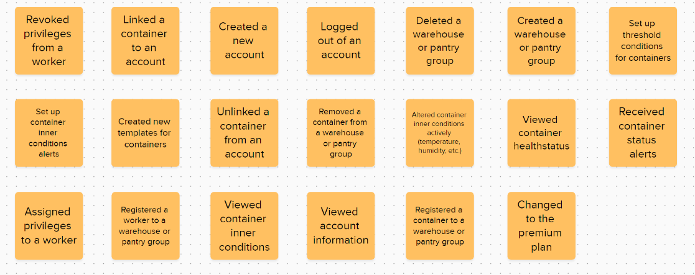
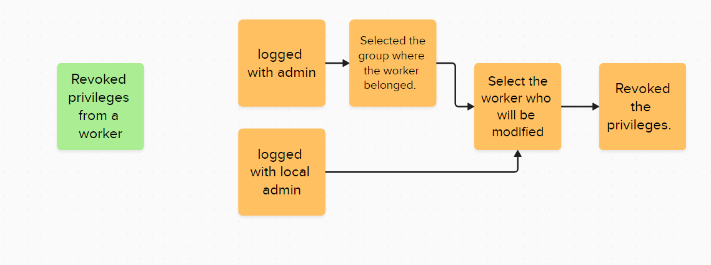
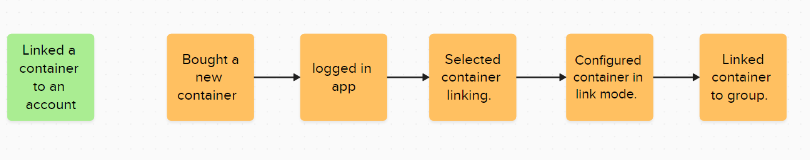
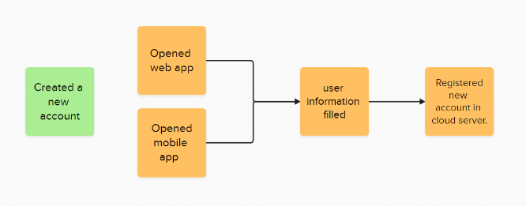
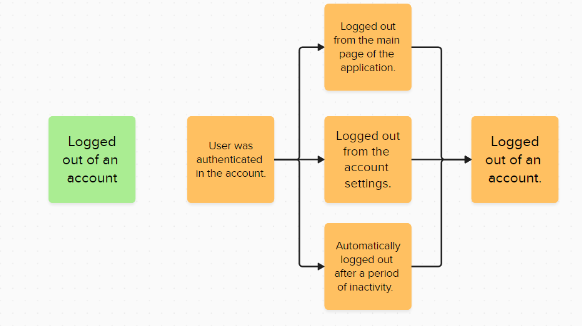
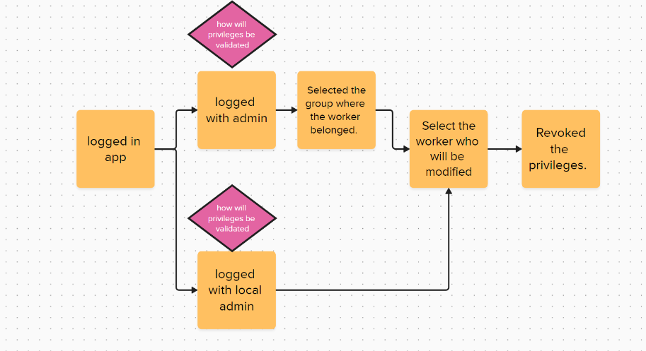
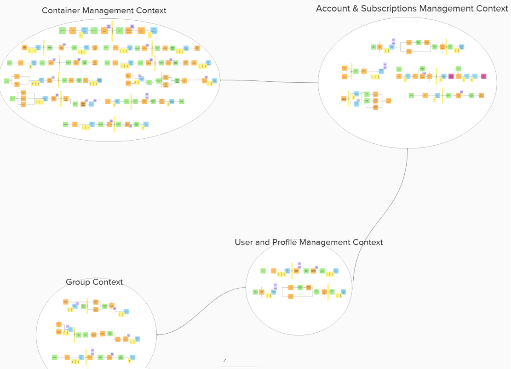

# Chapter IV: Solution Software Design
## 4.1. Strategic-Level Domain-Driven Design
### 4.1.1. EventStorming

Nuestro proceso de event storming se llevó a cabo utilizando la herramienta MURAL, donde desarrollamos todo el flujo. Comenzamos con el primer paso, la Exploración No Estructurada, en el cual analizamos y compartimos nuestras opiniones sobre los eventos del dominio, siguiendo las recomendaciones pertinentes. Además, consideramos varios criterios para seleccionar los eventos del dominio, como su relevancia, frecuencia, y temporalidad.

*Evidencia del desarrollo del primer paso del DDD.*

Después de ello, comenzamos con el segundo paso llamado Timelines, donde discutimos el flujo de los eventos del dominio. 
En este flujo, podemos observar la secuencia de acciones para poder revocar los privilegios de un trabajador asociado a un local, por el administrador. 

 

En este flujo, se observan las acciones a realizar para poder asociar un contenedor a una cuenta y a un grupo en específico, el grupo se refiere a un local de restaurante, si el dueño posee más de un local.

 

En este flujo podemos ver los pasos para crear una cuenta en ambas plataformas, tanto web como mobile

 

En este flujo, podemos ver los pasos para cerrar sesión de su cuenta en la aplicación

 *Evidencia del desarrollo del segundo paso de DDD.*

#### 4.1.1.1. Candidate Context Discovery

Para hallar a nuestros Candidate Context, continuamos con el paso 3 Pain Points, donde discutimos eventos del flujo que podrían ser cuellos de botella o pasos manuales que requieren automatización.  
 

En este timeline, un pain point es como validar los privilegios del usuario que inició sesión, para verificar si puede o no realizar una acción.

 

En este timeline, un pain point es como validar los privilegios del usuario que inició sesión, para verificar si se puede realizar o no la acción de asociar un contenedor a una cuenta o a un grupo en específico

 

 *Evidencia del desarrollo del tercer paso del DDD.*

Después, comenzamos con el cuarto paso del DDD llamado Pivotal Points, donde identificamos puntos o eventos comerciales importantes que indicaban un cambio en el contexto o la fase. 

 *Evidencia del desarrollo del cuarto paso del DDD.*

Con todo ello, comenzamos el paso de Commands, donde escribimos el desencadenante de ciertos eventos del dominio, así como el actor encargado.  

 *Evidencia del desarrollo del quinto paso del DDD.*

Después proseguimos con el paso 6, Policies donde identificamos eventos que debían de ejecutarse en automático o necesitaban alguna politica. 

 *Evidencia del desarrollo del sexto paso del DDD.*

Con ello procedemos a discutir los modelos de lectura de datos. 

 *Evidencia del desarrollo del septimo paso del DDD.*

También empezamos a discutir el uso de sistemas externos, donde únicamente se encontró necesario en el siguiente. 

 *Evidencia del desarrollo del octavo paso del DDD.*

Después, se comenzó con la identificación de los agregattes, para ello, tomamos criterios como granularidad, consistencia, y estabilidad. Con esos criterios, se procedió a elegir los Agreggattes, los cuales fueron los siguientes. 

 *Evidencia del desarrollo del noveno paso del DDD.*

Ya por ultimo y después de un análisis y discusión grupal, los siguientes bounded contexts fueron elegidos. 

 *Evidencia del desarrollo del DDD*

 Revisar el Mural para un mayor detalle:
[Eventstorming DittoBox](https://app.mural.co/t/ditto4864/m/ditto4864/1725121777423/239190dadf52ee7435517714464aff1e7a8980cd?sender=u68114f0b4359c72ffebc1564)

#### 4.1.1.2. Domain Message Flows Modeling

En relación con los flujos de mensajería, se eligieron los más relevantes para nuestro negocio, donde se involucra contenedores y permisos.
1. El acceso al contenedor:
   
2. Las alertas cuando un thershold es excedido:
   
3. El proceso de subcripción:
   
4. Revocar permisos:
   

#### 4.1.1.3. Bounded Context Canvases
De acuerdo con los boundend contexts definidos en puntos anteriores, se crearon sus respectivos Canvases:

### 4.1.2. Context Mapping

### Container Management Context

### Account & Subscriptions Management Context

### User and Profile Management Context

### Group Context

### Context Mapping
1. Container Management Context ↔ Account & Subscriptions Management Context:
Relación clave: El Container Management Context necesita verificar las suscripciones y los permisos de los usuarios antes de permitir que gestionen los contenedores. El Account & Subscriptions Management Context proporciona la validación necesaria para permitir o denegar el acceso, asegurando que solo los usuarios con una suscripción válida y los permisos adecuados puedan interactuar con los contenedores.
2. Account & Subscriptions Management Context ↔ User and Profile Management Context:
Relación clave: El Account & Subscriptions Management Context depende del User and Profile Management Context para manejar la autenticación y los perfiles de usuario. Aquí, la información sobre los usuarios, sus privilegios y permisos es clave para asociar las suscripciones y validar el acceso a las funcionalidades del sistema.
3. User and Profile Management Context ↔ Group Context:
Relación clave: El User and Profile Management Context se relaciona con el Group Context para gestionar los roles y permisos a nivel grupal. Esto es importante en el caso de organizaciones que gestionan múltiples usuarios en grupos, donde ciertos usuarios pueden tener privilegios que les otorgan diferentes niveles de acceso.

  

Para una mejor visibilidad: https://app.mural.co/t/ditto4864/m/ditto4864/1725121777423/239190dadf52ee7435517714464aff1e7a8980cd?sender=u68114f0b4359c72ffebc1564

### 4.1.3. Software Architecture

La arquitectura de software abarca la estructura esencial de un sistema, abarcando sus componentes, las relaciones entre ellos y los principios de diseño que los rigen.

#### 4.1.3.1. Software Architecture System Landscape Diagram

Es un diagrama que muestra la estructura general del sistema.

  

#### 4.1.3.2. Software Architecture Context Level Diagrams

El diagrama de contexto muestra las relaciones y flujos de información entre los actores (usuarios y sistemas)

  

#### 4.1.3.3. Software Architecture Container Level Diagrams

El diagrama ilustra cómo los diferentes contenedores del sistema interactúan entre sí y con los usuarios finales.

  

#### 4.1.3.4. Software Architecture Deployment Diagrams

Este diagrama muestra cómo los diferentes elementos del sistema, como aplicaciones, servidores, bases de datos y dispositivos de usuario, se despliegan en nodos físicos o virtuales.

  

## 4.2. Tactical-Level Domain-Driven Design
### 4.2.1. Bounded Context: <Bounded Account & Subscription Management Context>
El dominio de Account & Subscription Management describe detalladamente las funciones y procesos que se llevan a cabo para la gestión de cuentas de usuario y suscripciones dentro de nuestra plataforma. Este dominio es responsable de manejar todas las operaciones relacionadas con la creación, actualización y eliminación de cuentas, así como la gestión de suscripciones. Esto incluye la actualización de datos del negocio, la gestión de representantes, y el manejo de niveles de suscripción, pagos y estados de la misma. Garantiza que las cuentas estén correctamente sincronizadas con el sistema de suscripción y que los cambios en las suscripciones se manejen de manera adecuada y eficiente, proporcionando un servicio fluido para los usuarios.

###### Diccionario de Clases

El Diccionario de Clases es una herramienta clave en el proceso de diseño y desarrollo del sistema de gestión de cuentas y suscripciones. Proporciona una descripción detallada de las clases fundamentales que forman la base del modelo de dominio. Este diccionario documenta las entidades, sus atributos, métodos y relaciones, lo que facilita la comprensión y colaboración entre los desarrolladores, garantizando una base sólida para la solución implementada en el proyecto de Account & Subscription Management.

#### Account

#### Subscription

#### 4.2.1.1. Domain Layer
Dentro del dominio de Account & Subscription Management, se encuentran entidades clave que permiten gestionar las cuentas de negocio y sus suscripciones dentro de nuestra plataforma. Estas entidades desempeñan un papel fundamental en los procesos de creación, actualización y administración de cuentas de usuario, así como en el manejo de las suscripciones, lo que incluye cambios en el nivel de suscripción, actualizaciones de datos empresariales, y el seguimiento de los pagos y estados de las suscripciones. Estas entidades garantizan que los usuarios puedan gestionar eficientemente su suscripción y que el sistema mantenga los datos actualizados de las cuentas.

#### 4.2.1.2. Interface Layer

En esta sección, presentamos la Capa de Interfaz de nuestra plataforma de Account & Subscription Management, que representa el punto de entrada para las interacciones entre los usuarios y el sistema. La Capa de Interfaz está compuesta por una serie de controladores que manejan las peticiones entrantes de los usuarios y devuelven las respuestas adecuadas, permitiendo una comunicación efectiva entre la plataforma y sus usuarios.

El contexto de esta capa incluye cuatro controladores principales: AccountController, SubscriptionController, UserController, y PaymentController. Estos controladores tienen la responsabilidad de gestionar las operaciones relacionadas con las cuentas, suscripciones, usuarios y pagos.

#### 4.2.1.3. Application Layer
En esta sección, presentamos la Capa de Aplicación (Application Layer) dentro del contexto de Account & Subscription Management. Esta capa actúa como intermediaria entre la lógica de negocio y la infraestructura del sistema, gestionando el flujo de datos y las interacciones. Los Command Handlers y Event Handlers son responsables de ejecutar acciones de escritura y manejar eventos del sistema, coordinándose con los servicios relevantes para realizar sus operaciones.

Cada Handler en esta capa utiliza servicios específicos para ejecutar las funciones relacionadas con cuentas y suscripciones.

#### 4.2.1.4. Infrastructure Layer
En esta sección, presentamos la Capa de Infraestructura (Infrastructure Layer) dentro del contexto de Account & Subscription Management. Esta capa es responsable de proporcionar los componentes técnicos y de soporte necesarios para que las otras capas del sistema funcionen correctamente. Incluye la implementación de repositorios y servicios que se conectan con sistemas externos para manejar la persistencia y gestión de datos.

Los repositorios en la Capa de Infraestructura implementan las interfaces definidas en la Capa de Dominio y se encargan de interactuar con la base de datos utilizando Entity Framework en .NET. Los repositorios clave en este contexto son AccountRepository, que maneja la información de las cuentas, y SubscriptionRepository, que gestiona las suscripciones vinculadas a las cuentas.

#### 4.2.1.5. Bounded Context Software Architecture Component Level Diagrams

  

#### 4.2.1.6. Bounded Context Software Architecture Code Level Diagrams

##### 4.2.1.6.1. Bounded Context Domain Layer Class Diagrams  

##### 4.2.1.6.2. Bounded Context Database Design Diagram  

### 4.2.2. Bounded Context: <Bounded User & Profile Management Context>

El dominio de User & Profile Management describe detalladamente las funciones y procesos que se llevan a cabo para la gestión de usuarios y sus perfiles dentro de nuestra plataforma. Este dominio es responsable de manejar todas las operaciones relacionadas con la creación, actualización y eliminación de usuarios, así como la gestión de los perfiles asociados. Esto incluye la actualización de nombres, la asignación y revocación de privilegios, y el manejo de los diferentes roles dentro del sistema. Garantiza que los usuarios y sus perfiles estén correctamente sincronizados y que los cambios en los privilegios se gestionen de manera adecuada y eficiente, proporcionando una experiencia fluida y segura para los usuarios.

##### Diccionario de Clases

El Diccionario de Clases es una herramienta clave en el proceso de diseño y desarrollo del sistema de gestión de usuarios y perfiles. Proporciona una descripción detallada de las clases fundamentales que forman la base del modelo de dominio. Este diccionario documenta las entidades, sus atributos, métodos y relaciones, lo que facilita la comprensión y colaboración entre los desarrolladores, garantizando una base sólida para la solución implementada en el proyecto de User & Profile Management.

#### 4.2.2.1. Domain Layer
Dentro del dominio de User & Profile Management, se encuentran entidades clave como lo escrito anteriormente. Estas entidades desempeñan un papel fundamental en los procesos necesarios para gestionar a los usuarios y sus perfiles, permitiendo a la plataforma administrar la información personal de los usuarios, así como los privilegios y roles asignados a cada perfil. Este dominio también garantiza que las interacciones entre los usuarios y el sistema se realicen de manera segura y eficiente, proporcionando acceso controlado a las distintas funcionalidades y recursos disponibles en la plataforma.

A continuación, se muestran todos los objetos relacionados con el dominio.

#### 4.2.2.2. Interface Layer
En esta sección, presentamos la Capa de Interfaz para el User & Profile Management Context, que actúa como el punto de entrada para las interacciones de los usuarios con el sistema. La Capa de Interfaz incluye controladores que procesan las solicitudes entrantes relacionadas con usuarios y perfiles, gestionando las respuestas del sistema y permitiendo una comunicación efectiva entre la plataforma y los usuarios.

Este contexto incluye los siguientes controladores:

- UserController
- ProfileController

#### 4.2.2.3. Application Layer
En esta sección, presentamos la Capa de Aplicación (Application Layer) dentro del contexto de User & Profile Management siguiendo el enfoque de diseño Domain-Driven Design (DDD). La Capa de Aplicación es responsable de coordinar las acciones y el flujo de datos entre la Capa de Dominio y la Capa de Infraestructura, actuando como intermediario y gestionando las interacciones entre estas capas. Esta capa asegura que la lógica de negocio, representada por la Capa de Dominio, se ejecute de manera eficiente y coherente.

#### 4.2.2.4. Infrastructure Layer

En esta sección, presentamos la Capa de Infraestructura (Infrastructure Layer) dentro del contexto de User & Profile Management, utilizando .NET y Entity Framework Core para la persistencia y gestión de datos. Esta capa es crucial para proporcionar los componentes técnicos y de soporte necesarios para que las otras capas del sistema funcionen correctamente.

Los repositorios en la Capa de Infraestructura implementan las interfaces definidas en la Capa de Dominio y se encargan de la persistencia y gestión de datos. En nuestro sistema, los repositorios están diseñados para interactuar con Entity Framework Core y manejar la comunicación con la base de datos.

#### 4.2.2.5. Bounded Context Software Architecture Component Level Diagrams

  

#### 4.2.2.6. Bounded Context Software Architecture Code Level Diagrams
##### 4.2.2.6.1. Bounded Context Domain Layer Class Diagrams

##### 4.2.2.6.2. Bounded Context Database Design Diagram

### 4.2.3. Bounded Context: <Bounded Container Management Context>

El dominio de Container Management describe detalladamente las funciones y procesos que se llevan a cabo para la gestión de contenedores dentro de nuestra plataforma. Este dominio es responsable de manejar todas las operaciones relacionadas con la creación, monitoreo, y mantenimiento de contenedores. Esto incluye la asignación de plantillas de control, el monitoreo de la salud del contenedor, la gestión de alertas en caso de que los umbrales establecidos sean superados, y la regulación automática de la temperatura, humedad, y ventilación dentro de los contenedores. Garantiza que los contenedores operen dentro de los parámetros deseados y que los eventos inesperados o problemas de funcionamiento sean manejados de manera eficiente, proporcionando un servicio confiable y seguro para los usuarios.

##### Diccionario de Clases

El Diccionario de Clases es una herramienta clave en el proceso de diseño y desarrollo del sistema de gestión de contenedores. Proporciona una descripción detallada de las clases fundamentales que forman la base del modelo de dominio. Este diccionario documenta las entidades, sus atributos, métodos y relaciones, lo que facilita la comprensión y colaboración entre los desarrolladores, garantizando una base sólida para la solución implementada en el proyecto de Container Management.

#### 4.2.3.1. Domain Layer
La Capa de Dominio (Domain Layer) es responsable de representar los conceptos principales y las reglas de negocio de Container Management. Esta capa se compone de entidades, objetos de valor y servicios de dominio que encapsulan la lógica central del sistema. A continuación, se describen las principales clases y objetos de valor que forman parte del dominio de gestión de contenedores.

#### 4.2.3.2. Interface Layer

En esta sección, presentamos la Capa de Interfaz (Interface Layer) dentro del contexto de Container Management. Esta capa representa el punto de entrada para las interacciones entre los usuarios y el sistema. La Capa de Interfaz está compuesta por una serie de controladores (controllers) que manejan las peticiones entrantes de los usuarios, coordinan las acciones entre las capas de dominio y aplicación, y devuelven las respuestas adecuadas, permitiendo una comunicación efectiva entre la plataforma y sus usuarios.

El contexto de esta capa incluye los siguientes controladores principales

#### 4.2.3.3. Application Layer
En esta sección, presentamos la Capa de Aplicación (Application Layer) dentro del contexto de Container Management, siguiendo el enfoque de diseño Domain-Driven Design (DDD). La Capa de Aplicación es responsable de coordinar las acciones y el flujo de datos entre la Capa de Dominio y la Capa de Infraestructura, actuando como intermediario y gestionando las interacciones entre estas capas. Esta capa es crucial para garantizar que la lógica de negocio, representada por la Capa de Dominio, se ejecute de manera eficiente y coherente.

La Capa de Aplicación se compone de Application Services, Command Handlers y Event Handlers.

#### 4.2.3.4. Infrastructure Layer

En esta sección, presentamos la Capa de Infraestructura (Infrastructure Layer) dentro del contexto de Container Management, utilizando .NET y Entity Framework Core como framework para la persistencia de datos. La Capa de Infraestructura es responsable de proporcionar los componentes técnicos necesarios para que las otras capas del sistema funcionen correctamente. Esta capa incluye la implementación de repositorios, servicios de conexión con sistemas externos, y otros componentes de infraestructura.

Los repositorios en la Capa de Infraestructura implementan las interfaces definidas en la Capa de Dominio y se encargan de la persistencia y gestión de datos. En este contexto, se utilizarán repositorios basados en Entity Framework Core para manejar la interacción con la base de datos.

#### 4.2.3.5. Bounded Context Software Architecture Component Level Diagrams

  

#### 4.2.3.6. Bounded Context Software Architecture Code Level Diagrams
##### 4.2.3.6.1. Bounded Context Domain Layer Class Diagrams
##### 4.2.3.6.2. Bounded Context Database Design Diagram

### 4.2.4. Bounded Context: <Bounded Groups Management Context>
El dominio de Group Management describe detalladamente las funciones y procesos que se llevan a cabo para la gestión de grupos dentro de nuestra plataforma. Este dominio es responsable de manejar todas las operaciones relacionadas con la creación, administración y mantenimiento de grupos. Esto incluye la vinculación y desvinculación de contenedores y usuarios a los grupos, la gestión de la ubicación geográfica de los grupos, y el registro de eventos importantes como la transferencia de contenedores entre grupos. El sistema garantiza que los grupos estén organizados de manera eficiente y que las operaciones de vinculación, desvinculación y administración se realicen sin inconvenientes, proporcionando un entorno bien estructurado y adaptable para los usuarios.

##### Diccionario de Clases
El Diccionario de Clases es una herramienta clave en el proceso de diseño y desarrollo del sistema de gestión de grupos. Proporciona una descripción detallada de las clases fundamentales que forman la base del modelo de dominio. Este diccionario documenta las entidades, sus atributos, métodos y relaciones, lo que facilita la comprensión y colaboración entre los desarrolladores, garantizando una base sólida para la solución implementada en el proyecto de Group Management.

#### 4.2.4.1. Domain Layer
La Capa de Dominio (Domain Layer) es responsable de representar los conceptos principales y las reglas de negocio de Group Management. Esta capa se compone de entidades, objetos de valor y servicios de dominio que encapsulan la lógica central del sistema. A continuación, se describen las principales clases y objetos de valor que forman parte del dominio de gestión de grupos.

#### 4.2.4.2. Interface Layer
En esta sección, presentamos la Capa de Interfaz (Interface Layer) dentro del contexto de Group Management. Esta capa representa el punto de entrada para las interacciones entre los usuarios y el sistema. La Capa de Interfaz está compuesta por una serie de controladores (controllers) que manejan las peticiones entrantes de los usuarios, coordinan las acciones entre las capas de dominio y aplicación, y devuelven las respuestas adecuadas, permitiendo una comunicación efectiva entre la plataforma y sus usuarios.

El contexto de esta capa incluye los siguientes controladores principales:

#### 4.2.4.3. Application Layer

n esta sección, presentamos la Capa de Aplicación (Application Layer) dentro del contexto de Group Management, siguiendo el enfoque de diseño Domain-Driven Design (DDD). La Capa de Aplicación es responsable de coordinar las acciones y el flujo de datos entre la Capa de Dominio y la Capa de Infraestructura, actuando como intermediario y gestionando las interacciones entre estas capas. Esta capa es crucial para garantizar que la lógica de negocio, representada por la Capa de Dominio, se ejecute de manera eficiente y coherente.

La Capa de Aplicación se compone de Application Services, Command Handlers y Event Handlers.

#### 4.2.4.4. Infrastructure Layer

En esta sección, presentamos la Capa de Infraestructura (Infrastructure Layer) dentro del contexto de Group Management, utilizando .NET y Entity Framework Core como framework para la persistencia de datos. La Capa de Infraestructura es responsable de proporcionar los componentes técnicos necesarios para que las otras capas del sistema funcionen correctamente. Esta capa incluye la implementación de repositorios, servicios de conexión con sistemas externos, y otros componentes de infraestructura.

Los repositorios en la Capa de Infraestructura implementan las interfaces definidas en la Capa de Dominio y se encargan de la persistencia y gestión de datos. En este contexto, los repositorios serán basados en Entity Framework Core para manejar la interacción con la base de datos.

#### 4.2.4.5. Bounded Context Software Architecture Component Level Diagrams

  

#### 4.2.4.6. Bounded Context Software Architecture Code Level Diagrams
##### 4.2.4.6.1. Bounded Context Domain Layer Class Diagrams

##### 4.2.4.6.2. Bounded Context Database Design Diagram

