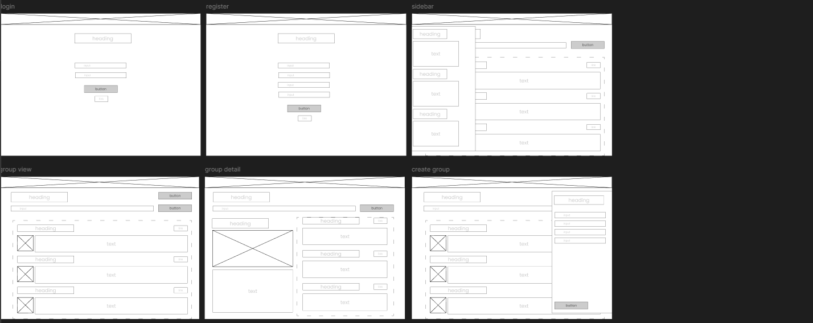
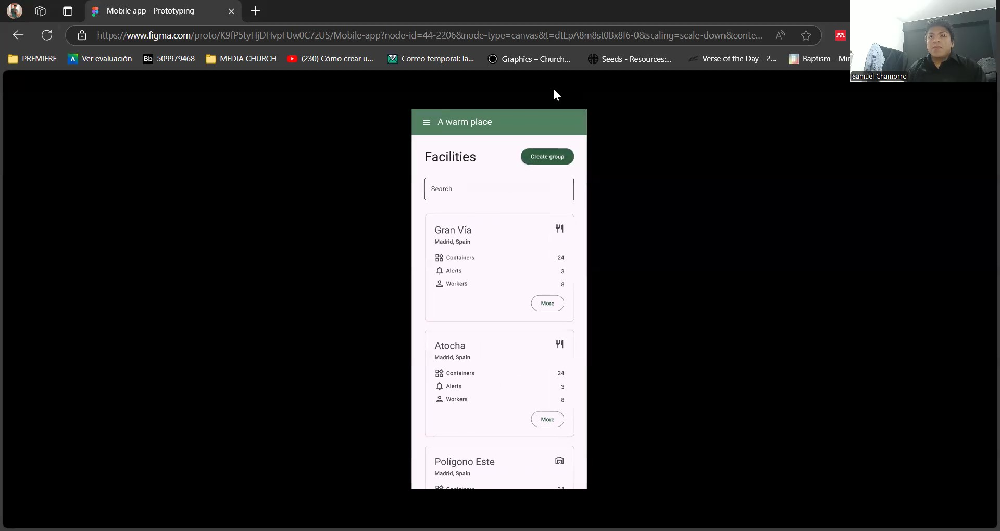

# Capítulo V: Solution UI/UX Design
## 5.1. Style Guidelines.
La creación de Style Guidelines es esencial para asegurar la coherencia visual y de experiencia en todos los productos digitales, incluyendo web, mobile e interfaces IoT. Este repositorio centralizado facilita la colaboración entre equipos y garantiza que todas las interacciones y elementos visuales sigan un mismo patrón estilístico.

### 5.1.1. General Style Guidelines.
Esta sección establece las directrices generales relacionadas con el diseño visual, desde branding hasta el tono de comunicación. Estas son las decisiones clave y las referencias adoptadas:

#### Branding:
- **Identidad visual**: DittoBox presenta una identidad moderna y confiable, centrada en la tecnología y la eficiencia.
- **Logotipo**: El logo utiliza una fuente sans-serif para evocar modernidad y claridad. La paleta de colores incluye tonos de verde que sugieren frescura y conservación, ideales para un producto centrado en la preservación de suministros.

#### Typography:
- **Fuente primaria**: Se utilizan fuentes sans-serif modernas como Roboto para títulos y encabezados, lo que refuerza la claridad y el enfoque tecnológico.
- **Fuente secundaria**: Para cuerpos de texto y descripciones, se usa Roboto para mejorar la legibilidad en pantallas digitales.
- **Tamaño**: La jerarquía de tamaño de las fuentes ayuda a mantener el foco en los puntos más importantes (títulos en tamaños grandes y descripciones en medianos y pequeños).
   

#### Colors:
- **Paleta de colores**: La paleta de colores es consistente, utilizando tonos de verde (#2B593C, #506354) y blanco (#FFFFFF) como colores principales, que sugieren frescura, naturaleza, y confianza.
- **Contrastes**: El contraste de verde oscuro con blanco permite una excelente legibilidad y resalta los CTAs (botones).

 

### 5.1.2. Web, Mobile and IoT Style Guidelines.
 
 
 
 
 
 

## 5.2. Information Architecture.
### 5.2.1. Organization Systems.
Los **Organization Systems** son los métodos utilizados para estructurar y presentar la información de manera clara y accesible para los usuarios. Dependiendo de la naturaleza de los datos y las tareas que los usuarios deban realizar, se aplican diferentes formas de organizar la información, como jerarquías visuales, secuencias lógicas o matrices. También se utilizan esquemas de categorización específicos (alfabético, cronológico, por tópicos o según audiencia) para asegurar que la información sea fácil de encontrar y comprender.

En este sistema, la organización de la información se aplica utilizando los siguientes esquemas:

1. **Jerárquica (Visual Hierarchy)**: La organización jerárquica se aplica en todos los formularios, pantallas de contenedores y visualización de instalaciones. Se prioriza la información más importante en la parte superior de cada página o tarjeta. Por ejemplo, en las pantallas de contenedores, el nombre del contenedor y su estado se destacan visualmente, seguidos de detalles como la temperatura, la humedad y la última sincronización. Esta jerarquía asegura que los usuarios identifiquen rápidamente lo más relevante (nombre, estado) antes de revisar detalles adicionales.

2. **Secuencial (Step-by-step to accomplish)**: Este sistema secuencial se utiliza en formularios como los de registro y de login, donde los usuarios deben completar una serie de pasos lógicos (ingreso de información) para avanzar a la siguiente etapa. Por ejemplo, en los formularios de registro de empresa o usuario, el proceso es simple: ingresar nombre, correo, contraseña y luego proceder con la acción deseada. El sistema lleva al usuario de manera fluida a través de los pasos sin crear confusión.

3. **Matricial**: Se observa en la presentación de los contenedores e instalaciones. Los datos de cada contenedor se agrupan en tarjetas individuales con el mismo formato, lo que permite comparaciones rápidas. Cada tarjeta muestra la misma estructura de datos (nombre, temperatura, humedad, sincronización), facilitando que los usuarios comparen varios contenedores a la vez. Este enfoque es eficiente para gestionar varias unidades de información de manera simultánea.

**Esquemas de Categorización de Contenido**:
- **Alfabético**: Se aplica en las listas de instalaciones para facilitar la búsqueda de ubicaciones.
- **Cronológico**: En las secciones de contenedores, se ordenan eventos como la última sincronización o la última conexión, asegurando que los datos más recientes se presenten de manera prominente.
- **Por tópicos**: Los datos se agrupan por categoría de producto en los contenedores (ejemplo: carnes, alimentos procesados, frutas y vegetales), lo que facilita la gestión según el tipo de producto almacenado.
- **Por audiencia**: La diferenciación entre tipos de usuarios (worker, owner) permite personalizar la interfaz para cada grupo de usuarios, mostrando información y opciones relevantes para sus roles específicos.

### 5.2.2. Labeling Systems.
Los **Labeling Systems** se encargan de definir las etiquetas y representaciones visuales que se utilizan para describir la información presentada en una interfaz. Las etiquetas deben ser concisas y claras, y su propósito es facilitar la comprensión rápida y correcta de los datos que se muestran. Estas etiquetas también ayudan a establecer relaciones y asociaciones entre los diferentes elementos de la interfaz, permitiendo que los usuarios interpreten la información sin confusión.

En este sistema, el etiquetado de datos sigue los siguientes principios:

1. **Simplicidad y Claridad en las Etiquetas**:
   Las etiquetas son concisas y utilizan el mínimo número de palabras necesarias para describir la información o acción. Ejemplos:
   - **Company name, Identification number, Email, Password**: Estas etiquetas en el formulario de registro son autoexplicativas, indicando claramente qué información debe introducirse.
   - **Temperature, Humidity, Last sync**: Estas etiquetas están presentes en las tarjetas de los contenedores y proporcionan una descripción precisa y directa de los datos monitoreados.
   - **Worker, Owner**: Estas etiquetas permiten al usuario seleccionar su rol en el sistema, simplificando el proceso de registro.

2. **Asociaciones entre Etiquetas**:
   Las etiquetas no solo describen datos, sino que también crean asociaciones útiles. Por ejemplo:
   - La etiqueta **"Needs attention"** implica que uno de los datos clave (como la temperatura o la sincronización) está fuera de los parámetros normales. Esto permite al usuario entender que se requiere una acción sin necesidad de analizar todos los datos en ese momento.
   - **Login** y **Register** son botones claramente asociados a las acciones de gestión de acceso al sistema, lo que facilita a los usuarios entender qué deben hacer sin necesidad de leer explicaciones adicionales.
   - En los contenedores, las etiquetas de configuración de temperatura y humedad están asociadas a su respectivo tipo de contenido (por ejemplo, frutas y vegetales), lo que ayuda a los usuarios a relacionar las condiciones del contenedor con el tipo de producto que se almacena.

#### Algunas Etiquetas usadas:
 - **Contenedores**: Sección donde se muestra toda la información relacionada con los contenedores gestionados por la empresa, incluyendo su estado operativo, temperatura, humedad y última sincronización.
 - **Añadir contenedor**: Etiqueta utilizada para acompañar a un botón que permite a los usuarios agregar un nuevo contenedor al sistema, proporcionando los datos requeridos como nombre, tipo de producto y configuración de parámetros.
 - **Editar contenedor**: Etiqueta usada para acompañar a un botón que permite modificar la configuración actual de un contenedor, ajustando valores como la temperatura, humedad y otros parámetros relacionados.
 - **Buscar contenedores**: Etiqueta utilizada en una sección de filtrado para permitir a los usuarios buscar y seleccionar contenedores específicos en función de parámetros como nombre o estado.
 - **Instalaciones**: Sección donde se muestra una lista de todas las instalaciones gestionadas por la empresa, junto con detalles sobre la cantidad de contenedores, alertas activas y el personal asignado.
 - **Añadir instalación**: Etiqueta utilizada para acompañar a un botón que permite a los usuarios agregar una nueva instalación, proporcionando detalles como la ubicación y la configuración inicial.
 - **Estado del contenedor**: Sección que detalla el estado operativo de un contenedor específico, incluyendo la temperatura interna, humedad y alertas activas. Ayuda a los usuarios a identificar si el contenedor necesita atención o ajustes.
 - **Template del contenedor**: Etiqueta que se refiere a una plantilla predefinida de configuración de temperatura y humedad para un contenedor según el tipo de producto almacenado (ej. carnes, frutas, procesados).
 - **Lista de trabajadores**: Sección donde se muestra un listado de todos los trabajadores asignados a la instalación o los contenedores, con detalles como nombre, rol y estado de conexión.
 - **Perfil del trabajador**: Sección que contiene la información personal de un trabajador, como su nombre, correo electrónico y permisos dentro del sistema. Permite gestionar las funciones asignadas a cada trabajador.
 - **Añadir trabajador**: Etiqueta usada para acompañar a un botón que permite agregar un nuevo trabajador al sistema, asignando roles y permisos según la instalación o los contenedores bajo su supervisión.
 - **Notificaciones**: Sección donde los usuarios reciben alertas y actualizaciones sobre el estado de los contenedores, incluyendo mensajes de advertencia sobre problemas de temperatura o sincronización fallida.
 - **Configuración de cuenta**: Sección donde los usuarios pueden personalizar su perfil, modificar la información de contacto y ajustar los permisos o roles dentro del sistema.
 - **Suscripción**: Etiqueta utilizada en la sección de gestión de pagos, donde el usuario puede revisar y modificar los planes de suscripción actuales, acceder a facturas o actualizar los métodos de pago.

### 5.2.3. SEO Tags and Meta Tags
Las etiquetas de SEO y metaetiquetas son elementos fundamentales para optimizar el posicionamiento de una página web en los motores de búsqueda. Estas etiquetas proporcionan información relevante sobre el contenido de la página, lo que ayuda a los motores de búsqueda a indexar y clasificar el sitio con la finalidad de brindar contenido relevante, autoritativo y útil a los usuarios.

#### Etiquetas de SEO:
|Producto|Etiquetas|Valores|
|---------|-------|-----|
|Landing Page|Title|DittoBox - Smart Container Management System|
|Landing Page|Metadescription|DittoBox is a smart container management system that helps businesses monitor and control temperature, humidity, and other conditions in real-time.|
|Landing Page|Keywords|container management, smart containers, temperature control, humidity monitoring, IoT|
|Landing Page|Author|Ditto, Samuel Chamorro Torres, Diego Cancho Coila, Luis Lagos, José Arenas Conde, Anthony Guerrero Castillo|
|Web App|Title|DittoBox - Web Application|
|Web App|Metadescription|DittoBox web application allows users to manage containers, monitor temperature, humidity, and receive real-time alerts.|
|Web App|Keywords|container management, temperature monitoring, humidity control, real-time alerts, IoT|
|Web App|Author|Ditto, Samuel Chamorro Torres, Diego Cancho Coila, Luis Lagos, José Arenas Conde, Anthony Guerrero Castillo|
|Mobile App|App Title|DittoBox|
|Mobile App|App keywords|container management, temperature control, humidity monitoring, IoT, real-time alerts|
|Mobile App|App Subtitle|Smart Container Management System|
|Mobile App|App Description|DittoBox is a smart container management system that helps businesses monitor and control temperature, humidity, and other conditions in real-time.|

### 5.2.4. Searching Systems.
El sistema de búsqueda en la aplicación móvil de DittoBox estará diseñado para ayudar a los usuarios a encontrar información relevante de manera rápida y eficiente, asegurando una experiencia de usuario óptima, incluso cuando haya una gran cantidad de datos disponibles.

#### Funciones del Sistema de Búsqueda:
- **Barra de búsqueda de templates**: En la parte superior de la aplicación, se implementará una barra de búsqueda que permitirá a los usuarios escribir palabras clave relacionadas a los templates que desea aplicar a su contenedor.
- **Barra de búsqueda por local**: En la parte superior de la vista de un local, se implementará una barra de búsqueda que permitirá a los usuarios escribir palabras clave relacionadas a los contenedores que desea encontrar.
- **Visualización de resultados**: Los resultados de las búsquedas serán mostrados en un formato de lista con vista previa de cada item. Cada resultado incluirá detalles clave como la temperatura, la humedad y el último tiempo de sincronización.

 

### 5.2.5. Navigation Systems.
La aplicación DittoBox está diseñada para ofrecer una experiencia de navegación intuitiva y eficiente, ayudando a los usuarios a interactuar fácilmente con la plataforma y cumplir sus objetivos. A continuación se detallan las principales acciones y técnicas implementadas para guiar a los usuarios a través del sistema:

#### Estructura de Navegación:
- **Menú lateral**: La aplicación presenta un menú lateral que permite un acceso rápido a las secciones clave como el Dashboard, Groups, Containers, Workers, y configuraciones adicionales como Account, Subscription, y Notifications. Este menú siempre está disponible, proporcionando una navegación coherente y accesible desde cualquier pantalla en la aplicación web.
- **Secciones de contenido**: La vista principal muestra varias tarjetas de localizaciones, cada una correspondiente a una instalación. Estas tarjetas incluyen información importante como el número de contenedores, alertas y trabajadores, y permiten al usuario navegar fácilmente a detalles específicos de cada instalación haciendo clic en el botón More.
- **Búsqueda centralizada**: Encima de las tarjetas, se encuentra una barra de búsqueda, facilitando a los usuarios encontrar rápidamente una instalación o grupo específico al ingresar palabras clave relacionadas.

#### Accesibilidad y Fluidez::
El diseño general se centra en reducir la cantidad de pasos necesarios para acceder a la información relevante. Gracias a las tarjetas resumidas y al menú siempre presente, los usuarios pueden cambiar entre diferentes secciones sin perder de vista su ubicación actual, lo que mejora la experiencia de navegación.

 

## 5.3. Landing Page UI Design.
En esta sección, el equipo de diseño traduce las decisiones tomadas en torno a la experiencia de usuario (UX) y la arquitectura de la información en una propuesta de interfaz de usuario (UI) para la página de aterrizaje de DittoBox.

#### Diseño y Arquitectura de Información:
La propuesta del Landing Page para DittoBox sigue un enfoque claro y minimalista, priorizando una navegación intuitiva y accesible. Los elementos clave se distribuyen de manera que guíen al usuario a través de una estructura lógica que resalta los puntos fuertes del producto, como su facilidad de uso y sus características tecnológicas. Se ha tenido en cuenta:

- **Jerarquía visual**: Utilizando tamaños de texto grandes y colores contrastantes, los títulos y llamadas a la acción (CTAs) se destacan de manera eficiente.
- **Diseño inclusivo**: El uso de fuentes legibles, colores suaves, y un diseño claro aseguran que la interfaz sea accesible para la mayoría de los usuarios.
- **Sistema de diseño coherente**: Todos los componentes (botones, tarjetas, y secciones) utilizan un esquema de colores verde y blanco consistente, manteniendo la cohesión visual acorde a los estilos definidos.

### 5.3.1. Landing Page Wireframe.
En el wireframe de la página de aterrizaje para un navegador web de escritorio, la estructura se divide en las siguientes secciones:
- **Header**: Incluye el logotipo, un menú de navegación sencillo (Home, Features, Pricing, Review, Contact), y un CTA claro para iniciar la prueba gratuita.
   
- **Sección hero**: Presenta una imagen atractiva del producto, un título que describe brevemente el valor de DittoBox y un botón visible para obtener más información.
     
- **Sección de características**: Utiliza íconos y descripciones breves para destacar las funcionalidades del producto, como el control de temperatura, IoT Connectivity, y monitoreo de humedad.
   
- **Testimonios**: Incluye una presentación de los testimonios de clientes satisfechos, proporcionando credibilidad y confianza en el producto.
 
- **Footer**: Información de contacto, enlaces rápidos y botones para descargar la aplicación móvil desde las tiendas de iOS y Android.
   

### 5.3.2. Landing Page Mock-up.
En el mock-up de la versión de escritorio, la landing page sigue la estructura del wireframe con un diseño visual terminado que incluye:

- **Colores suaves**: Se utiliza una paleta de colores verdes y blancos, que es amigable y profesional.
- **Tipografía moderna**: Los títulos en negrita y las descripciones en un tamaño legible aseguran una fácil comprensión del contenido.
- **Botones CTA bien visibles**: Los botones "Get Started" están diseñados en un verde más oscuro, haciéndolos resaltar sobre el fondo.

 

## 5.4. Applications UX/UI Design.
### 5.4.1. Applications Wireframes.

En esta sección, hemos colaborado para crear los wireframes que actúen como una representación visual detallada de la estructura y el diseño de nuestras interfaces de usuario. Trabajando en conjunto, hemos traducido los requisitos funcionales y las especificaciones del proyecto en diagramas gráficos claros y concisos que delinean cómo se organizarán y presentarán los diferentes componentes en la aplicación final.

**Web Application Wireframes**

   
   

Link del Figma: https://www.figma.com/design/l6VWI87Jfw8BfWudoz9I3C/Web-app?node-id=0-1&t=8aXwYSVX7p293Yfn-1

**Mobile Application Wireframes**

   

Link del Figma: https://www.figma.com/design/K9fP5tyHjDHvpFUw0C7zUS/Mobile-app?node-id=0-1&t=EBhUWa3rz0UYlnh6-1

### 5.4.2. Applications Wireflow Diagrams. 

En esta sección, presentamos los diagramas de flujo de nuestra aplicación web, elaborados por nuestro equipo. Estos diagramas reflejan el comportamiento de la aplicación en función de las interacciones esperadas de nuestros usuarios. Hemos desarrollado un diagrama de flujo para cada objetivo del usuario para cada funcionalidad de la aplicación, teniendo en cuenta que las acciones que hagan los usuarios variarán únicamente si poseen los privilegios necesarios, por lo que podemos considerar uno solo. Antes de crear los diagramas de flujo, realizamos flujos de tareas para establecer las rutas típicas que seguirá el usuario en la aplicación. En los diagramas de flujo, mostramos los cambios en la pantalla a medida que el usuario interactúa con la aplicación, añadiendo pasos con representaciones visuales del nuevo estado. Utilizamos la herramienta Figma para crear estos diagramas de flujo, y para cada uno de ellos hemos incluido el objetivo del usuario correspondiente y una explicación detallada del flujo.

**TaskFlow**
* Iniciar sesión
* Crear un grupo
* Modificar un grupo
* Seleccionar un grupo
* Añadir un trabajador
* Añdir rol a un trabajador
* Seleccionar un trabajador
* Crear un template
* Modificar un template
* Seleccionar un template
* Modificar detalle de cuenta
* Modificar detalle de subscripción
* Crear un contenedor
* Modificar un contenedor
* Seleccionar un conenedor

**User Goals**
* UG01: Administrar grupos para organizar y controlar el acceso a los recursos.  
El usuario accede a la aplicación, abre el sidebar y selecciona la opción de grupos. Posteriormente selecciona la creaación de grupo, completa toda la información que se le solicita y guarda. Luego, es capaz de seleccionar ese grupo creado, ver la información y editar las configuraciones.
   
   

* UG02: Gestionar trabajadores para definir roles y responsabilidades dentro de los grupos.  
El usuario accede a la aplicación, abre el sidebar y selecciona la opción de workers. Posteriormente selecciona un trabajador y puede modificar la información que se desee, como los roles, o a qué grupo desea enviarlo.
   
   

* UG03: Configurar plantillas para estandarizar la configuración de contenedores o grupos.  
El usuario accede a la aplicación, abre el sidebar y selecciona la opción de templates. Posteriormente, selecciona el template de su interés, puede modificarlo según sus necesitades y lo enlaza a un contenedor.
   
   

* UG04: Administrar la suscripción y los detalles de la cuenta personal para controlar el acceso y los servicios disponibles.  
El usuario accede a la aplicación, abre el sidebar y selecciona la opción de account. Posteriormente, modifica los datos deseados y guarda. Al momento de estar nuevamente en la sección principal, ingresa al sidebar y navega hacia subscription. En esta sección, el usuario modifica la configuración con el fin de hacer un cambio en su plan.
   
   

* UG05: Obtener una visión general del sistema y monitorear la actividad a través de un dashboard.  
El usuario accede a la aplicación, abre el sidebar y selecciona la opción de dashboard. En esta sección, el usuario es capaz de ver de forma resumida la información integrada de todos los contenedores que tiene disponibles, métricas clave y alertas.
   
 

* UG06: Controlar y gestionar contenedores dentro de los grupos para optimizar la operación.  
El usuario accede a la aplicación, abre el sidebar y selecciona la opción de containers. Posteriormente, el usuario selecciona un contenedor. Luego, le aparece el detalle del contenedor seleccionado, donde va a realizar las modificaciones deseadas.
   
 

**Enlace a Lucid Chart**: https://lucid.app/lucidchart/207552c6-b8ee-433f-8eb4-9f496a6ca0d0/edit?viewport_loc=-5221%2C-2319%2C15543%2C5621%2C0_0&invitationId=inv_62f1ad6b-4fb5-44a7-9ca4-f7d04f435315

### 5.4.2. Applications Mock-ups.

En esta sección, hemos trabajado para crear Mock-ups de nuestra solución que representen visualmente el aspecto y la sensación de nuestras interfaces de usuario. A través de este proceso, hemos transformado los conceptos y especificaciones del proyecto en representaciones visuales detalladas y realistas de cómo se verá la aplicación final. Estos mock-ups nos han permitido capturar la apariencia visual exacta de la aplicación, incluyendo detalles como el diseño de la interfaz de usuario, los colores, la tipografía y los elementos gráficos.

**Web Application Mock-ups**

   
   
   

Link del Figma: https://www.figma.com/design/l6VWI87Jfw8BfWudoz9I3C/Web-app?node-id=39-1224&t=8aXwYSVX7p293Yfn-1

**Mobile Application Mock-ups**

   

Link del Figma: https://www.figma.com/design/K9fP5tyHjDHvpFUw0C7zUS/Mobile-app?node-id=38-2&t=EBhUWa3rz0UYlnh6-1

### 5.4.3. Applications User Flow Diagrams.

En este apartado hemos documentado visualmente el flujo de interacción que los usuarios siguen al utilizar la aplicación. Estos diagramas nos muestran las diferentes pantallas y pasos que un usuario atraviesa desde que inicia la aplicación hasta que completa una acción o tarea específica. Nos sirven como una herramienta visual para comprender y analizar cómo los usuarios interactúan con la aplicación, identificar posibles problemas o áreas de mejora en la experiencia del usuario, y guiar el diseño y desarrollo de la interfaz de usuario para optimizar la usabilidad y la satisfacción del usuario.

**User Goals**
* UG01: Administrar grupos para organizar y controlar el acceso a los recursos.  
El usuario accede a la aplicación, abre el sidebar y selecciona la opción de grupos. Posteriormente selecciona la creaación de grupo, completa toda la información que se le solicita y guarda. Luego, es capaz de seleccionar ese grupo creado, ver la información y editar las configuraciones.
   

* UG02: Gestionar trabajadores para definir roles y responsabilidades dentro de los grupos.  
El usuario accede a la aplicación, abre el sidebar y selecciona la opción de workers. Posteriormente selecciona un trabajador y puede modificar la información que se desee, como los roles, o a qué grupo desea enviarlo.
   

* UG03: Configurar plantillas para estandarizar la configuración de contenedores o grupos.  
El usuario accede a la aplicación, abre el sidebar y selecciona la opción de templates. Posteriormente, selecciona el template de su interés, puede modificarlo según sus necesitades y lo enlaza a un contenedor.
   

* UG05: Obtener una visión general del sistema y monitorear la actividad a través de un dashboard.  
El usuario accede a la aplicación, abre el sidebar y selecciona la opción de dashboard. En esta sección, el usuario es capaz de ver de forma resumida la información integrada de todos los contenedores que tiene disponibles, métricas clave y alertas.
   

* UG06: Controlar y gestionar contenedores dentro de los grupos para optimizar la operación.  
El usuario accede a la aplicación, abre el sidebar y selecciona la opción de containers. Posteriormente, el usuario selecciona un contenedor. Luego, le aparece el detalle del contenedor seleccionado, donde va a realizar las modificaciones deseadas.
   

**Enlace a Lucid Chart**: https://lucid.app/lucidchart/207552c6-b8ee-433f-8eb4-9f496a6ca0d0/edit?viewport_loc=-5221%2C-2319%2C15543%2C5621%2C0_0&invitationId=inv_62f1ad6b-4fb5-44a7-9ca4-f7d04f435315

## 5.5. Applications Prototyping.
En esta sección, se detalla el proceso de prototipado de las aplicaciones web y móvil de DittoBox, que se realizó para crear interfaces intuitivas y centradas en el usuario. Utilizando un enfoque iterativo, se desarrollaron wireframes y mock-ups que permitieron validar el diseño y la arquitectura de información, asegurando una navegación fluida y una experiencia de usuario óptima. Para la aplicación web, se priorizó un flujo lógico de funcionalidades, mientras que en la versión móvil se implementaron principios de diseño responsivo y usabilidad en pantallas más pequeñas. Este proceso garantizó que ambas aplicaciones no solo fueran visualmente atractivas, sino también funcionales y accesibles, alineando las expectativas del cliente con las necesidades del usuario final.

 
**Enlace a Video Prototyping Web**: https://upcedupe-my.sharepoint.com/:v:/g/personal/u20211d744_upc_edu_pe/EQHop5nhAa9Avrvy0XPFcFUB26Iyf5_WaJpE5Pw86ut0LQ?e=u6LvyB

 
**Enlace a Video Prototyping Mobile**: https://upcedupe-my.sharepoint.com/:v:/g/personal/u20211d744_upc_edu_pe/EYiWT0ppwgBPpT3uAS1dWjcBFVWLQR1qlpSIx6s_0gnh1Q?e=dZ16tp
